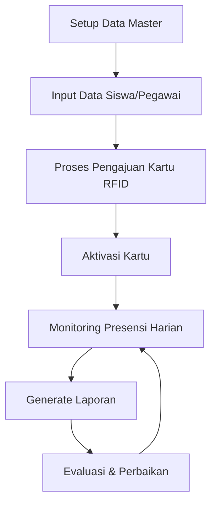
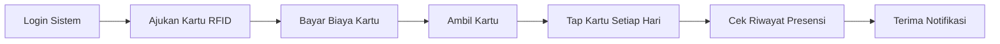

import {
  Card,
  CardGrid,
  Steps,
  Aside,
  Tabs,
  TabItem,
} from '@astrojs/starlight/components'

## Pengenalan Sistem

**Attendance Systems** adalah solusi presensi digital yang memanfaatkan teknologi RFID (Radio-Frequency Identification) untuk mencatat kehadiran siswa dan pegawai secara otomatis, akurat, dan real-time.

Sistem ini dirancang untuk:

- Menggantikan presensi manual yang memakan waktu
- Meningkatkan akurasi data kehadiran
- Memberikan notifikasi instant kepada orang tua/wali
- Mempermudah pembuatan laporan kehadiran
- Mengintegrasikan data presensi dengan sistem akademik

<Aside type="tip" title="Siapa yang bisa menggunakan sistem ini?">

Sistem ini dapat digunakan oleh:

- **Super Admin**: Akses penuh ke semua fitur
- **Operator**: Mengelola data master dan presensi
- **Wali Kelas**: Melihat dan mengelola presensi siswa di kelasnya
- **Pegawai**: Melihat riwayat presensi pribadi
- **Siswa**: Melihat riwayat presensi pribadi

</Aside>

---

## Cara Login

<Steps>

1. **Buka Browser**
   Akses sistem melalui URL yang diberikan oleh administrator (`https://presensi.mtsn1pandeglang.sch.id`)

2. **Masukkan Kredensial**

   ```
   Email/Username: email@example.com
   Password: ********
   ```

   <Aside type='caution'>
     Jangan bagikan password Anda kepada siapapun. Gunakan password yang kuat
     dengan kombinasi huruf, angka, dan simbol.
   </Aside>

3. **Klik Tombol "Masuk"**
   Setelah kredensial valid, Anda akan diarahkan ke dashboard utama sesuai dengan peran akun Anda.

4. **Verifikasi Dua Faktor (Opsional)**
   Jika diaktifkan, masukkan kode OTP yang dikirim ke email atau aplikasi authenticator Anda.

</Steps>

<Aside type='note' title='Lupa Password?'>
  Klik link **"Lupa Password?"** di halaman login, masukkan email terdaftar, dan
  ikuti instruksi reset password yang dikirim ke email Anda.
</Aside>

---

## Dashboard Utama

Setelah login berhasil, Anda akan melihat dashboard yang menampilkan informasi penting:

<CardGrid>
<Card title="Statistik Hari Ini" icon="bars">

- Total kehadiran siswa
- Total kehadiran pegawai
- Tingkat kehadiran hari ini
- Daftar Pegawai dan Siswa yang melakukan presensi paling awal

</Card>

<Card title="Grafik Kehadiran" icon="chart">

- Tren kehadiran mingguan
- Grafik perbandingan hadir/tidak hadir
- Statistik keterlambatan

</Card>

<Card title="Notifikasi Terbaru" icon="bell">

- Pengumuman sistem
- Pengajuan kartu RFID
- Update data penting
- Reminder deadline

</Card>

<Card title="Akses Cepat" icon="rocket">

- Presensi Manual
- Lihat Riwayat
- Input Data
- Generate Laporan

</Card>
</CardGrid>

### Komponen Dashboard Berdasarkan Peran

<Tabs>
<TabItem label="Super Admin">

- **Overview Sistem**: Total users, data master, statistik global
- **Aktivitas Terbaru**: Log aktivitas semua pengguna
- **Sistem Monitoring**: Status server, database, RFID reader
- **Quick Actions**: Kelola semua menu dengan akses penuh

</TabItem>

<TabItem label="Operator">

- **Data Master**: Statistik data siswa, pegawai, kelas
- **Presensi Hari Ini**: Rekap kehadiran real-time
- **Pengajuan Kartu**: Daftar pengajuan yang perlu diproses
- **Quick Actions**: Input data, generate laporan

</TabItem>

<TabItem label="Wali Kelas">

- **Presensi Kelas**: Statistik kehadiran siswa di kelas
- **Daftar Siswa**: Data siswa yang diampu
- **Rekap Bulanan**: Grafik kehadiran per bulan
- **Quick Actions**: Input manual presensi, export laporan kelas

</TabItem>

<TabItem label="Pegawai/Siswa">

- **Riwayat Presensi**: Data kehadiran pribadi
- **Statistik Pribadi**: Persentase kehadiran, keterlambatan
- **Informasi**: Pengumuman dan informasi penting
- **Profile**: Kelola data pribadi dan kartu RFID

</TabItem>
</Tabs>

---

## Navigasi Menu

Sistem menggunakan sidebar navigasi yang intuitif dengan struktur sebagai berikut:

### 1. **Dashboard**

- Halaman utama dengan ringkasan informasi

### 2. **Data Master** (Admin/Operator)

- Peran
- Pengguna
- Instansi
- Tahun Pelajaran
- Jurusan
- Kelas
- Jabatan
- Jadwal Presensi
- Mata Pelajaran
- Informasi

### 3. **Kartu Presensi**

- Pengajuan Kartu RFID
- Riwayat Pengajuan

### 4. **Pegawai**

- Data Pegawai
- Riwayat Presensi Pegawai

### 5. **Siswa**

- Data Siswa
- Riwayat Presensi Siswa

<Aside
type="tip"
title="Tips Navigasi"
>
- Menu yang aktif ditandai dengan highlight warna 
- Klik ikon menu di mobile untuk membuka/tutup sidebar

</Aside>

---

## Konsep Dasar Presensi RFID

### Apa itu RFID?

**RFID (Radio-Frequency Identification)** adalah teknologi identifikasi menggunakan gelombang radio. Sistem RFID terdiri dari:

1. **Kartu/Tag RFID**: Kartu yang dipegang siswa/pegawai berisi chip dengan ID unik
2. **Reader RFID**: Perangkat pembaca yang dipasang di pintu masuk/keluar
3. **Sistem Backend**: Aplikasi web yang memproses dan menyimpan data

### Cara Kerja Presensi

<Steps>

1. **Tap Kartu**

   Siswa/pegawai menempelkan kartu RFID ke reader

2. **Pembacaan ID**

   Reader menangkap ID unik dari kartu dan mengirim ke sistem

3. **Validasi Data**

   Sistem memvalidasi ID kartu dengan database pengguna

4. **Pencatatan Presensi**

   Jika valid, sistem mencatat waktu presensi secara otomatis

5. **Notifikasi**

   Notifikasi dikirim ke sistem dan WhatsApp orang tua (khusus siswa)

</Steps>

### Status Presensi

<CardGrid>
<Card title="Hadir" icon="approve-check">
Tap kartu dalam rentang waktu yang ditentukan
</Card>

<Card title='Terlambat' icon='warning'>
  Tap kartu melebihi batas waktu toleransi
</Card>

<Card title='Izin' icon='document'>
  Tidak hadir dengan surat izin yang disetujui
</Card>

<Card title=' Sakit' icon='heart'>
  Tidak hadir karena sakit dengan surat keterangan
</Card>

<Card title='Dispensasi' icon='star'>
  Izin meninggalkan kelas untuk keperluan sekolah
</Card>

<Card title="Alpha" icon="error">
Tidak hadir tanpa keterangan yang jelas
</Card>
</CardGrid>

---

## Alur Kerja Sistem

### Untuk Administrator/Operator



### Untuk Siswa/Pegawai



---

## Hak Akses Pengguna

Sistem menggunakan **Role-Based Access Control (RBAC)** untuk mengatur hak akses:

| Peran           | Akses Menu                     | Hak Akses                                           |
| --------------- | ------------------------------ | --------------------------------------------------- |
| **Super Admin** | Semua menu                     | Create, Read, Update, Delete semua data             |
| **Operator**    | Data Master, Presensi, Laporan | CRUD data master, kelola presensi, generate laporan |
| **Wali Kelas**  | Presensi Siswa (kelas sendiri) | Read riwayat, input manual, export laporan kelas    |
| **Pegawai**     | Profile, Presensi Pribadi      | Read riwayat pribadi, update profile                |
| **Siswa**       | Profile, Presensi Pribadi      | Read riwayat pribadi, update profile, ajukan kartu  |

<Aside type='caution' title='Keamanan Akses'>
  Setiap peran hanya dapat mengakses menu dan data sesuai dengan haknya.
  Percobaan akses ilegal akan tercatat dalam sistem log.
</Aside>

---

## Tips Penggunaan

<CardGrid>
<Card title="Keamanan" icon="lock">
- Logout setelah selesai menggunakan sistem 
- Jangan simpan password di browser publik
- Ganti password secara berkala 
- Aktifkan verifikasi dua faktor jika tersedia
</Card>

<Card title=' Efisiensi' icon='rocket'>
  - Gunakan fitur pencarian untuk akses cepat - Manfaatkan filter dan sorting
  data - Export data secara berkala untuk backup - Gunakan keyboard shortcuts
</Card>

<Card title=' Notifikasi' icon='bell'>
  - Pastikan nomor WhatsApp aktif dan valid - Periksa notifikasi sistem secara
  rutin - Simpan nomor kontak admin untuk emergency - Enable push notification
  di browser
</Card>

<Card title="Laporan" icon="document">
- Generate laporan di luar jam sibuk - Gunakan filter untuk laporan spesifik
- Download laporan dalam format yang sesuai - Verifikasi data sebelum export
final
</Card>
</CardGrid>

---

## Video Tutorial

<Aside type='note'>
  Video tutorial akan segera ditambahkan. Sementara waktu, ikuti panduan
  text-based di dokumentasi ini.
</Aside>

---

## Langkah Selanjutnya

Setelah memahami dasar-dasar sistem, Anda dapat melanjutkan ke:

<CardGrid>
<Card title="Update Profile" icon="user">
Pelajari cara mengelola profil dan keamanan akun [Baca Panduan
→](/menu-data-master/update-profile/)
</Card>

<Card title=' Data Master' icon='list-format'>
  Pahami cara mengelola data dasar sistem [Baca Panduan →](/menu-data-master/)
</Card>

<Card title=" Kartu Presensi" icon="approve-check">
Pelajari proses pengajuan kartu RFID [Baca Panduan →](/menu-kartu-presensi/)
</Card>
</CardGrid>

---

<Aside type='tip' title='Butuh Bantuan?'>
  Jika mengalami kesulitan, hubungi administrator sistem atau baca FAQ di menu
  bantuan.
</Aside>
