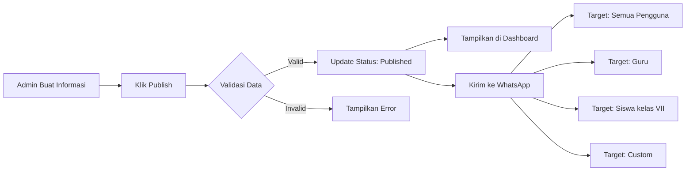

import {
    Card,
    CardGrid,
    Steps,
    Tabs,
    TabItem,
    Aside,
} from '@astrojs/starlight/components'

## Pengertian Informasi & Pengumuman

Modul Informasi adalah fitur untuk membuat dan menyebarkan pengumuman atau informasi penting kepada seluruh pengguna sistem. Informasi yang dipublikasikan dapat dilihat di dashboard dan otomatis dikirimkan melalui notifikasi WhatsApp.

<CardGrid>
    <Card title='Broadcast Otomatis' icon='rocket'>
        Informasi yang dipublish otomatis tersebar ke seluruh pengguna sistem
    </Card>
    <Card title='Notifikasi WhatsApp' icon='external'>
        Pengumuman penting langsung dikirim ke WhatsApp pengguna terdaftar
    </Card>
    <Card title='Target Audience' icon='star'>
        Pilih penerima: Semua, Guru, Siswa, Kelas Tertentu, atau Custom
    </Card>
    <Card title='Status Publikasi' icon='document'>
        Kelola dengan status: Draft, Published, Archived
    </Card>
</CardGrid>

---

## Jenis Informasi

### Berdasarkan Konten

<Tabs>
  <TabItem label="Pengumuman Umum">
    **Informasi untuk Semua** - Libur madrasah - Acara besar (porseni, study
    tour) - Perubahan jadwal - Update kebijakan madrasah **Target**: Seluruh
    pengguna sistem
  </TabItem>

<TabItem label='Pengumuman Akademik'>
    **Informasi Pembelajaran** - Jadwal ujian/ulangan - Pengumpulan tugas -
    Perubahan jadwal pelajaran - Rapat guru **Target**: Guru dan/atau siswa
    tertentu
</TabItem>

<TabItem label='Pengumuman Administratif'>
    **Informasi Administrasi** - Pembayaran SPP - Pengambilan rapor - Verifikasi
    data siswa - Update kartu presensi **Target**: Siswa/orang tua dan staff TU
</TabItem>

  <TabItem label="Pengumuman Darurat">
    **Informasi Mendesak** - Bencana alam - Perubahan mendadak - Keadaan darurat
    - Protokol keamanan **Target**: Semua, prioritas tinggi
  </TabItem>
</Tabs>

### Berdasarkan Prioritas

| Prioritas  | Icon | Keterangan                  | Contoh                    |
| ---------- | ---- | --------------------------- | ------------------------- |
| **Urgent** |      | Sangat penting dan mendesak | Libur mendadak, darurat   |
| **High**   |      | Penting dan perlu perhatian | Jadwal ujian, acara besar |
| **Medium** |      | Informasi standar           | Pengumuman biasa          |
| **Low**    |      | Informasi ringan            | Tips, reminder            |

---

## Membuat Informasi Baru

<Steps>

1. **Buka Menu Informasi**

    Navigasi ke **Data Master → Informasi** dari sidebar

2. **Klik Tombol Tambah**

    Klik **"+ Buat Pengumuman"** di pojok kanan atas

3. **Isi Detail Informasi**

    Lengkapi form dengan informasi berikut:
    - **Judul** (wajib) - Judul pengumuman yang menarik
    - **Konten** (wajib) - Isi pengumuman lengkap (mendukung rich text)
    - **Kategori** (wajib) - Pilih: Umum / Akademik / Administratif / Darurat
    - **Prioritas** (wajib) - Pilih: Urgent / High / Medium / Low
    - **Target Audience** (wajib) - Pilih penerima informasi
    - **Tanggal Mulai** (wajib) - Kapan informasi ditampilkan
    - **Tanggal Berakhir** (opsional) - Kapan informasi tidak ditampilkan lagi
    - **Lampiran** (opsional) - Upload file pendukung (PDF, gambar)

4. **Pilih Target Audience**

    Tentukan siapa yang akan menerima informasi:
    - Semua Pengguna
    - Guru/Pegawai
    - Siswa (semua atau kelas tertentu)
    - Staff TU
    - Wali Kelas
    - Custom (pilih manual)

5. **Tentukan Status Publikasi**
    - **Draft**: Belum dipublikasikan, hanya terlihat oleh pembuat
    - **Published**: Langsung dipublikasikan dan dikirim notifikasi WhatsApp
    - **Scheduled**: Dijadwalkan untuk dipublikasikan di waktu tertentu

6. **Simpan atau Publish**
    - Klik **"Simpan sebagai Draft"** untuk menyimpan tanpa publish
    - Klik **"Publish Sekarang"** untuk langsung mempublikasikan

</Steps>

<Aside type='caution' title='Perhatian!'>
    Setelah klik **"Publish"**, informasi akan **langsung dikirim ke WhatsApp**
    semua pengguna yang menjadi target. Pastikan konten sudah benar sebelum
    publish!
</Aside>

---

## Status Publikasi

### Draft

**Informasi belum dipublikasikan**

- Hanya terlihat oleh pembuat dan admin
- Dapat diedit kapan saja
- Tidak muncul di dashboard pengguna
- Tidak terkirim notifikasi WhatsApp

**Gunakan untuk**:

- Menyusun pengumuman yang belum final
- Review oleh atasan sebelum dipublikasikan
- Menjadwalkan publikasi di masa depan

### Published

**Informasi sudah dipublikasikan**

- Terlihat oleh semua target audience
- Muncul di dashboard pengguna
- **Otomatis terkirim notifikasi WhatsApp**
- Dapat diarsipkan jika sudah tidak relevan
- Edit dengan hati-hati (perubahan tidak ternotifikasi ulang)

**Otomatis terjadi saat**:

- Klik "Publish Sekarang"
- Jadwal publikasi tercapai (untuk scheduled)

### Archived

**Informasi yang sudah tidak aktif**

- Tidak muncul di dashboard pengguna
- Tetap tersimpan untuk histori
- Dapat di-restore jika diperlukan
- Tidak dapat diedit

**Gunakan untuk**:

- Informasi yang sudah kadaluarsa
- Pengumuman yang sudah selesai
- Membersihkan dashboard dari informasi lama

---

## Notifikasi WhatsApp

<Aside type='tip' title='Fitur Unggulan!'>
    Setiap informasi yang statusnya diubah menjadi **Published** akan **otomatis
    dikirimkan** ke WhatsApp pengguna yang menjadi target audience.
</Aside>

### Cara Kerja Notifikasi WhatsApp



### Format Pesan WhatsApp

**Template Notifikasi**:

```
*PENGUMUMAN MADRASAH*

*[Judul Pengumuman]*

[Isi konten pengumuman...]

 Tanggal: [DD/MM/YYYY]
 Waktu: [HH:MM WIB]

---
Dikirim otomatis dari Sistem Presensi RFID
MTs Negeri 1 Pandeglang
```

**Contoh Nyata**:

```
*PENGUMUMAN MADRASAH*

*Libur Hari Raya Idul Fitri 1446 H*

Assalamu'alaikum Wr. Wb.

Dengan ini kami informasikan bahwa:
- Libur Idul Fitri: 29 Maret - 7 April 2025
- Masuk kembali: Senin, 8 April 2025
- Harap persiapkan diri untuk KBM normal

Selamat merayakan Idul Fitri.
Mohon maaf lahir dan batin.

 Tanggal: 20 Maret 2025
 Waktu: 10:30 WIB

---
Dikirim otomatis dari Sistem Presensi RFID
MTs Negeri 1 Pandeglang
```

### Syarat Notifikasi WhatsApp Terkirim

<CardGrid>
  <Card title="Nomor Terdaftar" icon="approve-check">
    Pengguna harus memiliki nomor WhatsApp terdaftar di profil
  </Card>

<Card title='Status Published' icon='rocket'>
    Informasi harus berstatus **Published** (bukan Draft)
</Card>

<Card title='Target Valid' icon='star'>
    Pengguna termasuk dalam target audience yang dipilih
</Card>

  <Card title="Koneksi Aktif" icon="setting">
    Sistem WhatsApp Gateway dalam kondisi online dan aktif
  </Card>
</CardGrid>

---

## Target Audience

Tentukan siapa yang akan menerima informasi untuk memastikan pesan sampai ke penerima yang tepat.

### Pilihan Target

<Tabs>
  <TabItem label="Semua Pengguna">
    **Broadcast ke Seluruh Civitas** Cocok untuk: - Pengumuman libur madrasah -
    Perubahan kebijakan umum - Acara besar yang melibatkan semua **Penerima**:
    Guru, Staff, Siswa, Wali Kelas, semua role
  </TabItem>

<TabItem label='Per Role'>
    **Filter Berdasarkan Peran** - **Guru/Pegawai**: Rapat guru, update mengajar
    - **Siswa**: Jadwal ujian, tugas - **Staff TU**: Administrasi, pembayaran -
    **Wali Kelas**: Koordinasi kelas - **Orang Tua** (jika ada): Info kesiswaan
</TabItem>

<TabItem label='Per Kelas'>
    **Target Kelas Tertentu** Cocok untuk: - Pengumuman khusus Kelas VIII I
    (kelulusan) - Info jurusan tertentu - Acara kelas **Contoh**: Hanya siswa X
    Unggulan1, 2, 3
</TabItem>

  <TabItem label="Custom">
    **Pilih Manual** Cocok untuk: - Grup kecil - Panitia acara - Tim khusus
    **Cara**: Centang nama pengguna satu per satu
  </TabItem>
</Tabs>

---

## Mengedit Informasi

<Steps>

1. Klik ikon **Edit** pada row informasi yang ingin diubah
2. Perbarui konten atau pengaturan
3. Klik **"Simpan"**

</Steps>

<Aside type='caution' title='Catatan Penting!'>
    - Mengedit informasi yang sudah **Published** **TIDAK** akan mengirim
    notifikasi WhatsApp ulang - Jika perlu kirim notifikasi baru, buat
    pengumuman baru - Perubahan akan langsung terlihat di dashboard pengguna
</Aside>

---

## Menghapus Informasi

<Tabs>
  <TabItem label="Soft Delete (Arsip)">
    **Direkomendasikan** 1. Edit informasi 2. Ubah status menjadi **"Archived"**
    3. Informasi hilang dari dashboard tapi tetap tersimpan **Keuntungan**: -
    Data tetap ada untuk histori - Dapat di-restore jika diperlukan - Audit
    trail lengkap
  </TabItem>

  <TabItem label="Hard Delete (Hapus)">
    **Hati-hati!** 1. Klik ikon **Hapus** (trash) 2. Konfirmasi penghapusan 3.
    Data **dihapus permanen** **Peringatan**: - Data tidak dapat dikembalikan -
    Histori notifikasi hilang - Hanya untuk informasi yang salah input
  </TabItem>
</Tabs>

<Aside type='danger'>
    Informasi yang sudah dikirim ke WhatsApp **tidak dapat ditarik kembali**
    meskipun dihapus dari sistem. WhatsApp sudah terkirim ke device pengguna.
</Aside>

---

## Best Practice

<CardGrid>
  <Card title="Judul Jelas & Menarik" icon="star">
    Gunakan judul yang informatif dan langsung to the point agar pengguna
    langsung paham
  </Card>

<Card title='Konten Terstruktur' icon='document'>
    Gunakan bullet points, numbering, dan paragraph pendek agar mudah dibaca
</Card>

<Card title='Review Sebelum Publish' icon='approve-check'>
    Simpan sebagai Draft dulu, minta review atasan, baru publish untuk
    menghindari kesalahan
</Card>

  <Card title="Target Tepat" icon="rocket">
    Pilih target audience yang tepat agar tidak spam pengguna yang tidak relevan
  </Card>
</CardGrid>

---

## Contoh Kasus Penggunaan

### Kasus 1: Pengumuman Libur Mendadak

**Skenario**: Hujan deras, madrasah diliburkan

```
Judul:  LIBUR MENDADAK - Hujan Deras
Kategori: Darurat
Prioritas: Urgent
Target: Semua Pengguna
Status: Published (langsung)

Konten:
Assalamu'alaikum Wr. Wb.

Mengingat kondisi cuaca yang tidak memungkinkan,
madrasah DILIBURKAN untuk hari ini:

 Tanggal: Senin, 15 Januari 2025
 Pengumuman: 06:00 WIB

Kegiatan belajar mengajar akan dilanjutkan
kembali besok (Selasa, 16 Januari 2025)
dengan jadwal normal.

Harap informasikan ke teman dan keluarga.

Wassalamu'alaikum Wr. Wb.
```

**Hasil**: Notifikasi WhatsApp langsung terkirim ke 1000+ pengguna dalam hitungan menit.

### Kasus 2: Jadwal Ujian Semester

**Skenario**: Pengumuman jadwal UAS

```
Judul:  Jadwal Ujian Akhir Semester Genap 2024/2025
Kategori: Akademik
Prioritas: High
Target: Semua Siswa
Status: Scheduled (Publish 1 minggu sebelum ujian)

Konten:
Kepada seluruh siswa,

Berikut jadwal Ujian Akhir Semester Genap:

 Tanggal: 1-8 Juni 2025
 Waktu: 07:30 - selesai

Jadwal lengkap terlampir.

Persiapkan diri dengan baik!

[Lampiran: jadwal_uas_genap_2025.pdf]
```

### Kasus 3: Reminder Pembayaran SPP

**Skenario**: Reminder SPP bulan depan jatuh tempo

```
Judul: Reminder Pembayaran SPP Maret 2025
Kategori: Administratif
Prioritas: Medium
Target: Siswa (khusus yang belum bayar)
Status: Published

Konten:
Kepada orang tua/wali siswa,

Kami ingatkan bahwa pembayaran SPP bulan Maret 2025
akan jatuh tempo pada:

 Tanggal: 10 Maret 2025
 Nominal: Sesuai tagihan masing-masing

Pembayaran dapat dilakukan di:
- Bendahara madrasah (Loket TU)
- Transfer bank (rekening terlampir)

Terima kasih atas perhatiannya.
```

---

## Troubleshooting

### Notifikasi WhatsApp tidak terkirim

**Penyebab**:

- Nomor WhatsApp pengguna tidak terdaftar
- WhatsApp Gateway offline
- Koneksi internet bermasalah

**Solusi**:

1. Cek status WhatsApp Gateway di dashboard
2. Verifikasi nomor WA pengguna di profil mereka
3. Restart WhatsApp Gateway jika perlu
4. Kirim ulang notifikasi secara manual

### Informasi tidak muncul di dashboard pengguna

**Penyebab**:

- Status masih **Draft**
- Target audience tidak termasuk pengguna tersebut
- Tanggal mulai belum tercapai

**Solusi**:

1. Ubah status menjadi **Published**
2. Cek target audience, pastikan sudah benar
3. Cek tanggal mulai dan berakhir

### Notifikasi terkirim double

**Penyebab**: Klik tombol "Publish" berkali-kali

**Solusi**:

- Tunggu sampai proses selesai (loading indicator)
- Cek log pengiriman notifikasi
- Di masa depan, klik sekali saja dan tunggu

---

## Tips Keamanan

<Aside type='tip'>
    - Batasi akses pembuatan informasi hanya untuk **Super Admin**,
    **Operator**, dan **Kepala Madrasah** - Aktifkan fitur approval untuk
    pengumuman prioritas **Urgent** - Log semua aktivitas publikasi untuk audit
    - Backup database secara berkala untuk recovery
</Aside>

---

## Statistik & Monitoring

Dashboard informasi menyediakan statistik:

- Total informasi published
- Jumlah penerima per informasi
- Rate notifikasi WhatsApp terkirim
- Jumlah pengguna yang sudah membaca
- Tren publikasi informasi per bulan

---

## Langkah Selanjutnya

<CardGrid>
  <Card title="Setup WhatsApp Gateway" icon="external">
    Pastikan WhatsApp Gateway sudah terkonfigurasi dengan baik. [Hubungi Tim IT
    untuk Setup →](../memulai)
  </Card>

  <Card title="Update Profil Pengguna" icon="star">
    Pastikan semua pengguna memiliki nomor WhatsApp terdaftar di profil.
    [Pelajari Update Profile →](../update-profile)
  </Card>
</CardGrid>
