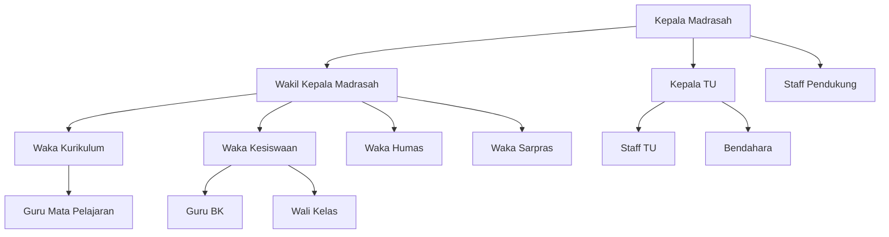
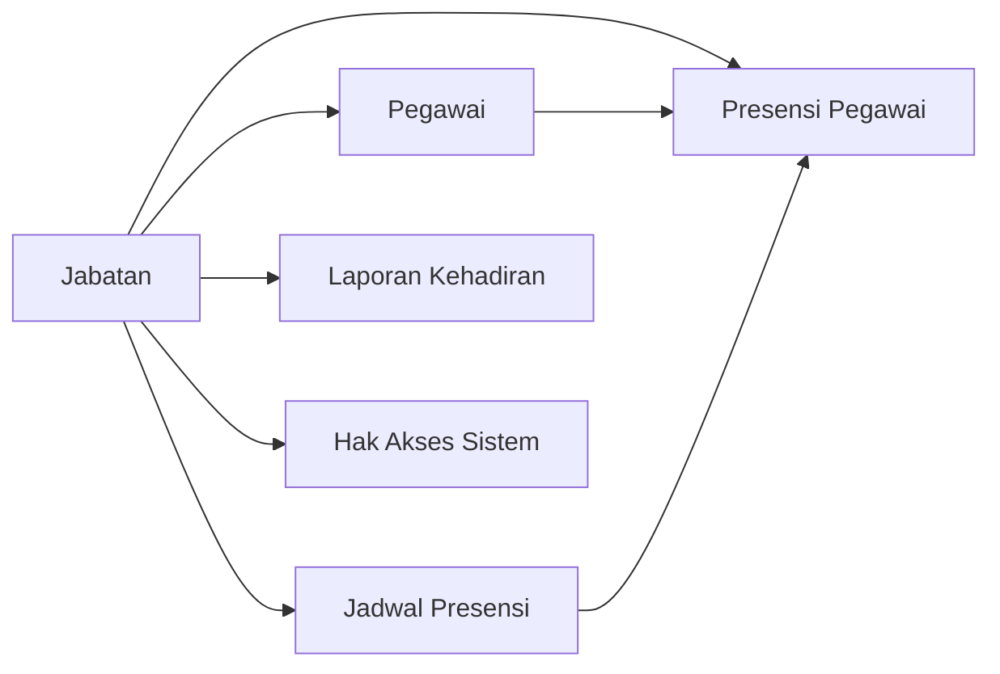

import {
  Card,
  CardGrid,
  Steps,
  Tabs,
  TabItem,
  Aside,
} from '@astrojs/starlight/components'

## Pengertian Jabatan

Jabatan adalah posisi struktural atau fungsional yang dimiliki pegawai dalam organisasi madrasah. Setiap jabatan memiliki tanggung jawab dan hak akses yang berbeda dalam sistem presensi.

<CardGrid>
  <Card title='Struktur Organisasi Jelas' icon='document'>
    Definisikan hirarki dan struktur kepegawaian madrasah secara sistematis
  </Card>
  <Card title='Hak Akses Terhubung' icon='setting'>
    Jabatan dapat dikaitkan dengan jadwal presensi dan hak akses sistem yang
    berbeda
  </Card>
  <Card title='Fleksibel & Customizable' icon='puzzle'>
    Tambahkan jabatan custom sesuai kebutuhan organisasi madrasah Anda
  </Card>
  <Card title='Pelaporan Terstruktur' icon='information'>
    Laporan kehadiran dapat dikelompokkan berdasarkan jabatan untuk analisis
  </Card>
</CardGrid>

---

## Jenis-jenis Jabatan

### Jabatan Struktural

Jabatan yang memiliki tanggung jawab manajerial dan pengambilan keputusan.

<Tabs>
  <TabItem label="Pimpinan">
    **Kepala Madrasah** - Pimpinan tertinggi madrasah - Akses penuh ke semua
    fitur sistem - Menerima rekap kehadiran semua pegawai **Wakil Kepala
    Madrasah** - Kurikulum, Kesiswaan, Humas, Sarana Prasarana - Akses sesuai
    bidang tugasnya
  </TabItem>

<TabItem label='Koordinator'>
  **Koordinator Program** - Ketua Program Keahlian - Koordinator BK -
  Koordinator Perpustakaan - Koordinator Laboratorium
</TabItem>

  <TabItem label="Staff TU">
    **Kepala TU** - Pimpinan staff administrasi **Staff TU** - Administrasi Umum
    - Bendahara - Operator
  </TabItem>
</Tabs>

### Jabatan Fungsional

Jabatan yang berhubungan dengan tugas teknis operasional.

| Jabatan                 | Deskripsi                        | Contoh                             |
| ----------------------- | -------------------------------- | ---------------------------------- |
| **Guru Mata Pelajaran** | Pengajar mata pelajaran tertentu | Guru Matematika, Guru Bahasa       |
| **Wali Kelas**          | Pembina kelas tertentu           | Wali Kelas VII Unggulan            |
| **Guru BK**             | Bimbingan dan konseling siswa    | Konselor                           |
| **Pustakawan**          | Pengelola perpustakaan           | Staff Perpustakaan                 |
| **Laboran**             | Pengelola laboratorium           | Laboran Unggulan, Laboran Komputer |

### Jabatan Pendukung

| Jabatan              | Deskripsi                          |
| -------------------- | ---------------------------------- |
| **Satpam/Penjaga**   | Keamanan dan kebersihan lingkungan |
| **Staff Kebersihan** | Maintenance kebersihan madrasah    |
| **Driver**           | Pengemudi kendaraan operasional    |
| **Teknisi**          | Maintenance peralatan teknis       |

---

## Struktur Organisasi

---

## Menambah Jabatan Baru

<Steps>

1. **Buka Menu Jabatan**

   Navigasi ke **Data Master → Jabatan** dari sidebar

2. **Klik Tombol Tambah**

   Klik tombol **"+ Tambah Jabatan"** di pojok kanan atas

3. **Isi Data Jabatan**

   Lengkapi form dengan informasi berikut:
   - **Nama Jabatan** (wajib) - Contoh: Wakil Kepala Kurikulum
   - **Kode Jabatan** (opsional) - Contoh: WAKA-KUR
   - **Kategori** (wajib) - Pilih: Struktural / Fungsional / Pendukung
   - **Deskripsi** (opsional) - Penjelasan singkat tugas dan tanggung jawab
   - **Jadwal Presensi** (wajib) - Pilih jadwal yang berlaku untuk jabatan ini
   - **Status** (wajib) - Aktif / Nonaktif

4. **Simpan Data**

   Klik tombol **"Simpan"** untuk menyimpan data jabatan

</Steps>

<Aside type='tip'>
  Gunakan **kode jabatan** yang singkat dan mudah diingat untuk mempercepat
  pencarian dan pelaporan.
</Aside>

---

## Mengatur Jadwal Presensi per Jabatan

Setiap jabatan dapat memiliki jadwal presensi yang berbeda sesuai dengan jam kerja.

### Contoh Skenario

<CardGrid>
  <Card title="Guru Mata Pelajaran" icon="star">
    **Jadwal**: 07:00 - 15:00 Mengikuti jam mengajar sesuai jadwal pelajaran
  </Card>

<Card title='Staff TU' icon='document'>
  **Jadwal**: 07:30 - 16:00 Jam kerja administrasi reguler
</Card>

<Card title='Satpam' icon='warning'>
  **Jadwal**: Shift (06:00 - 14:00 / 14:00 - 22:00) Bekerja dengan sistem shift
</Card>

  <Card title="Kepala Madrasah" icon="rocket">
    **Jadwal**: Fleksibel Tidak terikat jam presensi ketat
  </Card>
</CardGrid>

<Aside type='note'>
  Jadwal presensi harus sudah dibuat terlebih dahulu di menu **Data Master →
  Jadwal Presensi** sebelum dihubungkan dengan jabatan.
</Aside>

---

## Mengedit Data Jabatan

<Tabs>
  <TabItem label="Edit Cepat">
    1. Klik ikon **Edit** pada row jabatan 2. Ubah data yang diperlukan 3. Klik
    **"Simpan"**
  </TabItem>

<TabItem label='Nonaktifkan Jabatan'>
  Untuk jabatan yang sudah tidak digunakan: 1. Edit jabatan tersebut 2. Ubah
  **Status** menjadi **"Nonaktif"** 3. Simpan perubahan Jabatan nonaktif tidak
  akan muncul di dropdown saat menambah pegawai baru.
</TabItem>

  <TabItem label="Ubah Jadwal Presensi">
    Jika jam kerja jabatan berubah: 1. Edit jabatan 2. Pilih **Jadwal Presensi**
    yang baru 3. Simpan Perubahan berlaku mulai hari berikutnya.
  </TabItem>
</Tabs>

---

## Menghapus Jabatan

<Aside type="danger" title="Peringatan Penting!">
Jabatan **TIDAK DAPAT** dihapus jika:
- Masih ada pegawai aktif dengan jabatan tersebut
- Memiliki data historis presensi

**Solusi**: Pindahkan semua pegawai ke jabatan lain, atau ubah status jabatan menjadi **"Nonaktif"** sebagai gantinya.

</Aside>

<Steps>

1. Pastikan tidak ada pegawai dengan jabatan tersebut
2. Klik ikon **Hapus** (trash) pada row jabatan
3. Konfirmasi penghapusan dengan klik **"Ya, Hapus"**

</Steps>

---

## Hubungan Jabatan dengan Modul Lain

### Integrasi Sistem

- **Pegawai**: Setiap pegawai memiliki satu atau lebih jabatan
- **Jadwal Presensi**: Jadwal kerja disesuaikan dengan jabatan
- **Presensi**: Sistem validasi presensi berdasarkan jadwal jabatan
- **Laporan**: Rekap kehadiran dapat difilter dan dikelompokkan per jabatan
- **Hak Akses**: Role di sistem dapat dikaitkan dengan jabatan tertentu

---

## Best Practice Pengelolaan Jabatan

<CardGrid>
  <Card title="Standarisasi Nama" icon="approve-check">
    Gunakan nama jabatan yang sesuai dengan SK atau struktur organisasi resmi
    madrasah
  </Card>

<Card title='Dokumentasi Lengkap' icon='document'>
  Isi deskripsi jabatan dengan jelas untuk referensi dan onboarding pegawai baru
</Card>

<Card title='Review Berkala' icon='star'>
  Evaluasi struktur jabatan setiap tahun ajaran untuk menyesuaikan dengan
  kebutuhan
</Card>

  <Card title="Jangan Hapus Sembarangan" icon="warning">
    Nonaktifkan jabatan yang sudah tidak digunakan daripada menghapusnya untuk
    menjaga integritas data historis
  </Card>
</CardGrid>

---

## Contoh Kasus Penggunaan

### Kasus 1: Pegawai Memiliki Multi Jabatan

**Skenario**: Seorang guru merangkap sebagai Wali Kelas

**Solusi**:

- Jabatan utama: **Guru Mata Pelajaran** (untuk presensi utama)
- Jabatan tambahan: **Wali Kelas** (untuk tanggung jawab kelas)

Di sistem, pegawai dapat memiliki jabatan utama dan jabatan tambahan. Jadwal presensi mengikuti jabatan utama.

### Kasus 2: Perubahan Struktur Organisasi

**Skenario**: Ada pemekaran Wakil Kepala Madrasah dari 3 menjadi 4 bidang

**Solusi**:

1. Tambahkan jabatan baru: **Wakil Kepala Madrasah Bidang X**
2. Atur jadwal presensi sesuai kebutuhan
3. Assign pegawai yang bersangkutan ke jabatan baru
4. Jabatan lama tetap ada untuk data historis

### Kasus 3: Pegawai Shift

**Skenario**: Satpam bekerja dengan sistem shift

**Solusi**:

1. Buat 2 jadwal presensi berbeda:
   - Shift Pagi: 06:00 - 14:00
   - Shift Siang: 14:00 - 22:00
2. Buat 2 jabatan:
   - Satpam Shift Pagi
   - Satpam Shift Siang
3. Atau gunakan fitur manual override jadwal per pegawai

---

## Troubleshooting

### Tidak bisa menghapus jabatan

**Penyebab**: Masih ada pegawai aktif dengan jabatan tersebut

**Solusi**:

1. Cek daftar pegawai dengan jabatan tersebut di menu **Pegawai**
2. Pindahkan pegawai ke jabatan lain
3. Atau ubah status jabatan menjadi **"Nonaktif"**

### Jadwal presensi tidak muncul di dropdown

**Penyebab**: Jadwal presensi belum dibuat

**Solusi**:

1. Buat jadwal presensi terlebih dahulu di menu **Data Master → Jadwal Presensi**
2. Setelah jadwal tersedia, kembali ke form jabatan

### Pegawai presensi di waktu yang salah

**Penyebab**: Jadwal presensi jabatan tidak sesuai dengan jam kerja sebenarnya

**Solusi**:

1. Edit jabatan pegawai tersebut
2. Ubah jadwal presensi yang lebih sesuai
3. Atau buat jadwal presensi baru yang lebih tepat

---

## Tips Keamanan

<Aside type='tip'>
  - Batasi akses pengeditan jabatan hanya untuk **Super Admin** dan **Kepala
  TU** - Dokumentasikan setiap perubahan struktur organisasi untuk keperluan
  audit - Lakukan sinkronisasi dengan SK Kepala Madrasah terkait jabatan -
  Review hak akses sistem setiap kali ada perubahan jabatan penting
</Aside>

---

## Laporan Berdasarkan Jabatan

Sistem dapat menghasilkan laporan kehadiran yang dikelompokkan berdasarkan jabatan:

- **Rekap Kehadiran per Jabatan**: Persentase kehadiran guru, staff TU, dll
- **Perbandingan Antar Jabatan**: Analisis kedisiplinan berdasarkan jabatan
- **Tren Kehadiran**: Grafik kehadiran jabatan tertentu dalam periode waktu

---

## Langkah Selanjutnya

<CardGrid>
  <Card title="Kelola Data Pegawai" icon="star">
    Setelah jabatan dibuat, tambahkan pegawai dan assign jabatan kepada mereka.
    [Pelajari Data Pegawai →](../menu-pegawai/pegawai)
  </Card>

  <Card title="Atur Jadwal Presensi" icon="setting">
    Buat jadwal presensi yang sesuai dengan jam kerja setiap jabatan. [Pelajari
    Jadwal Presensi →](./jadwal-presensi)
  </Card>
</CardGrid>
