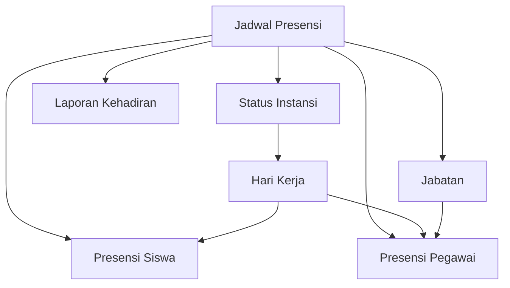

import {
    Card,
    CardGrid,
    Steps,
    Tabs,
    TabItem,
    Aside,
} from '@astrojs/starlight/components'

## Pengertian Jadwal Presensi

Jadwal Presensi adalah pengaturan waktu untuk presensi masuk dan pulang siswa serta pegawai. Sistem mendukung multiple jadwal untuk mengakomodasi berbagai kebutuhan seperti hari regular, hari khusus, atau shift kerja.

<CardGrid>
    <Card title='Fleksibel & Adaptif' icon='rocket'>
        Buat jadwal berbeda untuk hari biasa, hari Jumat, atau kondisi khusus
        lainnya
    </Card>
    <Card title='Toleransi Otomatis' icon='setting'>
        Sistem mendeteksi keterlambatan secara otomatis berdasarkan toleransi
        yang diatur
    </Card>
    <Card title='Multi Jadwal' icon='puzzle'>
        Dukung berbagai jadwal untuk pegawai shift, guru, siswa, dan staff
    </Card>
    <Card title='Integrasi Libur' icon='approve-check'>
        Otomatis menyesuaikan dengan hari libur nasional dan libur madrasah
    </Card>
</CardGrid>

---

## Jenis Jadwal Presensi

### Berdasarkan Waktu

<Tabs>
  <TabItem label="Presensi Masuk">
    **Waktu Tap Masuk** - Batas awal presensi masuk (contoh: 06:00) - Batas
    akhir presensi tepat waktu (contoh: 07:00) - Batas maksimal presensi masuk
    (contoh: 12:00) **Status**: - **Tepat Waktu**: Tap sebelum batas akhir -
    **Terlambat**: Tap setelah batas akhir tapi sebelum batas maksimal - 
    **Alpha**: Tidak tap sama sekali
  </TabItem>

  <TabItem label="Presensi Pulang">
    **Waktu Tap Pulang** - Batas awal presensi pulang (contoh: 15:00) - Batas
    normal pulang (contoh: 16:00) - Batas maksimal tap pulang (contoh: 20:00)
    **Status**: - **Normal**: Tap sesuai jadwal -  **Pulang Cepat**: Tap
    sebelum batas awal - **Lembur**: Tap setelah batas normal
  </TabItem>
</Tabs>

### Berdasarkan Hari

<CardGrid>
  <Card title="Hari Regular" icon="document">
    **Senin - Kamis** Jadwal normal sekolah Masuk: 07:00 | Pulang: 15:30
  </Card>

<Card title='Hari Jumat' icon='star'>
    **Jumat** Jadwal khusus hari Jumat Masuk: 07:00 | Pulang: 11:30
</Card>

<Card title='Hari Sabtu' icon='information'>
    **Sabtu (Swasta)** Untuk madrasah swasta Masuk: 07:00 | Pulang: 13:00
</Card>

  <Card title="Hari Libur" icon="approve-check">
    **Ahad & Libur Nasional** Tidak ada presensi Status: Libur
  </Card>
</CardGrid>

---

## Penyesuaian Otomatis Berdasarkan Status Instansi

<Aside type='note' title='Fitur Otomatis'>
    Sistem secara otomatis menyesuaikan jadwal presensi dan hari kerja
    berdasarkan status instansi yang dipilih.
</Aside>

### Status Instansi Negeri

**Hari Kerja**: Senin - Jumat (5 hari)

| Hari          | Status Presensi             | Laporan           |
| ------------- | --------------------------- | ----------------- |
| Senin - Kamis | Wajib Presensi              | Masuk rekap       |
| Jumat         | Wajib Presensi (Jam Khusus) | Masuk rekap       |
| Sabtu         | Libur                       | Tidak masuk rekap |
| Ahad          | Libur                       | Tidak masuk rekap |

### Status Instansi Swasta

**Hari Kerja**: Senin - Sabtu (6 hari)

| Hari          | Status Presensi | Laporan           |
| ------------- | --------------- | ----------------- |
| Senin - Jumat | Wajib Presensi  | Masuk rekap       |
| Sabtu         | Wajib Presensi  | Masuk rekap       |
| Ahad          | Libur           | Tidak masuk rekap |

<Aside type='tip'>
    Pengaturan status instansi (Negeri/Swasta) dilakukan di menu **Data Master →
    Instansi**. Perubahan status akan otomatis mempengaruhi jadwal presensi dan
    perhitungan laporan.
</Aside>

---

## Menambah Jadwal Baru

<Steps>

1. **Buka Menu Jadwal Presensi**

    Navigasi ke **Data Master → Jadwal Presensi**

2. **Klik Tombol Tambah**

    Klik **"+ Tambah Jadwal"** di pojok kanan atas

3. **Isi Informasi Dasar**
    - **Nama Jadwal** (wajib) - Contoh: "Jadwal Regular Senin-Kamis"
    - **Jenis** (wajib) - Pilih: Siswa / Pegawai / Umum
    - **Hari Berlaku** (wajib) - Centang hari yang berlaku
    - **Status** (wajib) - Aktif / Nonaktif

4. **Atur Waktu Presensi Masuk**
    - **Batas Awal Masuk**: 06:00 (earliest tap)
    - **Batas Tepat Waktu**: 07:00 (late threshold)
    - **Toleransi Keterlambatan**: 15 menit
    - **Batas Maksimal Masuk**: 12:00 (latest tap)

5. **Atur Waktu Presensi Pulang**
    - **Batas Awal Pulang**: 15:00 (earliest departure)
    - **Waktu Normal Pulang**: 15:30 (normal end time)
    - **Batas Maksimal Pulang**: 20:00 (latest tap)

6. **Simpan Jadwal**

    Klik **"Simpan"** untuk menyimpan konfigurasi

</Steps>

---

## Toleransi Keterlambatan

Sistem dapat mengakomodasi toleransi keterlambatan untuk menghindari sanksi yang terlalu ketat.

### Contoh Skenario

**Jadwal Masuk**: 07:00 WIB  
**Toleransi**: 15 menit

| Waktu Tap | Status      | Keterangan            |
| --------- | ----------- | --------------------- |
| 06:45     | Tepat Waktu | Masuk lebih awal      |
| 07:00     | Tepat Waktu | Tepat waktu           |
| 07:10     | Tepat Waktu | Masih dalam toleransi |
| 07:15     | Tepat Waktu | Batas toleransi       |
| 07:16     | Terlambat   | Melebihi toleransi    |
| 07:30     | Terlambat   | Terlambat 30 menit    |

<Aside type='caution'>
    Toleransi keterlambatan dapat diatur berbeda untuk: - Siswa: 0-15 menit
    (lebih ketat) - Pegawai: 15-30 menit (lebih fleksibel) - Shift Khusus:
    Custom sesuai kebutuhan
</Aside>

---

## Jadwal untuk Hari Khusus

### Jadwal Hari Jumat

Hari Jumat biasanya memiliki jadwal yang lebih pendek karena ada Sholat Jumat.

<Tabs>
  <TabItem label="Siswa">
    **Jadwal Siswa Hari Jumat** - Masuk: 07:00 - Pulang: 11:30 - Tidak ada KBM
    siang
  </TabItem>

<TabItem label='Guru'>
    **Jadwal Guru Hari Jumat** - Masuk: 07:00 - Pulang: 12:00 - Waktu untuk
    Sholat Jumat
</TabItem>

  <TabItem label="Staff TU">
    **Jadwal Staff hari Jumat** - Masuk: 07:30 - Pulang: 12:30 atau 14:00
    (fleksibel)
  </TabItem>
</Tabs>

### Jadwal Ramadan

Selama bulan Ramadan, jadwal dapat disesuaikan:

- **Masuk**: Tetap 07:00
- **Pulang**: Lebih awal (13:00 - 14:00)
- **Durasi**: Lebih pendek untuk mengakomodasi puasa

<Aside type='tip'>
    Buat jadwal khusus dengan nama "Jadwal Ramadan" dan aktifkan hanya saat
    bulan Ramadan. Nonaktifkan jadwal regular selama periode tersebut.
</Aside>

---

## Mengedit Jadwal Presensi

<Steps>

1. Klik ikon **Edit** pada row jadwal yang ingin diubah
2. Perbarui waktu atau pengaturan yang diperlukan
3. Klik **"Simpan"**

</Steps>

### Dampak Perubahan Jadwal

<Aside type='caution' title='Perhatian!'>
    Perubahan jadwal akan berlaku untuk presensi hari berikutnya. Data presensi
    yang sudah tercatat tidak akan berubah secara retroaktif.
</Aside>

**Yang Terpengaruh**:

- Presensi hari berikutnya
- Deteksi keterlambatan baru
- Laporan yang belum di-generate

**Yang TIDAK Terpengaruh**:

- Data presensi historis
- Laporan yang sudah di-export
- Statistik bulan sebelumnya

---

## Menonaktifkan Jadwal

Untuk jadwal yang sudah tidak digunakan atau jadwal sementara (Ramadan, libur):

<Steps>

1. Edit jadwal yang ingin dinonaktifkan
2. Ubah **Status** menjadi **"Nonaktif"**
3. Simpan perubahan

</Steps>

Jadwal nonaktif tidak akan digunakan untuk validasi presensi, tapi tetap tersimpan untuk keperluan histori.

---

## Hari Libur dan Pengecualian

### Jenis Hari Libur

<CardGrid>
  <Card title="Libur Nasional" icon="star">
    Hari libur yang ditetapkan pemerintah (Idul Fitri, Idul Adha, dll)
    **Status**: Otomatis libur
  </Card>

<Card title='Libur Madrasah' icon='document'>
    Libur khusus madrasah (study tour, acara internal) **Status**: Diatur manual
</Card>

<Card title='Cuti Bersama' icon='information'>
    Cuti bersama yang diatur pemerintah **Status**: Otomatis libur
</Card>

  <Card title="Hari Khusus" icon="approve-check">
    Acara tertentu yang mengubah jadwal (ujian, porseni) **Status**: Gunakan
    jadwal alternatif
  </Card>
</CardGrid>

### Mengatur Hari Libur Manual

Untuk hari libur khusus madrasah:

1. Navigasi ke **Informasi & Pengumuman**
2. Buat pengumuman dengan judul "Libur [Nama Acara]"
3. Sistem akan otomatis menandai hari tersebut sebagai libur
4. Atau atur manual di dashboard pada tanggal tersebut

---

## Hubungan dengan Modul Lain



### Integrasi Sistem

- **Presensi**: Validasi waktu tap berdasarkan jadwal aktif
- **Jabatan**: Pegawai menggunakan jadwal sesuai jabatannya
- **Status Instansi**: Negeri (5 hari) vs Swasta (6 hari)
- **Laporan**: Perhitungan kehadiran berdasarkan jadwal yang berlaku
- **Notifikasi**: Alert keterlambatan sesuai toleransi jadwal

---

## Best Practice

<CardGrid>
  <Card title="Buat Jadwal Template" icon="document">
    Buat template jadwal untuk regular, Jumat, Ramadan yang bisa digunakan
    setiap tahun
  </Card>

<Card title='Review Berkala' icon='star'>
    Evaluasi jadwal setiap semester untuk menyesuaikan dengan kebijakan baru
</Card>

<Card title='Toleransi Wajar' icon='approve-check'>
    Berikan toleransi yang realistis (10-15 menit) untuk menghindari sistem yang
    terlalu ketat
</Card>

  <Card title="Dokumentasi Perubahan" icon="information">
    Catat setiap perubahan jadwal untuk keperluan audit dan evaluasi
  </Card>
</CardGrid>

---

## Contoh Konfigurasi Lengkap

### Jadwal Regular Senin-Kamis (Siswa)

```
Nama Jadwal: Jadwal Siswa Senin-Kamis
Jenis: Siswa
Hari Berlaku: Senin, Selasa, Rabu, Kamis
Status: Aktif

PRESENSI MASUK:
- Batas Awal: 06:00
- Batas Tepat Waktu: 07:00
- Toleransi: 10 menit
- Batas Maksimal: 12:00

PRESENSI PULANG:
- Batas Awal: 15:00
- Waktu Normal: 15:30
- Batas Maksimal: 18:00
```

### Jadwal Jumat (Siswa)

```
Nama Jadwal: Jadwal Siswa Jumat
Jenis: Siswa
Hari Berlaku: Jumat
Status: Aktif

PRESENSI MASUK:
- Batas Awal: 06:00
- Batas Tepat Waktu: 07:00
- Toleransi: 10 menit
- Batas Maksimal: 10:00

PRESENSI PULANG:
- Batas Awal: 11:00
- Waktu Normal: 11:30
- Batas Maksimal: 13:00
```

### Jadwal Shift Satpam

```
Nama Jadwal: Satpam Shift Pagi
Jenis: Pegawai
Hari Berlaku: Senin-Sabtu
Status: Aktif

PRESENSI MASUK:
- Batas Awal: 05:30
- Batas Tepat Waktu: 06:00
- Toleransi: 5 menit
- Batas Maksimal: 08:00

PRESENSI PULANG:
- Batas Awal: 13:30
- Waktu Normal: 14:00
- Batas Maksimal: 15:00
```

---

## Troubleshooting

### Presensi siswa tidak tercatat padahal sudah tap

**Penyebab**: Tidak ada jadwal aktif untuk hari tersebut

**Solusi**:

1. Cek apakah jadwal untuk hari tersebut sudah dibuat dan statusnya **Aktif**
2. Pastikan hari tersebut tercentang di pengaturan **"Hari Berlaku"**
3. Verifikasi status instansi (Negeri/Swasta) sudah sesuai

### Semua siswa tercatat terlambat padahal tepat waktu

**Penyebab**: Batas tepat waktu di jadwal terlalu awal

**Solusi**:

1. Edit jadwal presensi
2. Sesuaikan **Batas Tepat Waktu** dan **Toleransi**
3. Atau lakukan koreksi manual di menu Riwayat Presensi

### Pegawai tidak bisa presensi di hari Sabtu

**Penyebab**: Status instansi adalah **Negeri** (Sabtu libur)

**Solusi**:

1. Jika memang pegawai harus presensi Sabtu, ubah jadwal khusus untuk pegawai tersebut
2. Atau gunakan presensi manual/koreksi

---

## Tips Keamanan

<Aside type='tip'>
    - Batasi akses edit jadwal hanya untuk **Super Admin** dan **Operator** -
    Lakukan backup jadwal sebelum melakukan perubahan besar - Informasikan
    perubahan jadwal ke seluruh pengguna minimal 1 hari sebelumnya - Pantau log
    perubahan jadwal untuk audit
</Aside>

---

## Langkah Selanjutnya

<CardGrid>
  <Card title="Hubungkan dengan Jabatan" icon="star">
    Setelah jadwal dibuat, hubungkan dengan jabatan pegawai yang sesuai.
    [Pelajari Jabatan →](./jabatan)
  </Card>

  <Card title="Lihat Presensi Real-Time" icon="rocket">
    Monitor presensi siswa dan pegawai berdasarkan jadwal yang sudah diatur.
    [Pelajari Riwayat Presensi →](../menu-pegawai/riwayat-presensi-pegawai)
  </Card>
</CardGrid>
