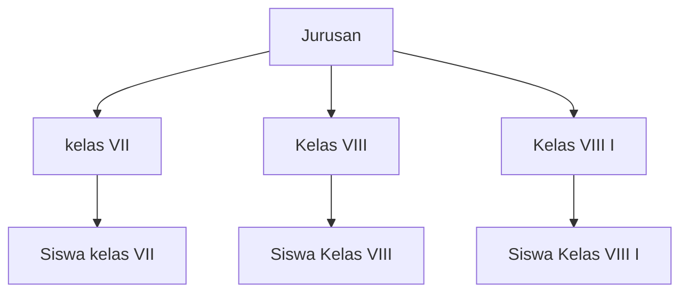

import {
    Card,
    CardGrid,
    Steps,
    Aside,
    Tabs,
    TabItem,
} from '@astrojs/starlight/components'

## Pengertian Jurusan

**Jurusan** atau Program Studi adalah kelompok bidang keahlian khusus yang ditawarkan kepada siswa, biasanya dimulai dari kelas VII (untuk SMA/MA/SMK). Jurusan membantu mengorganisir siswa berdasarkan minat dan bakat akademiknya.

### Contoh Jurusan

<CardGrid>
  <Card title="🔬 Unggulan(Ilmu Pengetahuan Alam)" icon="star">
    Fokus pada sains dan matematika **Mata Pelajaran Khas:** - Matematika
    Peminatan - Fisika - Kimia - Biologi
  </Card>

<Card title='IPS (Ilmu Pengetahuan Sosial)' icon='open-book'>
    Fokus pada ilmu sosial dan humaniora **Mata Pelajaran Khas:** - Ekonomi -
    Sosiologi - Geografi - Sejarah Peminatan
</Card>

<Card title='🕌 Keagamaan (Khusus MA)' icon='star'>
    Fokus pada studi agama Islam **Mata Pelajaran Khas:** - Tafsir-Ilmu Tafsir -
    Hadits-Ilmu Hadits - Fiqih-Ushul Fiqih - Bahasa Arab
</Card>

  <Card title=" Bahasa & Budaya" icon="heart">
    Fokus pada bahasa dan seni **Mata Pelajaran Khas:** - Bahasa Inggris -
    Bahasa Asing lain - Sastra - Antropologi
  </Card>
</CardGrid>

---

## Menambah Jurusan Baru

<Steps>

1. **Akses Menu Jurusan**

    Dashboard → Data Master → Jurusan

2. **Klik "Tambah Jurusan"**

    Klik tombol "+ Tambah Jurusan"

3. **Isi Kode Jurusan**

    ```
    Kode: IPA
    ```

    **Tips Kode:**
    - Singkat (2-4 karakter)
    - Huruf kapital
    - Mudah dikenali
    - Unik (tidak duplikat)

4. **Isi Nama Lengkap**

    ```
    Nama: Ilmu Pengetahuan Alam
    Nama Singkat: IPA
    ```

5. **Tambahkan Deskripsi**

    ```
    Deskripsi:
    Program Unggulanmempelajari ilmu sains dan matematika
    dengan fokus pada pengembangan kemampuan analitis,
    logika, dan pemecahan masalah saintifik.
    ```

6. **Set Status**

    ```
    Status: ● Aktif / ○ Nonaktif
    ```

7. **Konfigurasi Tambahan (Opsional)**
    - Kapasitas maksimal siswa per kelas
    - Kuota penerimaan per tahun
    - Warna identitas (untuk UI)
    - Icon/logo jurusan

8. **Simpan Data**

    Klik "Simpan" untuk membuat jurusan

</Steps>

<Aside type='tip' title='Naming Convention'>
    **Format yang direkomendasikan:** - Kode: ALL CAPS, no space (contoh:
    Unggulan, IPS, AGM) - Nama: Title Case (contoh: Ilmu Pengetahuan Alam) -
    Singkatan: ALL CAPS (contoh: IPA)
</Aside>

---

## Kode dan Nama Jurusan

### Standar Kode Jurusan

<Tabs>
  <TabItem label="Umum">

    | Kode | Nama Lengkap | |------|-------------| | **IPA** | Ilmu Pengetahuan
    Alam | | **IPS** | Ilmu Pengetahuan Sosial | | **BHS** | Bahasa dan Budaya |
    | **AGM** | Keagamaan/Agama |

  </TabItem>

<TabItem label='SMK/MAK'>
    | Kode | Nama Lengkap | |------|-------------| | **TKJ** | Teknik Komputer &
    Jaringan | | **RPL** | Rekayasa Perangkat Lunak | | **AKL** | Akuntansi &
    Keuangan Lembaga | | **OTKP** | Otomatisasi Tata Kelola Perkantoran | |
    **BDP** | Bisnis Daring & Pemasaran | | **TKR** | Teknik Kendaraan Ringan |
    | **TBSM** | Teknik Bisnis Sepeda Motor |
</TabItem>

  <TabItem label="Custom">
    Anda bisa membuat kode custom sesuai kebutuhan: **Contoh:** - **MIPA**:
    Matematika & Unggulan- **IIS**: Ilmu-Ilmu Sosial - **IBB**: Ilmu Bahasa & Budaya
    - **IPK**: Ilmu Pengetahuan Keagamaan **Rules:** - Maksimal 10 karakter -
    Hindari karakter khusus - Harus unique
  </TabItem>
</Tabs>

### Best Practice Penamaan

<CardGrid>
  <Card title="Good" icon="approve-check">
    **Kode:** - Unggulan✓ - TKJ ✓ - BHS ✓ **Nama:** - Ilmu Pengetahuan Alam ✓ -
    Teknik Komputer & Jaringan ✓ - Bahasa dan Budaya ✓
  </Card>

  <Card title="Bad" icon="error">
    **Kode:** - Unggulan(lowercase) ✗ - IPA-2024 (dengan tahun) ✗ - I.P.A. (dengan
    titik) ✗ **Nama:** - Unggulan(lowercase) ✗ - Unggulankelas VII (dengan tingkat) ✗ -
    Jurusan Unggulan(dengan prefix) ✗
  </Card>
</CardGrid>

---

## Mengedit Data Jurusan

<Steps>

1. **Cari Jurusan**

    Gunakan search box atau scroll list

2. **Klik Tombol Edit**

    Klik icon pada baris jurusan

3. **Ubah Data yang Diperlukan**
    - Nama jurusan
    - Deskripsi
    - Status
    - Konfigurasi lainnya

4. **Simpan Perubahan**

    Klik "Update"

</Steps>

<Aside type='caution' title='Hati-hati Ubah Kode!'>
    **Mengubah kode jurusan** dapat mempengaruhi: - Relasi dengan kelas existing
    - Laporan historis - Filter dan pencarian Jika memungkinkan, **jangan ubah
    kode** jurusan yang sudah digunakan. Buat jurusan baru jika perlu kode
    berbeda.
</Aside>

---

## Menghapus Jurusan

### Kapan Boleh Dihapus?

<Card title='Aman Dihapus Jika:' icon='approve-check'>
    - Belum ada kelas yang menggunakan - Belum ada siswa terdaftar - Belum
    digunakan di laporan - Jurusan duplikat atau salah input
</Card>

<Card title='Tidak Bisa Dihapus Jika:' icon='error'>
    - Sudah ada kelas aktif - Ada siswa terdaftar - Sudah digunakan di tahun
    ajaran sebelumnya - Ada data historis terkait
</Card>

### Cara Menghapus

<Steps>

1. **Cek Dependencies**

    Pastikan tidak ada kelas/siswa yang menggunakan

2. **Klik Tombol Hapus**

    Klik icon 🗑️ pada baris jurusan

3. **Konfirmasi Penghapusan**

    ```
    Hapus jurusan "Ilmu Pengetahuan Alam"?

    Action ini tidak bisa di-undo!

    [Batal]  [Ya, Hapus]
    ```

4. **Jurusan Terhapus**

    Data jurusan dihapus dari sistem

</Steps>

### Alternatif: Nonaktifkan

Jika tidak bisa dihapus, **nonaktifkan** jurusan:

<Card title=' Menonaktifkan Jurusan' icon='information'>
    **Keuntungan:** - Data historis tetap utuh - Tidak muncul di dropdown aktif
    - Bisa diaktifkan kembali - Laporan lama tetap valid **Cara:** 1. Edit
    jurusan 2. Set status: Nonaktif 3. Simpan
</Card>

---

## Hubungan Jurusan dengan Kelas

### Struktur Hierarki



### Penamaan Kelas Berdasarkan Jurusan

<Tabs>
  <TabItem label="Format Standar">
    **Pattern:** `[Tingkat] [Jurusan] [Nomor]` **Contoh:** ``` VII Unggulan X Unggulan2 X
    IPS 1 VIII Unggulan1 VIII Unggulan2 XII IPS 1 ```
  </TabItem>

<TabItem label='Format Alternatif'>
    **Pattern:** `[Jurusan]-[Tingkat]-[Nomor]` **Contoh:** ``` IPA-10-1 IPA-10-2
    IPS-11-1 IPS-12-1 ```
</TabItem>

  <TabItem label="Format Custom">
    Sesuaikan dengan kebutuhan sekolah: **Contoh MA:** ``` X MIA 1 (Matematika &
    IPA) X IIS 1 (Ilmu-Ilmu Sosial) X IPK 1 (Ilmu Pengetahuan Keagamaan) ```
  </TabItem>
</Tabs>

### One-to-Many Relationship

<Card title='Relasi Jurusan-Kelas' icon='bars'>
    **1 Jurusan dapat memiliki banyak Kelas:** Contoh Jurusan **IPA**: - VII
    Unggulan (30 siswa) - X Unggulan2 (32 siswa) - VIII Unggulan1 (28 siswa) -
    XI Unggulan2 (30 siswa) - XII Unggulan1 (25 siswa) - XII Unggulan2 (27
    siswa) **Total:** 6 kelas, 172 siswa
</Card>

---

## Konfigurasi Jurusan

### Kapasitas & Kuota

<Steps>

1. **Set Kapasitas Kelas**

    ```
    Kapasitas Max per Kelas: 32 siswa
    Kapasitas Min per Kelas: 20 siswa
    ```

    Sistem akan warning jika kelas over/under capacity

2. **Set Kuota Penerimaan**

    ```
    Kuota Tahun 2024/2025: 96 siswa (3 kelas)
    ```

    Untuk PPDB dan perencanaan kelas

3. **Rasio Guru:Siswa**

    ```
    Rasio Ideal: 1:24
    Minimum Guru: 4 orang
    ```

</Steps>

### Visual Identity

<Card title=' Branding Jurusan' icon='star'>
    **Untuk UI/UX yang lebih baik:** **Warna Identitas:** - IPA: Blue (#2563EB)
    - IPS: Green (#16A34A) - Keagamaan: Purple (#9333EA) - Bahasa: Yellow
    (#EAB308) **Icon/Logo:** - Upload icon khusus per jurusan - Muncul di
    dashboard, laporan - Format: SVG atau PNG **Benefit:** - Identifikasi visual
    cepat - UI lebih menarik - Branding konsisten
</Card>

---

## Filter & Pencarian

### Filter Berdasarkan Jurusan

Jurusan dapat digunakan untuk filter di berbagai modul:

<CardGrid>
  <Card title="Data Siswa" icon="user">
    Filter siswa berdasarkan jurusan untuk: - Export data per jurusan -
    Statistik jurusan - Komunikasi broadcast
  </Card>

<Card title='Laporan Presensi' icon='document'>
    Generate laporan kehadiran: - Per jurusan - Perbandingan antar jurusan -
    Trend kehadiran per jurusan
</Card>

<Card title='Kelas' icon='graduation'>
    Manajemen kelas: - List kelas per jurusan - Kapasitas per jurusan -
    Distribusi siswa
</Card>

  <Card title="Analisis" icon="bars">
    Analisis performa: - Rata-rata kehadiran per jurusan - Tingkat keterlambatan
    - Prestasi akademik
  </Card>
</CardGrid>

---

## Laporan Jurusan

### Statistik Jurusan

<Card title='Data Statistik' icon='chart'>
    **Otomatis ter-generate:** **Per Jurusan:** - Total siswa - Jumlah kelas -
    Rata-rata siswa per kelas - Tingkat kehadiran - Tingkat keterlambatan
    **Perbandingan:** - Jurusan dengan kehadiran terbaik - Trend performa antar
    jurusan - Distribusi siswa per jurusan **Akses:** Dashboard → Laporan →
    Statistik Jurusan
</Card>

### Export Data Jurusan

<Tabs>
  <TabItem label="List Siswa per Jurusan">
    **Format:** Excel/PDF **Konten:** - Daftar siswa per jurusan - Data lengkap
    (NIS, nama, kelas) - Kontak orang tua - Status aktif
  </TabItem>

<TabItem label='Rekap Presensi per Jurusan'>
    **Format:** Excel/PDF **Konten:** - Persentase kehadiran - Total
    hadir/izin/sakit/alpha - Perbandingan antar bulan - Grafik trend
</TabItem>

  <TabItem label="Profil Jurusan">
    **Format:** PDF **Konten:** - Deskripsi jurusan - Struktur kelas - Guru
    pengampu - Mata pelajaran peminatan - Prestasi
  </TabItem>
</Tabs>

---

## Import/Export Jurusan

### Import Massal

<Steps>

1. **Download Template**

    Klik "Download Template" di halaman Jurusan

2. **Isi Template Excel**

    ```
    | Kode | Nama | Deskripsi | Status |
    |------|------|-----------|--------|
    | Unggulan | Ilmu Pengetahuan Alam | ... | Aktif |
    | IPS  | Ilmu Pengetahuan Sosial | ... | Aktif |
    ```

3. **Upload File**

    Drag & drop atau browse file .xlsx

4. **Validasi**

    Sistem validasi data otomatis

5. **Import**

    Klik "Import" setelah validasi sukses

</Steps>

### Export Data

<Card title='Export Options' icon='hard-drive'>
    **Format tersedia:** - Excel (.xlsx): Untuk edit massal - CSV (.csv): Untuk
    integrasi - PDF (.pdf): Untuk dokumentasi **Filter sebelum export:** -
    Status: Aktif/Nonaktif/Semua - Ada siswa: Ya/Tidak - Tahun ajaran tertentu
</Card>

---

## Best Practices

<CardGrid>
  <Card title=" Perencanaan" icon="list-format">
    **Sebelum tambah jurusan baru:** - Survey minat siswa - Cek ketersediaan
    guru - Analisis kebutuhan pasar - Persiapkan fasilitas - Budget planning
  </Card>

<Card title='Konsistensi' icon='star'>
    **Maintain standar:** - Naming convention konsisten - Kode unik dan jelas -
    Deskripsi informatif - Update berkala - Dokumentasi lengkap
</Card>

<Card title='Monitoring' icon='bars'>
    **Review berkala:** - Kapasitas vs demand - Tingkat kehadiran - Performa
    akademik - Feedback siswa - Evaluasi kurikulum
</Card>

  <Card title="Adaptasi" icon="refresh">
    **Fleksibilitas:** - Sesuaikan dengan kurikulum baru - Response to market
    needs - Technology integration - Continuous improvement
  </Card>
</CardGrid>

---

## FAQ

<details>
<summary>**Berapa jurusan maksimal yang bisa dibuat?**</summary>

Tidak ada batasan hard limit. Namun untuk madrasah umum:

- MTs: Biasanya tidak ada jurusan (kelas reguler)
- MA/SMA: 2-4 jurusan (Unggulan, IPS, Agama, Bahasa)
- SMK/MAK: 3-8 jurusan tergantung kemampuan

</details>

<details>
<summary>**Bisakah siswa pindah jurusan?**</summary>

Bisa, dengan prosedur:

1. Request dari siswa/orang tua
2. Approval wali kelas & kepala sekolah
3. Edit data siswa → ubah kelas ke jurusan baru
4. System akan track history perpindahan

</details>

<details>
<summary>**Bagaimana jika jurusan ditutup?**</summary>

**Langkah:**

1. Nonaktifkan jurusan (jangan hapus)
2. Siswa existing tetap bisa lanjut sampai lulus
3. Tidak terima siswa baru di jurusan tersebut
4. Kelas existing tetap operasional
5. Arsipkan data setelah semua siswa lulus

</details>

<details>
<summary>**Apakah MTs perlu setup jurusan?**</summary>

**Tidak wajib.** MTs biasanya tidak ada penjurusan. Namun bisa dibuat kategori:

- Kelas Reguler
- Kelas Tahfidz
- Kelas Bilingual
- Kelas Akselerasi

Tetap gunakan fitur jurusan untuk kategorisasi ini.

</details>

---

## Troubleshooting

<Tabs>
  <TabItem label="Kode Duplikat">
    **Error:** "Kode jurusan sudah digunakan" **Solusi:** - Gunakan kode berbeda
    - Cek jurusan nonaktif (mungkin ada) - Atau edit jurusan existing
  </TabItem>

<TabItem label='Tidak Bisa Hapus'>
    **Error:** "Jurusan sedang digunakan" **Solusi:** - Cek kelas yang masih
    aktif - Nonaktifkan jurusan daripada hapus - Atau move siswa ke jurusan lain
    dulu
</TabItem>

  <TabItem label="Import Gagal">
    **Error:** Berbagai error saat import **Solusi:** - Gunakan template resmi -
    Cek kode tidak duplikat - Pastikan format Excel benar - Lihat error log
    untuk detail
  </TabItem>
</Tabs>

---

## Langkah Selanjutnya

<CardGrid>
  <Card title="Setup Kelas" icon="graduation">
    Buat kelas berdasarkan jurusan [Panduan Kelas →](/menu-data-master/kelas/)
  </Card>

<Card title='Tambah Mata Pelajaran' icon='book'>
    Input mapel peminatan per jurusan [Panduan Mata Pelajaran
    →](/menu-data-master/mata-pelajaran/)
</Card>

  <Card title=" Data Master" icon="left-arrow">
    Kembali ke overview [Data Master →](/menu-data-master/)
  </Card>
</CardGrid>

---

<Aside type='tip' title='Pro Tips'>
    - Buat jurusan sebelum tahun ajaran dimulai - Konsultasi dengan kurikulum
    dan guru - Perhatikan tren dan kebutuhan industri - Survey minat siswa baru
    setiap tahun - Document rasionale setiap keputusan
</Aside>
