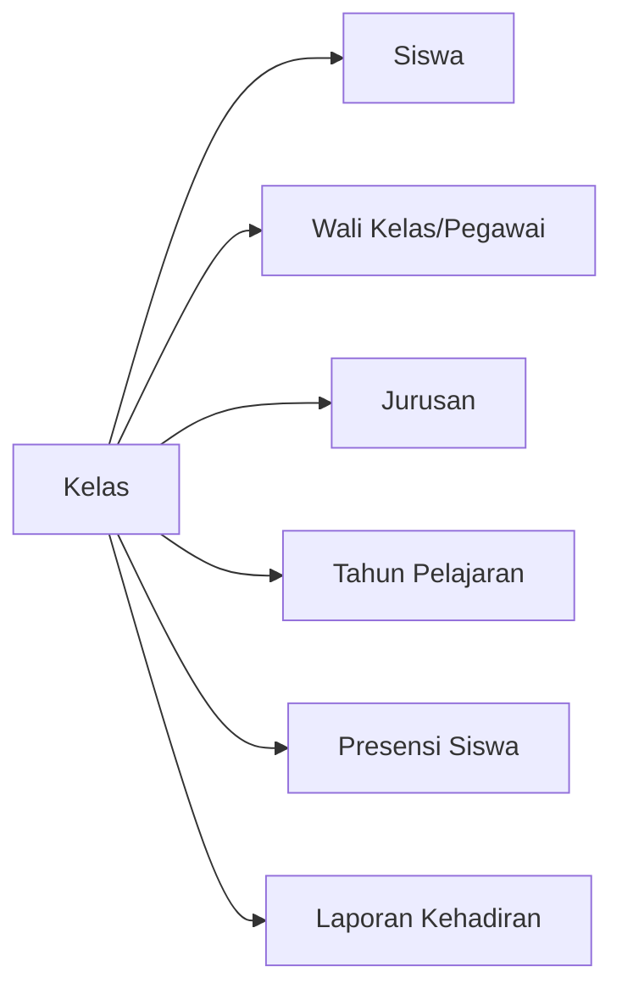

import {
  Card,
  CardGrid,
  Steps,
  Tabs,
  TabItem,
  Aside,
} from '@astrojs/starlight/components'

## Pengertian Kelas

Kelas adalah rombongan belajar yang mengelompokkan siswa berdasarkan tingkat dan jurusan. Setiap kelas memiliki wali kelas yang bertanggung jawab terhadap siswa dalam kelasnya.

<CardGrid>
  <Card title='Struktur Terorganisir' icon='document'>
    Kelompokkan siswa berdasarkan tingkat dan jurusan untuk memudahkan manajemen
  </Card>
  <Card title='Wali Kelas' icon='star'>
    Setiap kelas memiliki wali kelas yang mengawasi kehadiran dan perkembangan
    siswa
  </Card>
  <Card title='Kapasitas Fleksibel' icon='rocket'>
    Atur kapasitas maksimal siswa per kelas sesuai standar pendidikan
  </Card>
  <Card title='Mudah Dipindah' icon='puzzle'>
    Transfer siswa antar kelas dengan mudah untuk kenaikan tingkat atau
    penjurusan ulang
  </Card>
</CardGrid>

---

## Struktur Penamaan Kelas

Format penamaan kelas mengikuti standar: **[Tingkat] [Jurusan] [Nomor Rombel]**

<Aside type='tip' title='Contoh Penamaan'>
  - **VII Unggulan** → Kelas 10 UnggulanRombel 1 - **XI TKJ 2** → Kelas 11
  Teknik Komputer Jaringan Rombel 2 - **XII IPS 3** → Kelas 12 IPS Rombel 3
</Aside>

### Komponen Penamaan

| Komponen         | Keterangan                   | Contoh        |
| ---------------- | ---------------------------- | ------------- |
| **Tingkat**      | VII, VIII, IX (10, 11, 12)   | VII, VIII, IX |
| **Jurusan**      | Unggulan, IPS, TKJ, RPL, dll | Unggulan, TKJ |
| **Nomor Rombel** | Urutan rombongan belajar     | 1, 2, 3       |

---

## Menambah Kelas Baru

<Steps>

1. **Buka Menu Kelas**

   Navigasi ke **Data Master → Kelas** dari sidebar

2. **Klik Tombol Tambah**

   Klik tombol **"+ Tambah Kelas"** di pojok kanan atas

3. **Isi Data Kelas**

   Lengkapi form dengan informasi berikut:
   - **Nama Kelas** (wajib) - Format: VII Unggulan
   - **Tingkat** (wajib) - Pilih X, XI, atau XII
   - **Jurusan** (wajib) - Pilih dari daftar jurusan
   - **Wali Kelas** (opsional) - Pilih pegawai sebagai wali kelas
   - **Kapasitas Maksimal** (wajib) - Contoh: 36 siswa
   - **Tahun Pelajaran** (wajib) - Otomatis tahun aktif

4. **Simpan Data**

   Klik tombol **"Simpan"** untuk menyimpan data kelas

</Steps>

<Aside type='note'>
  Pastikan jurusan sudah dibuat terlebih dahulu di menu **Data Master →
  Jurusan** sebelum menambah kelas.
</Aside>

---

## Mengatur Wali Kelas

Setiap kelas sebaiknya memiliki wali kelas yang bertanggung jawab.

<Tabs>
  <TabItem label="Saat Tambah Kelas">
    Pilih wali kelas langsung saat membuat kelas baru dari dropdown **Wali
    Kelas**
  </TabItem>

<TabItem label='Edit Kelas Existing'>
  1. Klik ikon **Edit** pada kelas yang ingin diubah 2. Pilih pegawai dari
  dropdown **Wali Kelas** 3. Klik **Simpan**
</TabItem>

  <TabItem label="Ganti Wali Kelas">
    Wali kelas dapat diganti kapan saja dengan mengedit data kelas dan memilih
    pegawai yang berbeda
  </TabItem>
</Tabs>

<Aside type='caution' title='Batasan Wali Kelas'>
  Satu pegawai dapat menjadi wali kelas di lebih dari satu kelas, namun
  disarankan maksimal 2 kelas untuk efektivitas pengawasan.
</Aside>

---

## Kapasitas Siswa

Atur batas maksimal siswa per kelas untuk menjaga kualitas pembelajaran.

### Standar Kapasitas

- **Kapasitas Ideal**: 32-36 siswa per kelas
- **Kapasitas Minimum**: 20 siswa
- **Kapasitas Maksimum**: 40 siswa (sesuai Permendikbud)

<Aside type='tip'>
  Sistem akan memberikan **warning** jika jumlah siswa melebihi kapasitas yang
  ditetapkan, namun tetap dapat menambah siswa dalam kondisi darurat.
</Aside>

---

## Memindahkan Siswa Antar Kelas

<Steps>

1. **Buka Data Siswa**

   Navigasi ke **Menu Siswa → Siswa**

2. **Pilih Siswa**

   Centang siswa yang akan dipindahkan (dapat multiple selection)

3. **Pilih Aksi Bulk**

   Klik dropdown **"Aksi"** dan pilih **"Pindah Kelas"**

4. **Pilih Kelas Tujuan**

   Pilih kelas tujuan dari dropdown yang tersedia

5. **Konfirmasi Perpindahan**

   Klik **"Proses"** dan konfirmasi perpindahan

</Steps>

<Aside type='note'>
  Riwayat perpindahan kelas akan tercatat dalam log sistem untuk keperluan
  audit.
</Aside>

### Skenario Perpindahan Kelas

<CardGrid>
  <Card title='Kenaikan Tingkat' icon='rocket'>
    Perpindahan massal siswa dari kelas VII ke XI, atau XI ke XII di akhir tahun
    ajaran
  </Card>
  <Card title='Penjurusan Ulang' icon='puzzle'>
    Siswa pindah jurusan karena minat atau prestasi akademik
  </Card>
  <Card title='Pemerataan Kelas' icon='setting'>
    Redistribusi siswa untuk menyeimbangkan jumlah per kelas
  </Card>
</CardGrid>

---

## Mengedit Data Kelas

<Steps>

1. Klik ikon **Edit** (pensil) pada row kelas yang ingin diubah
2. Perbarui informasi yang diperlukan
3. Klik **"Simpan"** untuk menyimpan perubahan

</Steps>

### Yang Dapat Diedit

- Nama kelas
- Wali kelas
- Kapasitas maksimal
- Tingkat dan jurusan (harus buat kelas baru)

<Aside type='caution'>
  Perubahan data kelas akan mempengaruhi laporan presensi dan statistik yang
  sudah ada.
</Aside>

---

## Menghapus Kelas

<Aside type="danger" title="Peringatan Penting!">
Kelas **TIDAK DAPAT** dihapus jika:
- Masih ada siswa aktif dalam kelas tersebut
- Memiliki data presensi historis

Pindahkan semua siswa terlebih dahulu sebelum menghapus kelas.

</Aside>

<Steps>

1. Pastikan kelas sudah kosong (0 siswa)
2. Klik ikon **Hapus** (trash) pada row kelas
3. Konfirmasi penghapusan dengan klik **"Ya, Hapus"**

</Steps>

---

## Hubungan Kelas dengan Modul Lain

### Integrasi Sistem

- **Siswa**: Setiap siswa terikat pada satu kelas aktif
- **Jurusan**: Kelas merupakan turunan dari jurusan
- **Wali Kelas**: Pegawai yang bertanggung jawab atas kelas
- **Presensi**: Data presensi dikelompokkan berdasarkan kelas
- **Laporan**: Rekap kehadiran dapat difilter per kelas

---

## Best Practice

<CardGrid>
  <Card title='Penamaan Konsisten' icon='approve-check'>
    Gunakan format penamaan yang konsisten untuk semua kelas agar mudah dicari
    dan dikelola
  </Card>
  <Card title='Update Wali Kelas' icon='star'>
    Pastikan setiap kelas memiliki wali kelas yang aktif dan dapat dihubungi
  </Card>
  <Card title='Monitoring Kapasitas' icon='warning'>
    Pantau jumlah siswa per kelas secara berkala agar tidak melebihi kapasitas
    ideal
  </Card>
  <Card title='Arsip Kelas Lama' icon='document'>
    Jangan hapus kelas lama, biarkan untuk keperluan histori dan laporan
    retrospektif
  </Card>
</CardGrid>

---

## Troubleshooting

### Tidak bisa menambah siswa ke kelas

**Penyebab**: Kelas sudah mencapai kapasitas maksimal

**Solusi**:

1. Tingkatkan kapasitas kelas di menu edit
2. Atau pindahkan beberapa siswa ke kelas lain

### Wali kelas tidak muncul di dropdown

**Penyebab**: Pegawai belum terdaftar atau tidak aktif

**Solusi**:

1. Pastikan pegawai sudah ditambahkan di menu **Data Master → Pegawai**
2. Cek status pegawai apakah masih aktif

### Tidak bisa hapus kelas

**Penyebab**: Masih ada siswa aktif dalam kelas

**Solusi**:

1. Pindahkan semua siswa ke kelas lain terlebih dahulu
2. Atau nonaktifkan kelas tanpa menghapusnya

---

## Tips Keamanan

<Aside type='tip'>
  - Batasi akses pengeditan kelas hanya untuk **Super Admin** dan **Operator** -
  Lakukan backup data sebelum melakukan perpindahan kelas massal - Catat setiap
  perubahan struktur kelas untuk dokumentasi internal
</Aside>

---

## Langkah Selanjutnya

<CardGrid>
  <Card title="Kelola Siswa" icon="open-book">
    Setelah kelas dibuat, tambahkan siswa ke dalam kelas masing-masing.
    [Pelajari Data Siswa →](../menu-siswa/siswa)
  </Card>

  <Card title="Atur Jadwal Presensi" icon="setting">
    Konfigurasi jadwal presensi untuk setiap tingkat atau kelas khusus.
    [Pelajari Jadwal Presensi →](./jadwal-presensi)
  </Card>
</CardGrid>
