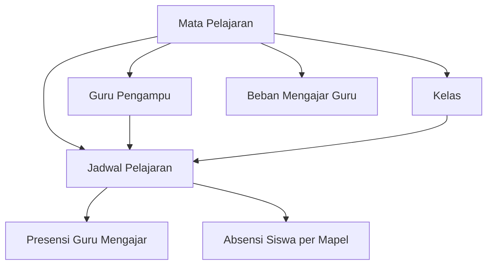

import {
  Card,
  CardGrid,
  Steps,
  Tabs,
  TabItem,
  Aside,
} from "@astrojs/starlight/components";

## Pengertian Mata Pelajaran

Mata Pelajaran adalah database seluruh mata pelajaran yang diajarkan di madrasah. Data ini digunakan sebagai acuan untuk penyusunan jadwal pelajaran dan penugasan guru pengampu.

<CardGrid>
  <Card title="Terorganisir" icon="document">
    Kelola seluruh mata pelajaran dengan kode dan kategori yang jelas
  </Card>
  <Card title="Guru Pengampu" icon="star">
    Hubungkan mata pelajaran dengan guru yang mengampu
  </Card>
  <Card title="Kategori Fleksibel" icon="puzzle">
    Kelompokkan mapel: Wajib, Peminatan, Muatan Lokal, Ekstrakurikuler
  </Card>
  <Card title="Integrasi Jadwal" icon="rocket">
    Data mapel terintegrasi dengan sistem jadwal pelajaran
  </Card>
</CardGrid>

---

## Kategori Mata Pelajaran

### Mata Pelajaran Wajib

Mata pelajaran yang wajib diikuti oleh seluruh siswa sesuai kurikulum nasional.

<Tabs>
  <TabItem label="Kelompok A (Umum)">
    **Mata Pelajaran Umum** - Pendidikan Agama Islam - Pendidikan Pancasila dan
    Kewarganegaraan - Bahasa Indonesia - Matematika - Sejarah Indonesia - Bahasa
    Inggris
  </TabItem>

<TabItem label="Kelompok B (Umum)">
  **Mata Pelajaran Penunjang** - Seni Budaya - Pendidikan Jasmani, Olahraga, dan
  Kesehatan - Prakarya dan Kewirausahaan
</TabItem>

  <TabItem label="Kelompok C (Peminatan)">
    **Sesuai Jurusan** - **IPA**: Matematika, Fisika, Kimia, Biologi - **IPS**:
    Ekonomi, Sosiologi, Geografi, Sejarah - **Bahasa**: Bahasa Asing, Sastra,
    Antropologi
  </TabItem>
</Tabs>

### Mata Pelajaran Khusus Madrasah

| Kategori            | Mata Pelajaran           | Keterangan     |
| ------------------- | ------------------------ | -------------- |
| **Rumpun PAI**      | Al-Qur'an Hadits         | Wajib          |
|                     | Akidah Akhlak            | Wajib          |
|                     | Fiqih                    | Wajib          |
|                     | Sejarah Kebudayaan Islam | Wajib          |
|                     | Bahasa Arab              | Wajib          |
| **Muatan Lokal**    | Bahasa Daerah            | Sesuai wilayah |
|                     | Kearifan Lokal           | Opsional       |
| **Ekstrakurikuler** | Tahfidz                  | Pilihan        |
|                     | Pramuka                  | Wajib          |
|                     | PMR, Paskibra            | Pilihan        |

---

## Kode Mata Pelajaran

Setiap mata pelajaran memiliki kode unik untuk memudahkan identifikasi dan pencatatan.

### Format Kode

**[KATEGORI]-[SINGKATAN]**

<Aside type="tip" title="Contoh Kode">
  - **PAI-QH** → Pendidikan Agama Islam - Al-Qur'an Hadits - **MTK-01** →
  Matematika Wajib - **IPA-FIS** → Unggulan- Fisika - **BHS-ING** → Bahasa
  Inggris - **MUL-BJW** → Muatan Lokal - Bahasa Jawa - **EKSKUL-THF** →
  Ekstrakurikuler - Tahfidz
</Aside>

### Manfaat Kode

- Memudahkan pencarian di sistem
- Standarisasi pelaporan
- Integrasi dengan sistem jadwal
- Export data untuk aplikasi lain

---

## Menambah Mata Pelajaran Baru

<Steps>

1. **Buka Menu Mata Pelajaran**

   Navigasi ke **Data Master → Mata Pelajaran**

2. **Klik Tombol Tambah**

   Klik **"+ Tambah Mata Pelajaran"** di pojok kanan atas

3. **Isi Data Mata Pelajaran**

   Lengkapi form dengan informasi berikut:
   - **Kode Mapel** (wajib) - Contoh: MTK-01
   - **Nama Mata Pelajaran** (wajib) - Contoh: Matematika Wajib
   - **Nama Singkat** (opsional) - Contoh: MTK
   - **Kategori** (wajib) - Pilih: Wajib / Peminatan / Muatan Lokal / Ekstrakurikuler
   - **Kelompok** (wajib) - Pilih: A / B / C
   - **Rumpun** (opsional) - Contoh: MUnggulan, IPS, Bahasa
   - **Beban SKS/Jam** (wajib) - Contoh: 4 jam/minggu
   - **Status** (wajib) - Aktif / Nonaktif

4. **Atur Guru Pengampu** (Opsional)
   - Pilih guru dari dropdown
   - Satu mapel dapat memiliki beberapa guru pengampu

5. **Simpan Data**

   Klik **"Simpan"** untuk menyimpan data mata pelajaran

</Steps>

<Aside type="note">
  Pastikan data guru sudah lengkap di menu **Data Master → Pegawai** sebelum
  menambahkan guru pengampu.
</Aside>

---

## Mengatur Guru Pengampu

Setiap mata pelajaran dapat memiliki satu atau lebih guru pengampu.

<Tabs>
  <TabItem label="Single Pengampu">
    **Satu Guru untuk Semua Kelas** Cocok untuk: - Mapel dengan guru spesialis -
    Sekolah dengan jumlah kelas sedikit Contoh: Guru Matematika mengajar semua
    kelas VII, VIII, IX
  </TabItem>

<TabItem label="Multiple Pengampu">
  **Beberapa Guru untuk Kelas Berbeda** Cocok untuk: - Mapel dengan banyak
  rombel - Pembagian beban mengajar Contoh: - Guru A: Matematika VII Unggulan, 2
  - Guru B: Matematika X Unggulan3, 4
</TabItem>

  <TabItem label="Team Teaching">
    **Kolaborasi Beberapa Guru** Cocok untuk: - Mata pelajaran praktikum - Kelas
    dengan jumlah siswa besar Contoh: Praktikum Kimia diampu 2 guru (teori +
    praktik)
  </TabItem>
</Tabs>

### Menambah Guru Pengampu

<Steps>

1. Edit mata pelajaran yang sudah ada
2. Di bagian **Guru Pengampu**, klik **"+ Tambah Guru"**
3. Pilih nama guru dari dropdown
4. Tentukan kelas yang diampu (opsional)
5. Klik **"Simpan"**

</Steps>

---

## Beban SKS dan Jam Pelajaran

Setiap mata pelajaran memiliki alokasi waktu (beban jam) sesuai kurikulum.

### Standar Beban Jam

| Kategori Mapel      | Beban Jam/Minggu | Keterangan                           |
| ------------------- | ---------------- | ------------------------------------ |
| **Mapel Wajib A**   | 2-4 jam          | Matematika, B. Indonesia, B. Inggris |
| **Mapel Wajib B**   | 2-3 jam          | Seni, Penjas, Prakarya               |
| **Mapel Peminatan** | 3-4 jam          | Fisika, Kimia, Biologi, dll          |
| **Mapel PAI**       | 2 jam            | Per rumpun (QH, Akidah, Fiqih, SKI)  |
| **Muatan Lokal**    | 2 jam            | Bahasa Daerah, dll                   |
| **Ekstrakurikuler** | 2-4 jam          | Tahfidz, Pramuka, dll                |

<Aside type="note">
  Total beban belajar siswa dalam seminggu disesuaikan dengan struktur kurikulum
  yang berlaku (Kurikulum 2013 atau Kurikulum Merdeka).
</Aside>

---

## Mengedit Data Mata Pelajaran

<Steps>

1. Klik ikon **Edit** pada row mata pelajaran yang ingin diubah
2. Perbarui informasi yang diperlukan
3. Klik **"Simpan"**

</Steps>

### Yang Dapat Diedit

- Nama mata pelajaran
- Guru pengampu
- Beban jam
- Kategori dan kelompok
- Kode (hati-hati, akan mempengaruhi jadwal existing)

<Aside type="caution">
  Perubahan kode mata pelajaran dapat mempengaruhi jadwal pelajaran yang sudah
  dibuat. Pastikan melakukan sinkronisasi setelah mengubah kode.
</Aside>

---

## Menghapus Mata Pelajaran

<Aside type="danger" title="Peringatan Penting!">
Mata pelajaran **TIDAK DAPAT** dihapus jika:
- Sudah digunakan dalam jadwal pelajaran yang aktif
- Memiliki data nilai atau presensi siswa
- Terhubung dengan guru pengampu aktif

**Solusi**: Ubah status menjadi **"Nonaktif"** sebagai gantinya.

</Aside>

<Steps>

1. Pastikan mata pelajaran tidak digunakan di jadwal aktif
2. Klik ikon **Hapus** (trash) pada row mata pelajaran
3. Konfirmasi penghapusan dengan klik **"Ya, Hapus"**

</Steps>

---

## Hubungan dengan Jadwal Pelajaran



### Integrasi Sistem

- **Jadwal Pelajaran**: Mata pelajaran menjadi komponen utama jadwal
- **Guru Pengampu**: Sistem mencocokkan guru dengan mapel yang diajarkan
- **Beban Mengajar**: Otomatis menghitung total jam mengajar guru
- **Presensi**: Tracking kehadiran guru per mata pelajaran
- **Laporan**: Rekap per mata pelajaran untuk evaluasi pembelajaran

---

## Import & Export Data

### Import Mata Pelajaran Massal

Untuk menambahkan banyak mata pelajaran sekaligus:

<Steps>

1. **Download Template Excel**

   Klik tombol **"Download Template"** di halaman Mata Pelajaran

2. **Isi Data di Excel**

   Lengkapi kolom:
   - Kode Mapel
   - Nama Mata Pelajaran
   - Kategori
   - Kelompok
   - Beban Jam
   - Status

3. **Upload File Excel**

   Klik **"Import Data"** dan pilih file Excel yang sudah diisi

4. **Validasi & Simpan**

   Sistem akan memvalidasi data, jika tidak ada error klik **"Proses Import"**

</Steps>

<Aside type="tip">
  Gunakan fitur import untuk setup awal atau saat pergantian kurikulum agar
  lebih efisien.
</Aside>

### Export Data Mata Pelajaran

Export data untuk:

- Backup data
- Dokumentasi kurikulum
- Pelaporan ke instansi terkait

**Format Export**: Excel (.xlsx), PDF, CSV

---

## Best Practice

<CardGrid>
  <Card title="Kode Konsisten" icon="approve-check">
    Gunakan format kode yang konsisten dan mudah diingat untuk semua mata
    pelajaran
  </Card>

<Card title="Update Guru Pengampu" icon="star">
  Pastikan data guru pengampu selalu update, terutama di awal tahun ajaran
</Card>

<Card title="Sesuai Kurikulum" icon="document">
  Sinkronkan mata pelajaran dengan struktur kurikulum yang berlaku
  (K13/Kurikulum Merdeka)
</Card>

  <Card title="Review Berkala" icon="information">
    Evaluasi daftar mata pelajaran setiap tahun untuk penyesuaian dengan
    kebijakan baru
  </Card>
</CardGrid>

---

## Contoh Konfigurasi Lengkap

### Mata Pelajaran IPA

```
Kode: IPA-FIS
Nama: Fisika
Nama Singkat: FIS
Kategori: Peminatan
Kelompok: C
Rumpun: MIPA
Beban Jam: 4 jam/minggu
Guru Pengampu:
  - Dr. Budi Santoso (VII Unggulan, 2)
  - Ir. Siti Aminah (X Unggulan3, 4)
Status: Aktif
```

### Mata Pelajaran PAI

```
Kode: PAI-QH
Nama: Al-Qur'an Hadits
Nama Singkat: QH
Kategori: Wajib
Kelompok: A
Rumpun: Pendidikan Agama Islam
Beban Jam: 2 jam/minggu
Guru Pengampu:
  - Ustadz Ahmad Dahlan, S.Ag
Status: Aktif
```

### Ekstrakurikuler

```
Kode: EKSKUL-THF
Nama: Tahfidz Al-Qur'an
Nama Singkat: Tahfidz
Kategori: Ekstrakurikuler
Kelompok: -
Rumpun: Keagamaan
Beban Jam: 4 jam/minggu
Guru Pengampu:
  - Ustadz Hafidz Al-Amin, Lc
Status: Aktif
```

---

## Troubleshooting

### Tidak bisa menambahkan guru pengampu

**Penyebab**: Data guru belum terdaftar atau tidak aktif

**Solusi**:

1. Pastikan guru sudah ditambahkan di menu **Data Master → Pegawai**
2. Cek status pegawai apakah aktif
3. Pastikan jabatan guru adalah "Guru" atau "Wali Kelas"

### Mata pelajaran tidak muncul saat buat jadwal

**Penyebab**: Status mata pelajaran adalah **Nonaktif**

**Solusi**:

1. Edit mata pelajaran tersebut
2. Ubah **Status** menjadi **"Aktif"**
3. Simpan dan coba buat jadwal lagi

### Tidak bisa menghapus mata pelajaran

**Penyebab**: Mata pelajaran masih digunakan di jadwal aktif

**Solusi**:

1. Hapus atau ubah jadwal yang menggunakan mata pelajaran tersebut
2. Atau ubah status menjadi **"Nonaktif"** tanpa menghapus

---

## Tips Manajemen Kurikulum

<Aside type="tip">
  - **Awal Tahun Ajaran**: Review dan update seluruh daftar mata pelajaran -
  **Pergantian Kurikulum**: Siapkan mata pelajaran baru sebelum tahun ajaran
  dimulai - **Dokumentasi**: Simpan struktur kurikulum dalam bentuk dokumen
  terpisah untuk referensi - **Koordinasi**: Libatkan Wakil Kepala Kurikulum
  dalam pengelolaan mata pelajaran
</Aside>

---

## Integrasi dengan Sistem Presensi

Meskipun sistem ini fokus pada presensi RFID harian, data mata pelajaran dapat digunakan untuk:

### Presensi per Mata Pelajaran

- Guru dapat mencatat kehadiran siswa per mata pelajaran
- Tracking jam mengajar guru sesuai dengan beban mengajar
- Laporan kehadiran dapat difilter per mata pelajaran

### Laporan Akademik

- Rekap kehadiran siswa per mata pelajaran untuk rapor
- Analisis korelasi kehadiran dengan prestasi akademik
- Monitoring efektivitas pembelajaran per mapel

---

## Langkah Selanjutnya

<CardGrid>
  <Card title="Buat Jadwal Pelajaran" icon="rocket">
    Setelah mata pelajaran lengkap, susun jadwal pelajaran untuk setiap kelas.
    [Hubungi Administrator untuk Jadwal →](../memulai)
  </Card>

  <Card title="Kelola Data Guru" icon="star">
    Pastikan data guru pengampu lengkap dan up-to-date. [Pelajari Data Pegawai
    →](../menu-pegawai/pegawai)
  </Card>
</CardGrid>
