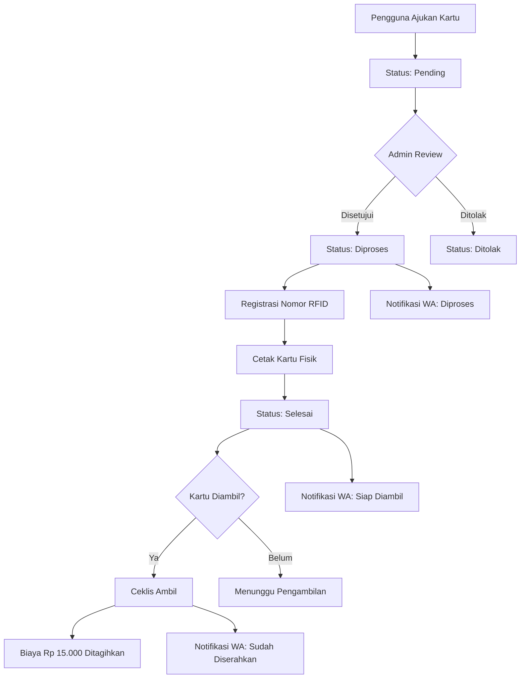
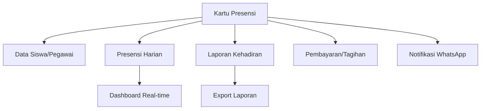

import {
  Card,
  CardGrid,
  Steps,
  Tabs,
  TabItem,
  Aside,
} from "@astrojs/starlight/components";

## Apa itu Kartu Presensi RFID?

Kartu Presensi RFID adalah kartu identitas yang dilengkapi dengan chip RFID (Radio Frequency Identification) untuk melakukan presensi secara otomatis dengan sistem tap. Setiap kartu memiliki nomor unik yang terhubung dengan data siswa atau pegawai di sistem.

<CardGrid>
  <Card title="Presensi Cepat" icon="rocket">
    Tap kartu di reader RFID, presensi langsung tercatat dalam hitungan detik
  </Card>
  <Card title="Akurat & Real-time" icon="approve-check">
    Data presensi langsung masuk ke sistem dan dapat dipantau secara real-time
  </Card>
  <Card title="Anti Manipulasi" icon="warning">
    Setiap kartu memiliki ID unik yang tidak dapat diduplikasi atau dipalsukan
  </Card>
  <Card title="Terintegrasi Penuh" icon="puzzle">
    Terhubung dengan sistem laporan, notifikasi, dan dashboard monitoring
  </Card>
</CardGrid>

---

## Fungsi Kartu RFID

### Presensi Harian

**Tap untuk Masuk dan Pulang**

- ✅ Presensi masuk di pagi hari
- ✅ Presensi pulang di sore hari
- ✅ Otomatis tercatat dengan timestamp
- ✅ Status kehadiran langsung ter-update (Hadir/Terlambat)

### Identifikasi & Akses

**Kartu sebagai ID Digital**

- 🔐 Akses ke area tertentu (perpustakaan, lab)
- 👤 Identifikasi diri yang sah dan resmi
- 📊 Tracking aktivitas siswa/pegawai
- 🎫 Integrasi dengan sistem lain (kantin, dll - future)

---

## Jenis Kartu Presensi

<Tabs>
  <TabItem label="Kartu Siswa">
    **ID Card Siswa** **Informasi di Kartu**: - Foto siswa - Nama lengkap - NIS
    / NISN - Kelas - Logo madrasah - Nomor RFID (barcode) **Desain**: Vertikal,
    full color **Biaya**: Rp 15.000 per kartu
  </TabItem>

{" "}

<TabItem label="Kartu Pegawai">
  **ID Card Guru/Staff** **Informasi di Kartu**: - Foto pegawai - Nama lengkap -
  NIP / NIK - Jabatan - Logo madrasah - Nomor RFID (barcode) **Desain**:
  Horizontal, full color **Biaya**: Rp 15.000 per kartu
</TabItem>

  <TabItem label="Kartu Tamu">
    **ID Card Sementara** **Untuk**: Tamu, praktikan, volunteer **Masa Aktif**:
    Sesuai keperluan (1 hari - 1 bulan) **Biaya**: Gratis (deposit kartu)
  </TabItem>
</Tabs>

---

## Alur Pengajuan Kartu



### Tahapan Detail

<Steps>

1. **Pengajuan (User)**

   Siswa/pegawai mengajukan pembuatan kartu baru melalui sistem

   **Status**: Pending ⏳

2. **Review & Persetujuan (Admin)**

   Administrator mereview dan menyetujui pengajuan

   **Status**: Diproses ⚙️

   **Notifikasi**: WhatsApp ke user "Kartu sedang diproses"

3. **Registrasi RFID (Admin)**

   Admin meregistrasi nomor RFID unik untuk kartu tersebut

   **Status**: Diproses ⚙️

4. **Cetak Kartu (Admin)**

   Kartu fisik dicetak dengan desain dan informasi lengkap

   **Status**: Selesai ✅

   **Notifikasi**: WhatsApp ke user "Kartu sudah siap diambil"

5. **Pengambilan Kartu (User)**

   User mengambil kartu di loket TU/operator

   Admin ceklis status "Diserahkan" ✅

   **Biaya**: Rp 15.000 ditagihkan/dibayar

   **Notifikasi**: WhatsApp ke user "Kartu telah diserahkan"

</Steps>

---

## Biaya Pengajuan Kartu

<Aside type="note" title="Informasi Biaya">
  Setiap pengajuan kartu presensi dikenakan biaya pembuatan sebesar **Rp
  15.000** per kartu.
</Aside>

### Rincian Biaya

| Komponen             | Biaya         |
| -------------------- | ------------- |
| Material kartu PVC   | Rp 5.000      |
| Chip RFID            | Rp 3.000      |
| Cetak full color     | Rp 4.000      |
| Laminasi & finishing | Rp 2.000      |
| Tali/lanyard         | Rp 1.000      |
| **TOTAL**            | **Rp 15.000** |

### Kapan Biaya Ditagihkan?

<CardGrid>
  <Card title="Saat Pengambilan" icon="approve-check">
    Biaya ditagihkan **hanya saat kartu sudah diserahkan** ke user, bukan saat
    pengajuan
  </Card>

{" "}

<Card title="Akumulasi Otomatis" icon="rocket">
  Sistem otomatis menambahkan biaya ke tagihan SPP/pembayaran user
</Card>

  <Card title="Bukti Pembayaran" icon="document">
    User menerima bukti pembayaran digital via sistem dan WhatsApp
  </Card>
</CardGrid>

---

## Status Pengajuan Kartu

### Status: Pending ⏳

**Pengajuan menunggu review administrator**

- Pengajuan baru masuk
- Belum direview oleh admin
- User dapat membatalkan pengajuan
- Tidak ada biaya jika dibatalkan

### Status: Diproses ⚙️

**Kartu sedang dalam proses pembuatan**

- Admin sudah menyetujui pengajuan
- Registrasi RFID sedang berlangsung
- Pencetakan kartu fisik
- **Notifikasi WhatsApp otomatis terkirim**: "Kartu Anda sedang diproses"

<Aside type="tip">
  Proses pembuatan kartu biasanya memakan waktu 2-3 hari kerja tergantung
  antrian.
</Aside>

### Status: Selesai ✅

**Kartu sudah siap diambil**

- Kartu fisik sudah jadi
- Menunggu pengambilan oleh user
- **Notifikasi WhatsApp otomatis terkirim**: "Kartu sudah siap diambil di loket TU"
- User dapat mengecek lokasi dan jam pengambilan

### Status: Diserahkan ✅

**Kartu sudah diserahkan kepada user**

- Admin ceklis bahwa kartu sudah diserahkan
- **Biaya Rp 15.000 otomatis ditagihkan**
- **Notifikasi WhatsApp otomatis terkirim**: "Kartu telah diserahkan. Biaya Rp 15.000 sudah ditambahkan ke tagihan Anda"
- User sudah dapat menggunakan kartu untuk presensi

---

## Notifikasi WhatsApp Otomatis

Setiap perubahan status pengajuan kartu akan **otomatis mengirim notifikasi WhatsApp** kepada user.

### Format Notifikasi

**1. Status Diproses**

```
🔔 *KARTU PRESENSI - UPDATE*

Halo, [Nama User]

Pengajuan kartu presensi Anda telah disetujui dan
sedang dalam proses pembuatan.

 No. Pengajuan: KP-2025-0001
⚙️ Status: DIPROSES
⏱️ Estimasi selesai: 2-3 hari kerja

Anda akan dihubungi kembali saat kartu sudah siap
diambil.

---
MTs Negeri 1 Pandeglang
Sistem Presensi RFID
```

**2. Status Selesai (Siap Diambil)**

```
🔔 *KARTU PRESENSI - SIAP DIAMBIL*

Halo, [Nama User]

Kartu presensi Anda sudah selesai dan siap diambil!

 No. Pengajuan: KP-2025-0001
✅ Status: SELESAI
💰 Biaya: Rp 15.000 (dibayar saat pengambilan)

📍 Lokasi Pengambilan: Loket TU
⏰ Jam Pengambilan: Senin-Jumat, 08:00-14:00

Harap bawa bukti identitas saat pengambilan.

---
MTs Negeri 1 Pandeglang
Sistem Presensi RFID
```

**3. Status Diserahkan**

```
🔔 *KARTU PRESENSI - DISERAHKAN*

Halo, [Nama User]

Kartu presensi Anda telah diserahkan.

 No. Pengajuan: KP-2025-0001
✅ Status: DISERAHKAN
 Biaya: Rp 15.000 (sudah ditambahkan ke tagihan)

Kartu Anda sudah aktif dan dapat digunakan untuk
presensi mulai sekarang.

⚠️ PENTING:
- Jaga kartu dengan baik
- Lapor segera jika hilang/rusak
- Kartu pengganti dikenakan biaya baru

Terima kasih!

---
MTs Negeri 1 Pandeglang
Sistem Presensi RFID
```

---

## Kartu Hilang atau Rusak

### Prosedur Kartu Hilang

<Steps>

1. **Lapor ke Operator/TU**

   Segera laporkan kehilangan kartu ke bagian TU atau operator sistem

2. **Nonaktifkan Kartu Lama**

   Admin akan menonaktifkan kartu yang hilang untuk mencegah penyalahgunaan

3. **Ajukan Kartu Pengganti**

   Buat pengajuan kartu baru dengan alasan "Pengganti kartu hilang"

4. **Bayar Biaya Pengganti**

   Dikenakan biaya yang sama: **Rp 15.000**

5. **Terima Kartu Baru**

   Proses sama seperti pengajuan kartu baru (2-3 hari kerja)

</Steps>

### Prosedur Kartu Rusak

<Tabs>
  <TabItem label="Rusak Ringan">
    **Kartu masih bisa dibaca** - Chip RFID masih berfungsi - Hanya
    lecet/kotor/pudar - **Tidak perlu ganti**, cukup dibersihkan - Gratis, tidak
    ada biaya
  </TabItem>

  <TabItem label="Rusak Berat">
    **Kartu tidak bisa dibaca** - Chip RFID rusak/tidak berfungsi - Kartu
    patah/sobek parah - **Harus ganti kartu baru** - Biaya penggantian: **Rp
    15.000** Prosedur sama dengan kartu hilang
  </TabItem>
</Tabs>

<Aside type="caution" title="Tips Merawat Kartu">
  - Simpan di tempat yang aman (dompet, card holder) - Jangan ditekuk, direndam
  air, atau terkena panas - Pasang lanyard agar tidak mudah hilang - Hindari
  kontak dengan magnet atau benda tajam
</Aside>

---

## Riwayat Pengajuan Kartu

Sistem menyimpan histori lengkap semua pengajuan kartu untuk setiap user.

### Informasi yang Tersimpan

- 📅 Tanggal pengajuan
- 🔢 Nomor pengajuan (unik)
- Status (Pending/Diproses/Selesai/Diserahkan/Ditolak)
- Nomor RFID yang diregistrasi
- 💰 Biaya yang ditagihkan
- 📝 Alasan pengajuan (Baru/Hilang/Rusak)
- ⏱️ Timeline perubahan status

### Manfaat Riwayat

- Tracking pengajuan yang sedang berjalan
- Bukti pembayaran kartu
- Audit trail untuk administrator
- Referensi jika ada keluhan atau masalah

---

## FAQ

### ❓ Berapa lama proses pembuatan kartu?

**Jawab**: 2-3 hari kerja setelah pengajuan disetujui, tergantung antrian.

### ❓ Apakah bisa percepat pembuatan kartu?

**Jawab**: Untuk kasus mendesak, hubungi operator. Bisa dipercepat dengan biaya tambahan atau prioritas khusus.

### ❓ Kartu hilang saat belum bayar, apakah tetap kena biaya?

**Jawab**: Jika kartu hilang sebelum diserahkan (status masih Selesai), hubungi admin. Biaya bisa diwaive-kan untuk kasus tertentu.

### ❓ Bisa tidak minta desain kartu khusus?

**Jawab**: Desain kartu mengikuti template standar madrasah. Tidak ada customization untuk individu demi keseragaman.

### ❓ Nomor RFID bisa dipindah ke kartu lain?

**Jawab**: Tidak bisa. Setiap chip RFID memiliki nomor unik yang permanen dan tidak dapat dipindahkan.

---

## Keamanan Kartu RFID

<CardGrid>
  <Card title="Enkripsi Data" icon="warning">
    Data di chip RFID terenkripsi dan tidak dapat dibaca sembarangan
  </Card>

{" "}

<Card title="Unique ID" icon="approve-check">
  Setiap kartu memiliki ID unik yang terdaftar di sistem, tidak bisa diduplikasi
</Card>

{" "}

<Card title="Monitoring Real-time" icon="rocket">
  Setiap tap kartu tercatat dengan lokasi dan waktu yang akurat
</Card>

  <Card title="Alert System" icon="star">
    Sistem mendeteksi aktivitas mencurigakan (tap ganda, lokasi tidak wajar)
  </Card>
</CardGrid>

---

## Statistik Kartu Presensi

Dashboard menampilkan statistik kartu untuk monitoring:

- 📊 Total kartu aktif (siswa + pegawai)
- 📈 Pengajuan kartu per bulan
- ⏱️ Rata-rata waktu proses pembuatan
- 💰 Total pendapatan dari biaya kartu
- 🔄 Jumlah kartu pengganti (hilang/rusak)
- ✅ Tingkat penggunaan kartu vs manual

---

## Integrasi dengan Modul Lain



---

## Langkah Selanjutnya

<CardGrid>
  <Card title="Ajukan Kartu Sekarang" icon="rocket">
    Mulai ajukan kartu presensi RFID Anda untuk kemudahan presensi harian.
    [Ajukan Kartu →](./pengajuan-kartu-presensi)
  </Card>

  <Card title="Pelajari Presensi" icon="star">
    Pahami cara menggunakan kartu untuk presensi masuk dan pulang. [Pelajari
    Presensi →](../memulai)
  </Card>
</CardGrid>
