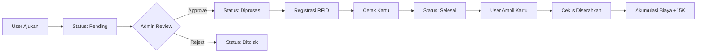

import {
  Card,
  CardGrid,
  Steps,
  Aside,
  Tabs,
  TabItem,
} from "@astrojs/starlight/components";

## Pengertian Pengajuan Kartu

**Pengajuan Kartu Presensi** adalah proses formal untuk mendapatkan kartu RFID yang akan digunakan untuk presensi otomatis. Setiap pengguna (siswa/pegawai) harus mengajukan kartu terlebih dahulu sebelum bisa melakukan presensi dengan sistem RFID.

### Informasi Biaya

<Card title="💰 Biaya Pembuatan Kartu" icon="information">
  **Tarif Resmi:** Rp 15.000 per kartu **Mencakup:** - Kartu RFID dengan chip -
  Cetak design kartu - Laminating - Registrasi sistem - Aktivasi kartu
  **Pembayaran:** - Tunai saat pengambilan kartu - Atau melalui bendahara
  sekolah - Bukti pembayaran disimpan sistem
</Card>

<Aside type="note">
  Biaya ini adalah untuk pembuatan kartu baru maupun penggantian kartu
  hilang/rusak.
</Aside>

---

## Mengajukan Kartu Baru

### Untuk Siswa/Pegawai

<Steps>

1. **Login ke Sistem**

   Gunakan akun yang sudah terdaftar

2. **Akses Menu Kartu Presensi**

   Dashboard → Kartu Presensi → Ajukan Kartu Baru

3. **Isi Form Pengajuan**

   ```
   Nama: [Otomatis terisi dari profile]
   NIS/NIP: [Otomatis terisi]
   Jenis Kartu: ● Kartu Baru / ○ Penggantian

   Jika Penggantian:
   Alasan: ● Hilang / ○ Rusak / ○ Tidak Berfungsi
   Keterangan: [Jelaskan kronologi]
   ```

4. **Upload Foto (Jika Belum Ada)**

   - Pas foto formal
   - Background merah/biru
   - Ukuran 3x4 cm
   - Format JPG/PNG
   - Max 500KB

5. **Konfirmasi Data**

   Review semua informasi sebelum submit

6. **Submit Pengajuan**

   Klik "Ajukan Kartu" untuk submit

7. **Tunggu Approval**

   Status awal: **Pending**

   Anda akan menerima notifikasi via:

   - Dashboard (bell icon)
   - Email
   - WhatsApp

</Steps>

<Aside type="tip" title="Tips Pengajuan Sukses">
  - Pastikan foto profil sudah ter-upload - Gunakan nomor telepon aktif (untuk
  notifikasi WhatsApp) - Jika penggantian, sertakan bukti laporan kehilangan
  (opsional) - Siapkan uang pas Rp 15.000 untuk pembayaran
</Aside>

---

## Registrasi Nomor RFID

### Oleh Administrator

Setelah pengajuan disetujui, admin akan meregistrasi nomor RFID unik:

<Steps>

1. **Akses Pengajuan Pending**

   Dashboard → Kartu Presensi → Daftar Pengajuan

2. **Pilih Pengajuan**

   Klik pengajuan yang akan diproses

3. **Scan/Input Nomor RFID**

   ```
   Metode 1: Scan dengan RFID Reader
   - Tap kartu RFID ke reader
   - Nomor otomatis terdeteksi

   Metode 2: Input Manual
   - Ketik nomor yang tertera di kartu
   - Format: 10-digit hexadecimal
   - Contoh: A1B2C3D4E5
   ```

4. **Validasi Nomor**

   Sistem akan cek:

   - ✅ Nomor belum terdaftar (unique)
   - ✅ Format nomor valid
   - ✅ RFID reader terdeteksi

   Jika error:

   - ❌ Nomor sudah digunakan → Ganti kartu lain
   - ❌ Format tidak valid → Cek ulang nomor
   - ❌ Reader error → Restart reader

5. **Set Data Kartu**

   ```
   Nomor RFID: A1B2C3D4E5
   Tanggal Registrasi: [Auto]
   Expired: [3 tahun dari sekarang]
   Status: Aktif
   ```

6. **Simpan Registrasi**

   Klik "Registrasi RFID"

</Steps>

<Aside type="caution" title="Keunikan Nomor RFID">
  **PENTING:** Setiap nomor RFID harus unik di sistem. Tidak boleh ada 2 user
  dengan nomor RFID yang sama. Sistem akan reject jika nomor duplikat
  terdeteksi.
</Aside>

---

## Proses Persetujuan

### Alur Persetujuan



### Role dalam Approval

| Role              | Hak Akses                           |
| ----------------- | ----------------------------------- |
| **Siswa/Pegawai** | Ajukan, Lihat status sendiri        |
| **Operator**      | Approve, Reject, Proses, Selesaikan |
| **Super Admin**   | Full access semua pengajuan         |
| **Wali Kelas**    | Lihat pengajuan kelas sendiri       |

---

## Status Pengajuan Kartu

### 1. Pending

<Card title="⏳ Status: Pending" icon="clock">
  **Arti:** Pengajuan baru masuk, menunggu review admin **Durasi:** Maksimal 1-2
  hari kerja **Action User:** - Tunggu notifikasi - Cek status di dashboard -
  Hubungi admin jika >2 hari **Action Admin:** - Review kelengkapan data -
  Verifikasi identitas - Approve atau reject
</Card>

### 2. Diproses

<Card title="🔄 Status: Diproses" icon="setting">
  **Arti:** Pengajuan disetujui, kartu sedang dibuat **Proses:** 1. Registrasi
  nomor RFID 2. Design kartu (foto + data) 3. Cetak fisik kartu 4. Laminating 5.
  Quality check **Durasi:** 2-3 hari kerja **Notifikasi:** - ✅ Email: "Kartu
  Anda sedang diproses" - ✅ WhatsApp: "Pengajuan kartu disetujui dan sedang
  dibuat" - ✅ Dashboard: Badge "Processing"
</Card>

<Aside type="note" title="Notifikasi Otomatis">
  Saat status berubah ke "Diproses", sistem **otomatis kirim notifikasi** ke
  email dan WhatsApp user untuk memberitahu bahwa kartu sedang dibuat.
</Aside>

### 3. Selesai

<Card title="✅ Status: Selesai" icon="approve-check">
  **Arti:** Kartu sudah jadi, siap diambil **Action User:** - Datang ke kantor
  admin - Bawa uang Rp 15.000 (pas) - Tunjukkan ID/bukti identitas - Terima
  kartu + struk pembayaran - Test kartu di reader **Notifikasi:** - ✅ Email:
  "Kartu sudah jadi, silakan diambil" - ✅ WhatsApp: "Kartu presensi Anda sudah
  selesai. Silakan ambil di kantor admin dengan membawa uang Rp 15.000" - ✅
  Dashboard: Badge "Ready to Pickup"
</Card>

### 4. Diserahkan

<Card title="🎯 Status: Diserahkan" icon="star">
  **Arti:** Kartu sudah diambil user **Proses Penyerahan:** 1. User datang ke
  kantor admin 2. Admin verifikasi identitas 3. User bayar Rp 15.000 4. Admin
  ceklis "Sudah Diserahkan" ✓ 5. Sistem update status ke "Diserahkan" 6.
  **Akumulasi biaya otomatis +15.000** **Impact:** - Kartu aktif dan bisa
  digunakan - Biaya masuk ke laporan keuangan - History tercatat di sistem -
  User bisa mulai presensi
</Card>

<Aside type="tip" title="Bukti Penyerahan">
  Admin wajib print struk/bukti penyerahan yang berisi: - Nama user - Nomor RFID
  - Tanggal penyerahan - Biaya yang dibayar - Tanda tangan user & admin
</Aside>

### 5. Ditolak (Rejected)

<Card title="❌ Status: Ditolak" icon="error">
  **Kemungkinan Alasan:** - Data tidak lengkap - Foto tidak sesuai syarat - User
  sudah punya kartu aktif - Belum bayar biaya sebelumnya - Alasan lain
  (dijelaskan admin) **Action User:** - Baca alasan penolakan - Perbaiki
  data/dokumen - Ajukan ulang **Notifikasi:** - Email + WhatsApp dengan alasan
  penolakan
</Card>

---

## Mencetak Kartu

### Design Kartu

<Tabs>
  <TabItem label="Sisi Depan">
    **Layout:** ``` ┌─────────────────────────┐ │ [LOGO MADRASAH] │ │ │ │ MTs
    NEGERI 1 │ │ PANDEGLANG │ │ │ │ ┌─────────┐ │ │ │ FOTO │ │ │ │ 3x4 │ │ │
    └─────────┘ │ │ │ │ Ahmad Hidayat │ │ NIS: 2024001 │ │ Kelas: X IPA 1 │ │ │
    │ KARTU PRESENSI │ └─────────────────────────┘ ```
  </TabItem>

{" "}

<TabItem label="Sisi Belakang">
  **Layout:** ``` ┌─────────────────────────┐ │ │ │ NOMOR RFID: │ │ A1B2C3D4E5 │
  │ │ │ Berlaku: 2024-2027 │ │ │ │ ┌─────────────┐ │ │ │ BARCODE/ │ │ │ │ QR
  CODE │ │ │ └─────────────┘ │ │ │ │ Alamat Sekolah │ │ Telp: 0253-801234 │ │ │
  └─────────────────────────┘ ```
</TabItem>

  <TabItem label="Spesifikasi">
    **Material:** - Kartu PVC tebal 0.76mm - RFID chip embedded (125kHz atau
    13.56MHz) - Laminating glossy **Ukuran:** - Standard: 85.5mm x 54mm (ukuran
    kartu ATM) - Thickness: 0.8mm **Durability:** - Waterproof - Scratch
    resistant - 3 tahun umur kartu **Print Quality:** - Resolution: 300 DPI
    minimum - Full color - Barcode/QR readable
  </TabItem>
</Tabs>

### Proses Cetak

<Steps>

1. **Generate Design**

   Sistem otomatis generate design berdasarkan template

2. **Preview & Approval**

   Admin preview design sebelum cetak

3. **Print Kartu**

   Gunakan printer kartu RFID khusus

4. **Quality Check**

   - Foto jelas?
   - Data akurat?
   - RFID berfungsi?
   - Laminating rapi?

5. **Masukkan ke Envelope**

   Siap diserahkan ke user

</Steps>

---

## Kartu Hilang/Rusak

### Proses Penggantian

<Steps>

1. **Lapor Kehilangan**

   Segera lapor ke admin untuk nonaktifkan kartu lama

2. **Ajukan Penggantian**

   ```
   Jenis: Penggantian Kartu
   Alasan: ● Hilang / ○ Rusak / ○ Tidak Berfungsi
   Nomor Kartu Lama: [Jika ingat]
   Kronologi: [Jelaskan kapan/bagaimana hilang]
   Bukti: [Upload laporan jika ada]
   ```

3. **Biaya Penggantian**

   Sama dengan kartu baru: **Rp 15.000**

4. **Proses Sama**

   Ikuti alur pengajuan normal (Pending → Diproses → Selesai)

5. **Kartu Lama Otomatis Nonaktif**

   Sistem nonaktifkan kartu lama untuk keamanan

</Steps>

<Aside type="caution" title="Keamanan Kartu Hilang">
  **Jika kartu hilang, SEGERA lapor!** Kartu yang hilang bisa disalahgunakan
  untuk presensi atas nama Anda. Admin akan langsung nonaktifkan kartu tersebut.
</Aside>

### Kartu Rusak - Syarat Klaim

<Card title="📋 Syarat Penggantian Kartu Rusak" icon="list-format">
  **Kembalikan kartu rusak untuk verifikasi:** **Kondisi yang diterima:** -
  Kartu retak tapi masih utuh - RFID tidak terdeteksi - Print luntur/pudar -
  Laminating terkelupas **Kondisi TIDAK diterima:** - Kartu hilang (bukan rusak)
  - Dirusak dengan sengaja - Terbakar/tercuci (user negligence) **Proses:** 1.
  Bawa kartu rusak ke admin 2. Admin verifikasi kerusakan 3. Jika valid,
  disetujui tanpa biaya tambahan (gratis) 4. Jika tidak valid, bayar normal Rp
  15.000
</Card>

---

## Menonaktifkan Kartu

### Kapan Kartu Perlu Dinonaktifkan?

<CardGrid>
  <Card title="🎓 Siswa Lulus" icon="graduation">
    Otomatis nonaktif saat status siswa berubah ke "Lulus"
  </Card>

{" "}

<Card title="📤 Pindah Sekolah" icon="right-arrow">
  Nonaktif manual saat siswa mutasi keluar
</Card>

{" "}

<Card title="👔 Pegawai Resign" icon="user">
  Nonaktif saat pegawai tidak aktif lagi
</Card>

{" "}

<Card title="❌ Kartu Hilang" icon="error">
  Nonaktif segera untuk mencegah penyalahgunaan
</Card>

{" "}

<Card title="🔄 Penggantian" icon="refresh">
  Kartu lama nonaktif saat terbit kartu baru
</Card>

  <Card title="⏸️ Suspend Sementara" icon="clock">
    Nonaktif untuk investigasi/hukuman
  </Card>
</CardGrid>

### Cara Menonaktifkan

**Oleh Admin:**

<Steps>

1. **Cari Kartu**

   Dashboard → Kartu Presensi → Kelola Kartu

2. **Pilih Kartu**

   Cari by nama/NIS/nomor RFID

3. **Klik "Nonaktifkan"**

   Toggle status dari Aktif → Nonaktif

4. **Isi Alasan**

   ```
   Alasan Nonaktifkan:
   ● Lulus
   ● Pindah
   ● Hilang
   ● Resign
   ● Suspend
   ○ Lainnya: [...]
   ```

5. **Konfirmasi**

   Kartu langsung nonaktif

</Steps>

<Aside type="note">
  Kartu yang nonaktif tidak bisa digunakan untuk presensi. Tap kartu ke reader
  tidak akan tercatat.
</Aside>

---

## Riwayat Kartu Presensi

### Tracking History

<Card title="📜 Log Kartu Lengkap" icon="list-format">
  Sistem mencatat semua aktivitas kartu: **Event yang dicatat:** - Pengajuan
  submit - Status change (Pending→Diproses→Selesai) - Registrasi RFID -
  Penyerahan ke user (+ waktu) - Pembayaran dicatat - Aktivasi/Nonaktif -
  Penggantian kartu - Setiap tap presensi **Akses Log:** - User: Lihat history
  kartu sendiri - Admin: Lihat semua history - Wali Kelas: History siswa di
  kelasnya **Export:** Bisa di-export untuk audit/report
</Card>

### Statistik Kartu

<Tabs>
  <TabItem label="Per User">
    **Data per user:** - Total pengajuan: X kali - Kartu aktif saat ini: [Nomor]
    - Riwayat penggantian: Y kali - Total biaya dibayar: Rp Z - Kartu terakhir
    aktif sejak: [Tanggal]
  </TabItem>

{" "}

<TabItem label="Global">
  **Data sistem keseluruhan:** - Total kartu aktif: X - Total kartu nonaktif: Y
  - Pengajuan bulan ini: Z - Revenue kartu: Rp [Total] - Rata-rata waktu proses:
  N hari
</TabItem>

  <TabItem label="Laporan">
    **Report tersedia:** - Laporan pengajuan per periode - Daftar kartu
    aktif/nonaktif - Revenue report kartu - Kartu yang akan expired - Statistik
    penggantian
  </TabItem>
</Tabs>

---

## Notifikasi Otomatis

### Trigger Notifikasi

<Card title="📲 Sistem Notifikasi WhatsApp" icon="phone">
  **Notifikasi otomatis terkirim saat:** **1. Status: Diproses** ``` Template
  WhatsApp: Halo [Nama], Kabar baik! Pengajuan kartu presensi Anda telah
  disetujui dan sedang dalam proses pembuatan. Status: DIPROSES Estimasi
  selesai: 2-3 hari kerja Anda akan mendapat notifikasi lagi saat kartu sudah
  jadi dan siap diambil. Terima kasih, MTs Negeri 1 Pandeglang ``` **2. Status:
  Selesai** ``` Template WhatsApp: Halo [Nama], Kartu presensi Anda sudah
  SELESAI dibuat! 🎉 Silakan ambil di kantor administrasi dengan membawa: - Uang
  Rp 15.000 (pas) - Kartu pelajar/identitas Jam buka: Senin-Jumat 07:30-14:00
  Terima kasih, MTs Negeri 1 Pandeglang ``` **3. Status: Ditolak** ``` Template
  WhatsApp: Halo [Nama], Mohon maaf, pengajuan kartu presensi Anda DITOLAK.
  Alasan: [Alasan dari admin] Silakan perbaiki dan ajukan kembali. Hubungi admin
  jika ada pertanyaan. Terima kasih, MTs Negeri 1 Pandeglang ```
</Card>

---

## Akumulasi Biaya

### Sistem Pencatatan Otomatis

<Card title="💰 Auto Financial Tracking" icon="bars">
  **Saat admin ceklis "Sudah Diserahkan":** **Yang terjadi:** 1. Status kartu →
  "Diserahkan" 2. Timestamp penyerahan dicatat 3. **Biaya Rp 15.000 masuk ke
  akumulasi** 4. Entry baru di laporan keuangan 5. Receipt/struk di-generate 6.
  Admin dapat notifikasi **Tracking:** - Total revenue dari kartu per hari/bulan
  - Laporan per operator (siapa yang handle) - Rekonsiliasi dengan kas fisik -
  Export untuk akuntansi
</Card>

### Laporan Keuangan Kartu

<Steps>

1. **Akses Laporan**

   Dashboard → Laporan → Keuangan Kartu

2. **Filter Periode**

   Pilih tanggal mulai - selesai

3. **Lihat Data**

   - Total pengajuan: X kartu
   - Total diserahkan: Y kartu
   - Revenue: Rp Y × 15.000
   - Pending: Z kartu (belum bayar)

4. **Export Laporan**

   Download Excel/PDF untuk arsip

</Steps>

---

## FAQ

<details>
<summary>**Berapa lama proses pembuatan kartu?**</summary>

Rata-rata 3-5 hari kerja:

- Review pengajuan: 1-2 hari
- Cetak kartu: 2-3 hari
- Total: 3-5 hari kerja

</details>

<details>
<summary>**Apakah bisa ambil kartu di hari yang sama saat pengajuan?**</summary>

Tidak bisa. Kartu harus melalui proses approval → registrasi RFID → cetak → laminating. Minimal 3 hari kerja.

</details>

<details>
<summary>**Kalau kehilangan, apakah bisa pakai kartu lama yang ketemu?**</summary>

Tidak. Setelah kartu dilaporkan hilang dan diganti baru, kartu lama otomatis nonaktif permanent untuk keamanan.

</details>

<details>
<summary>**Bisakah bayar biaya kartu via transfer?**</summary>

Tergantung kebijakan sekolah. Hubungi bendahara untuk opsi pembayaran non-tunai.

</details>

---

## Troubleshooting

<Tabs>
  <TabItem label="Pengajuan Ditolak">
    **Solusi:** - Baca alasan penolakan dengan teliti - Perbaiki data sesuai
    instruksi - Update foto jika diperlukan - Ajukan ulang setelah perbaikan -
    Hubungi admin jika tidak jelas
  </TabItem>

{" "}

<TabItem label="Notifikasi Tidak Masuk">
  **Cek:** - Nomor WhatsApp di profile benar? - WhatsApp aktif? - Setting
  notifikasi WA enabled? - Cek folder spam email - Hubungi admin untuk resend
</TabItem>

  <TabItem label="Kartu Tidak Terdeteksi">
    **Kemungkinan:** - Kartu belum aktif di sistem - RFID reader bermasalah -
    Chip kartu rusak - Salah tap (terlalu cepat/jauh) **Solusi:** - Test di
    reader berbeda - Tap dengan benar (dekat, 1-2 detik) - Lapor admin untuk cek
    - Ganti kartu jika chip rusak
  </TabItem>
</Tabs>

---

## Langkah Selanjutnya

<CardGrid>
  <Card title="👨‍🎓 Data Siswa" icon="user">
    Kelola data siswa setelah kartu aktif [Panduan Siswa →](/menu-siswa/siswa/)
  </Card>

{" "}

<Card title="📊 Riwayat Presensi" icon="bars">
  Lihat riwayat kehadiran Anda [Riwayat Siswa
  →](/menu-siswa/riwayat-presensi-siswa/) [Riwayat Pegawai
  →](/menu-pegawai/riwayat-presensi-pegawai/)
</Card>

  <Card title="🔙 Menu Kartu" icon="left-arrow">
    Kembali ke overview kartu presensi [Kartu Presensi →](/menu-kartu-presensi/)
  </Card>
</CardGrid>

---

<Aside type="tip" title="Pro Tips">
  - Ajukan kartu 1 minggu sebelum tahun ajaran dimulai - Simpan nomor RFID kartu
  untuk referensi - Foto kartu sebagai backup - Treat kartu dengan baik (jangan
  ditekuk/scratch) - Laporkan masalah segera ke admin - Simpan struk pembayaran
</Aside>
