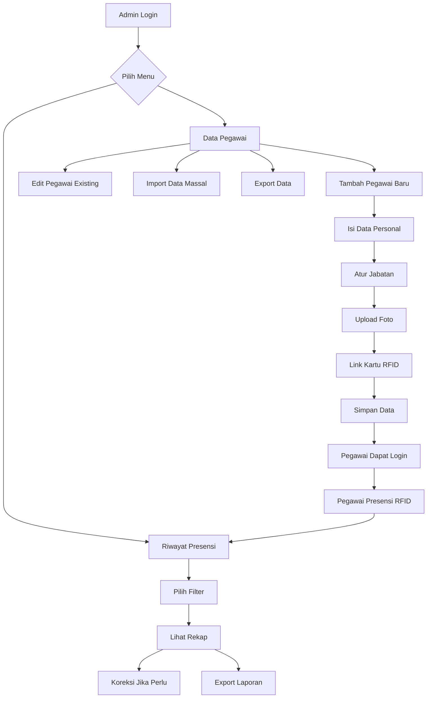
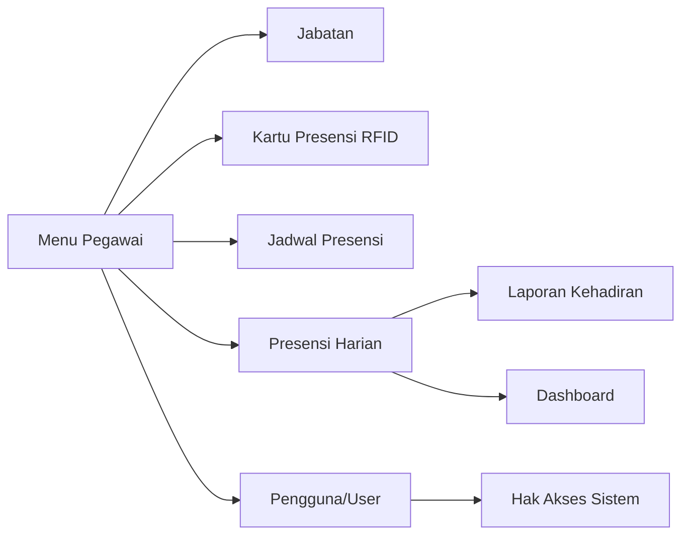

import {
  Card,
  CardGrid,
  Steps,
  Tabs,
  TabItem,
  Aside,
} from "@astrojs/starlight/components";

## Pengertian Menu Pegawai

Menu Pegawai adalah modul lengkap untuk mengelola data kepegawaian dan monitoring kehadiran seluruh guru, staff, dan karyawan madrasah. Modul ini mencakup pengelolaan data personal, jabatan, hingga analisis kehadiran.

<CardGrid>
  <Card title="Database Terpusat" icon="document">
    Kelola seluruh data pegawai (guru, staff TU, satpam) dalam satu sistem
    terintegrasi
  </Card>
  <Card title="Presensi Real-time" icon="rocket">
    Monitor kehadiran pegawai secara real-time dengan sistem RFID otomatis
  </Card>
  <Card title="Laporan Lengkap" icon="star">
    Generate laporan kehadiran, statistik, dan analisis kinerja pegawai
  </Card>
  <Card title="Import/Export Massal" icon="puzzle">
    Import data pegawai baru atau export untuk keperluan pelaporan eksternal
  </Card>
</CardGrid>

---

## Fungsi Menu Pegawai

### Manajemen Data

**Kelola Informasi Kepegawaian**

- ✅ Data personal pegawai (nama, NIP, kontak)
- ✅ Jabatan dan struktural
- ✅ Status kepegawaian (PNS, GTT, PTT)
- ✅ Riwayat kepangkatan dan pendidikan
- ✅ Upload dokumen dan foto pegawai
- ✅ Link kartu presensi RFID

### Monitoring Kehadiran

**Tracking Presensi Harian**

- 📊 Rekap kehadiran per pegawai
- ⏰ Status: Hadir, Terlambat, Izin, Sakit, Cuti, Alpha
- 📈 Grafik dan statistik kehadiran
- 📅 Filter berdasarkan periode (harian/bulanan)
- 💼 Laporan per jabatan atau unit kerja

### Administrasi

**Pengelolaan Administrasi Kepegawaian**

- 📄 Upload dokumen penting (SK, ijazah)
- Manajemen kartu RFID pegawai
- 🔄 Import/export data massal
- 🖨️ Cetak ID card dan laporan
- 📧 Notifikasi ke pegawai via sistem/WhatsApp

---

## Daftar Sub-Menu Pegawai

### 1. Data Pegawai

**Pengelolaan Database Pegawai**

<CardGrid>
  <Card title="CRUD Lengkap" icon="star">
    Tambah, edit, hapus data pegawai dengan interface yang user-friendly
  </Card>
  <Card title="Upload Foto" icon="document">
    Upload foto pegawai untuk ID card dan profil sistem
  </Card>
  <Card title="Import Massal" icon="rocket">
    Import ratusan data pegawai sekaligus via Excel atau ZIP file
  </Card>
  <Card title="Export Data" icon="approve-check">
    Export data ke Excel, PDF, atau CSV untuk pelaporan
  </Card>
</CardGrid>

**Fitur Utama**:

- Tambah pegawai baru (manual atau import)
- Edit data pegawai existing
- Upload foto pegawai untuk ID card
- Atur jabatan dan status kepegawaian
- Link dengan kartu presensi RFID
- Nonaktifkan/reaktifkan pegawai
- Hapus data pegawai (soft delete)

[Pelajari Selengkapnya →](./pegawai)

---

### 2. Riwayat Presensi Pegawai

**Monitoring dan Analisis Kehadiran**

<CardGrid>
  <Card title="Rekap Real-time" icon="rocket">
    Lihat rekap kehadiran pegawai yang ter-update secara real-time
  </Card>
  <Card title="Filter Fleksibel" icon="setting">
    Filter berdasarkan periode, pegawai, jabatan, atau status kehadiran
  </Card>
  <Card title="Koreksi Data" icon="star">
    Koreksi manual jika ada kesalahan tap atau lupa presensi
  </Card>
  <Card title="Export Laporan" icon="document">
    Generate dan export laporan untuk keperluan kepegawaian
  </Card>
</CardGrid>

**Fitur Utama**:

- Melihat rekap presensi per pegawai
- Filter berdasarkan periode waktu
- Filter berdasarkan jabatan
- Status presensi detail (Hadir, Terlambat, Izin, dll)
- Koreksi data presensi manual
- Export laporan (Excel/PDF)
- Statistik dan grafik kehadiran
- Perbandingan antar periode

[Pelajari Selengkapnya →](./riwayat-presensi-pegawai)

---

## Siapa yang Dapat Mengakses?

### Hak Akses Berdasarkan Role

<Tabs>
  <TabItem label="Super Admin">
    **Akses Penuh** ✅ Kelola semua data pegawai ✅ Tambah/edit/hapus pegawai ✅
    Import/export data massal ✅ Lihat semua riwayat presensi ✅ Koreksi data
    presensi ✅ Generate semua laporan ✅ Atur jabatan dan hak akses
  </TabItem>

{" "}

<TabItem label="Operator">
  **Akses Operasional** ✅ Tambah/edit data pegawai ✅ Upload foto pegawai ✅
  Import/export data ✅ Lihat riwayat presensi ✅ Koreksi data presensi ✅
  Generate laporan ❌ Tidak bisa hapus pegawai ❌ Tidak bisa atur hak akses
</TabItem>

{" "}

<TabItem label="Kepala Madrasah">
  **Akses Monitoring** ✅ Lihat semua data pegawai ✅ Lihat semua riwayat
  presensi ✅ Generate laporan ✅ Lihat statistik dan grafik ❌ Tidak bisa edit
  data ❌ Tidak bisa koreksi presensi
</TabItem>

{" "}

<TabItem label="Kepala TU">
  **Akses Administrasi** ✅ Kelola data pegawai TU ✅ Upload dokumen ✅ Lihat
  presensi pegawai TU ✅ Generate laporan TU ⚠️ Terbatas pada unit TU saja
</TabItem>

  <TabItem label="Pegawai">
    **Akses Personal** ✅ Lihat data pribadi sendiri ✅ Update profil sendiri ✅
    Lihat riwayat presensi sendiri ✅ Download slip gaji/presensi sendiri ❌
    Tidak bisa lihat data pegawai lain ❌ Tidak bisa edit data orang lain
  </TabItem>
</Tabs>

---

## Alur Kerja Menu Pegawai

### Workflow Detail

<Steps>

1. **Setup Awal**

   - Admin menambahkan data pegawai baru
   - Upload foto untuk ID card
   - Atur jabatan dan hak akses
   - Link dengan kartu presensi RFID

2. **Operasional Harian**

   - Pegawai tap kartu RFID saat masuk/pulang
   - Data presensi otomatis tercatat
   - Admin monitoring real-time di dashboard
   - Alert jika ada pegawai alpha/terlambat

3. **Monitoring & Koreksi**

   - Admin cek rekap presensi harian
   - Koreksi manual jika ada kesalahan
   - Input manual untuk izin/sakit
   - Update status kehadiran

4. **Pelaporan Berkala**

   - Generate laporan bulanan
   - Export ke Excel/PDF
   - Kirim ke kepala madrasah
   - Arsip untuk keperluan audit

</Steps>

---

## Kategori Pegawai

### Berdasarkan Status Kepegawaian

<CardGrid>
  <Card title="PNS (Pegawai Negeri Sipil)" icon="star">
    **Status Tetap Pemerintah** - NIP dari BKN - SK Pengangkatan dari Kemenag -
    Gaji dari APBN - Pensiun di usia 60 tahun
  </Card>

{" "}

<Card title="GTT (Guru Tidak Tetap)" icon="document">
  **Guru Honorer** - SK dari Kepala Madrasah - Kontrak per tahun ajaran - Gaji
  dari BOS/Komite - Dapat diangkat PNS
</Card>

  <Card title="PTT (Pegawai Tidak Tetap)" icon="information">
    **Staff Honorer** - Staff TU, Satpam, Kebersihan - Kontrak jangka pendek -
    Gaji dari dana operasional - Fleksibel
  </Card>
</CardGrid>

### Berdasarkan Jabatan

| Kategori       | Jabatan                                  | Jumlah Tipikal |
| -------------- | ---------------------------------------- | -------------- |
| **Struktural** | Kepala Madrasah, Wakil Kepala            | 1-5 orang      |
| **Fungsional** | Guru Mata Pelajaran, Wali Kelas          | 20-50 orang    |
| **Staff TU**   | Kepala TU, Staff Administrasi, Bendahara | 3-10 orang     |
| **Pendukung**  | Satpam, Kebersihan, Driver, Teknisi      | 3-8 orang      |

---

## Integrasi dengan Modul Lain

### Hubungan Antar Modul

- **Jabatan**: Setiap pegawai memiliki jabatan yang menentukan jadwal kerja
- **Kartu RFID**: Pegawai linked dengan kartu untuk presensi otomatis
- **Jadwal Presensi**: Jabatan menentukan jadwal kerja (shift, jam masuk-pulang)
- **Presensi Harian**: Data tap RFID tercatat sebagai presensi
- **Laporan**: Rekap kehadiran untuk evaluasi kinerja
- **User Sistem**: Data pegawai terhubung dengan akun login sistem
- **Penggajian** (future): Presensi sebagai dasar perhitungan gaji/tunjangan

---

## Fitur Unggulan

<CardGrid>
  <Card title="Import Data Massal" icon="rocket">
    **Upload Banyak Pegawai Sekaligus** - Import dari Excel (format template) -
    Import foto pegawai via ZIP file - Validasi otomatis sebelum proses -
    Rollback jika ada error Cocok untuk: Setup awal, pergantian tahun, mutasi
    massal
  </Card>

{" "}

<Card title="Export Laporan Fleksibel" icon="document">
  **Multiple Format Export** - Excel (.xlsx) - untuk analisis lanjutan - PDF -
  untuk cetak dan arsip - CSV - untuk integrasi sistem lain - Custom template
  sesuai kebutuhan Cocok untuk: Pelaporan rutin, audit, evaluasi
</Card>

{" "}

<Card title="Koreksi Presensi Manual" icon="star">
  **Flexibilitas Koreksi Data** - Input manual untuk izin/sakit - Koreksi
  kesalahan tap - Approval multi-level (opsional) - Log histori perubahan Cocok
  untuk: Lupa tap, kondisi darurat, keterlambatan
</Card>

  <Card title="Dashboard Analitik" icon="approve-check">
    **Visual Insights** - Grafik kehadiran real-time - Perbandingan antar
    periode - Top 10 pegawai paling rajin/sering alpha - Tren kedisiplinan per
    bulan Cocok untuk: Monitoring kepala madrasah, evaluasi SDM
  </Card>
</CardGrid>

---

## Workflow Umum

### Skenario: Menambah Pegawai Baru

**Pegawai baru masuk, perlu didaftarkan ke sistem**

<Steps>

1. **Input Data Pegawai**

   - Admin input data personal (nama, NIP, kontak)
   - Pilih jabatan dan status kepegawaian
   - Upload foto untuk ID card

2. **Registrasi Kartu RFID**

   - Admin scan kartu RFID baru
   - Link nomor RFID dengan data pegawai
   - Test tap untuk validasi

3. **Buat Akun Login**

   - Generate username dan password default
   - Atur role/hak akses sesuai jabatan
   - Kirim kredensial ke email/WhatsApp pegawai

4. **Orientasi & Aktivasi**
   - Pegawai login pertama kali
   - Update profil dan ganti password
   - Mulai presensi RFID dari hari berikutnya

</Steps>

### Skenario: Monitoring Kehadiran Bulanan

**Akhir bulan, perlu rekap kehadiran untuk laporan**

<Steps>

1. **Buka Riwayat Presensi**

   - Navigasi ke menu Riwayat Presensi Pegawai
   - Pilih bulan yang ingin direkap

2. **Filter dan Review**

   - Filter jika perlu (per jabatan, per unit)
   - Review data: cek alpha, izin, terlambat
   - Koreksi jika ada data yang salah

3. **Generate Laporan**

   - Klik "Export Laporan"
   - Pilih format: Excel atau PDF
   - Sesuaikan layout dan header

4. **Kirim ke Atasan**
   - Download file laporan
   - Kirim ke kepala madrasah via email
   - Arsipkan untuk rekam jejak

</Steps>

---

## Best Practice

<CardGrid>
  <Card title="Update Data Berkala" icon="star">
    Review dan update data pegawai setiap semester untuk memastikan akurasi
  </Card>

{" "}

<Card title="Backup Rutin" icon="approve-check">
  Lakukan backup database pegawai minimal 1x per bulan ke storage eksternal
</Card>

{" "}

<Card title="Validasi Import" icon="warning">
  Selalu cek preview sebelum finalisasi import untuk menghindari data duplikat
</Card>

  <Card title="Training Pegawai" icon="document">
    Berikan orientasi sistem presensi kepada pegawai baru agar tidak bingung
  </Card>
</CardGrid>

---

## Tips Keamanan

<Aside type="tip">
  - Batasi akses edit data pegawai hanya untuk **Super Admin** dan **Operator**
  terpercaya - Aktifkan log aktivitas untuk audit trail semua perubahan data -
  Enkripsi data personal sensitif (NIK, nomor rekening, dll) - Backup database
  secara berkala ke server eksternal/cloud - Review hak akses pegawai secara
  periodik, nonaktifkan yang sudah resign
</Aside>

---

## Statistik & Monitoring

Dashboard Menu Pegawai menyediakan statistik real-time:

### Key Metrics

- 👥 **Total Pegawai Aktif**: Jumlah pegawai yang masih aktif bekerja
- 📊 **Tingkat Kehadiran**: Persentase kehadiran rata-rata per bulan
- ⚠️ **Pegawai Alpha Hari Ini**: Alert untuk follow-up
- 📈 **Tren Kedisiplinan**: Grafik naik/turun dibanding bulan lalu
- 🏆 **Top Performer**: Pegawai dengan kehadiran terbaik
- ⏰ **Rata-rata Keterlambatan**: Analisis pola keterlambatan

### Visual Dashboard

- 📊 **Chart**: Bar chart, line chart, pie chart
- 🗓️ **Calendar View**: Heatmap kehadiran per hari
- 📋 **Table**: Sortable dan searchable datatable
- 🔔 **Alert**: Real-time notification untuk anomali

---

## Langkah Selanjutnya

<CardGrid>
  <Card title="Kelola Data Pegawai" icon="rocket">
    Mulai menambahkan data pegawai lengkap untuk operasional sistem. [Ke Halaman
    Data Pegawai →](./pegawai)
  </Card>

  <Card title="Lihat Riwayat Presensi" icon="star">
    Monitor kehadiran pegawai dan generate laporan kehadiran. [Ke Riwayat
    Presensi →](./riwayat-presensi-pegawai)
  </Card>
</CardGrid>
