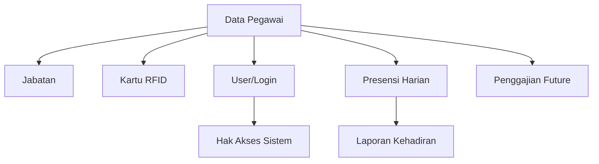

import {
  Card,
  CardGrid,
  Steps,
  Tabs,
  TabItem,
  Aside,
} from "@astrojs/starlight/components";

## Pengertian Data Pegawai

Data Pegawai adalah database lengkap yang menyimpan informasi seluruh guru, staff TU, dan karyawan madrasah. Database ini mencakup data personal, jabatan, status kepegawaian, kontak, hingga dokumen pendukung.

<CardGrid>
  <Card title="Database Terpusat" icon="document">
    Satu sumber kebenaran untuk semua data kepegawaian madrasah
  </Card>
  <Card title="Terintegrasi" icon="puzzle">
    Terhubung dengan presensi, kartu RFID, penggajian, dan laporan
  </Card>
  <Card title="Mudah Dikelola" icon="star">
    Interface user-friendly untuk CRUD (Create, Read, Update, Delete) data
  </Card>
  <Card title="Scalable" icon="rocket">
    Mampu menampung ribuan data pegawai dengan performa optimal
  </Card>
</CardGrid>

---

## Menambah Pegawai Baru

<Steps>

1. **Buka Menu Data Pegawai**

   Navigasi ke **Menu Pegawai → Pegawai** dari sidebar

2. **Klik Tombol Tambah**

   Klik **"+ Tambah Pegawai"** di pojok kanan atas

3. **Isi Data Personal**

   **Informasi Dasar**:

   - **Nama Lengkap** (wajib) - Sesuai ijazah
   - **NIP** (opsional) - Untuk PNS
   - **NIK** (wajib) - Nomor KTP
   - **NUPTK** (opsional) - Untuk guru
   - **Tempat Lahir** (wajib)
   - **Tanggal Lahir** (wajib)
   - **Jenis Kelamin** (wajib)
   - **Agama** (wajib)

   **Kontak**:

   - **Email** (wajib) - Email aktif
   - **No. HP** (wajib) - WhatsApp aktif
   - **Alamat Lengkap** (wajib)
   - **Kode Pos** (opsional)

4. **Atur Jabatan & Status**

   - **Jabatan** (wajib) - Pilih dari dropdown
   - **Status Kepegawaian** (wajib) - PNS / GTT / PTT
   - **TMT (Terhitung Mulai Tanggal)** (wajib) - Tanggal mulai kerja
   - **Status Aktif** (wajib) - Aktif / Nonaktif

5. **Upload Foto Pegawai**

   - Klik **"Upload Foto"**
   - Pilih file foto (JPG/PNG, max 2MB)
   - Background: Biru untuk pegawai
   - Crop dan sesuaikan jika perlu

6. **Link Kartu RFID** (Opsional)

   - Jika sudah ada kartu RFID, input nomor RFID
   - Atau skip, akan diisi nanti saat kartu tersedia

7. **Simpan Data**

   Klik **"Simpan"** untuk menyimpan data pegawai

8. **Verifikasi**

   - Sistem akan validasi data
   - Jika ada error, perbaiki sesuai petunjuk
   - Jika sukses, pegawai muncul di daftar

</Steps>

<Aside type="tip">
  Pastikan email dan nomor HP yang diinput **aktif dan valid** karena akan
  digunakan untuk kredensial login dan notifikasi sistem.
</Aside>

---

## Data yang Dibutuhkan

### Data Wajib

<CardGrid>
  <Card title="Identitas Pribadi" icon="star">
    - Nama lengkap - NIK (KTP) - Tempat & tanggal lahir - Jenis kelamin - Agama
  </Card>

<Card title="Kontak" icon="document">
  - Email aktif - Nomor HP/WhatsApp - Alamat lengkap
</Card>

  <Card title="Kepegawaian" icon="approve-check">
    - Jabatan - Status (PNS/GTT/PTT) - TMT (Tanggal Mulai Tugas) - Status aktif
  </Card>
</CardGrid>

### Data Opsional

| Kategori         | Data              | Keterangan               |
| ---------------- | ----------------- | ------------------------ |
| **Identifikasi** | NIP               | Khusus PNS               |
|                  | NUPTK             | Khusus guru              |
| **Pendidikan**   | Ijazah terakhir   | S1, S2, S3               |
|                  | Jurusan           | Sesuai ijazah            |
| **Kepegawaian**  | Golongan          | Untuk PNS                |
|                  | Masa kerja        | Otomatis hitung dari TMT |
| **Keluarga**     | Status nikah      | Menikah/Belum            |
|                  | Jumlah tanggungan | Untuk tunjangan          |
| **Bank**         | Nomor rekening    | Untuk penggajian         |
|                  | Nama bank         | BRI, BNI, Mandiri, dll   |

---

## Mengatur Jabatan Pegawai

Setiap pegawai harus memiliki jabatan yang menentukan:

- Jadwal kerja (masuk-pulang)
- Hak akses sistem
- Tanggung jawab
- Struktur pelaporan

### Memilih Jabatan

<Tabs>
  <TabItem label="Saat Input Baru">
    **Pilih dari Dropdown** 1. Di form tambah pegawai, cari field **"Jabatan"**
    2. Klik dropdown, pilih jabatan yang sesuai 3. Jika jabatan belum ada, buat
    dulu di menu **Data Master → Jabatan**
  </TabItem>

<TabItem label="Edit Pegawai Existing">
  **Ubah Jabatan** 1. Klik **Edit** pada row pegawai 2. Ubah field **"Jabatan"**
  3. Simpan perubahan Perubahan jabatan akan mempengaruhi jadwal presensi mulai
  hari berikutnya
</TabItem>

  <TabItem label="Multi Jabatan">
    **Pegawai dengan Beberapa Jabatan** Contoh: Guru merangkap Wali Kelas 1.
    Jabatan utama: **Guru Mata Pelajaran** 2. Jabatan tambahan: **Wali Kelas**
    (di field terpisah) Jadwal presensi mengikuti jabatan utama
  </TabItem>
</Tabs>

---

## Menghubungkan dengan Kartu RFID

Agar pegawai dapat presensi dengan sistem RFID, data pegawai harus di-link dengan kartu.

### Cara Link Kartu RFID

<Steps>

1. **Siapkan Kartu RFID**

   Pastikan pegawai sudah memiliki kartu RFID aktif

2. **Buka Data Pegawai**

   Klik **Edit** pada pegawai yang akan di-link

3. **Scan Nomor RFID**

   - Gunakan RFID reader untuk scan kartu
   - Atau input manual nomor RFID (10 digit integer)
   - Contoh: 1365289563

4. **Simpan**

   Klik **"Simpan"**, sistem akan validasi:

   - Apakah nomor RFID sudah terdaftar?
   - Apakah sudah digunakan pegawai lain?

5. **Test Tap**

   Minta pegawai test tap kartu di reader untuk konfirmasi

</Steps>

<Aside type="caution">
  Satu nomor RFID hanya bisa di-link ke **satu pegawai**. Jika nomor sudah
  digunakan, sistem akan menolak dan menampilkan error.
</Aside>

---

## Mengedit Data Pegawai

### Edit Data Personal

<Steps>

1. Cari pegawai di tabel menggunakan search atau filter
2. Klik ikon **Edit** (pensil) pada row pegawai
3. Ubah data yang perlu diperbarui
4. Klik **"Simpan"**

</Steps>

### Yang Dapat Diedit

- Data personal (nama, kontak, alamat)
- Jabatan dan status kepegawaian
- Foto pegawai
- Nomor RFID
- Email dan nomor HP
- NIK dan NIP (hati-hati, harus sesuai dokumen resmi)

<Aside type="note">
  Perubahan data pegawai akan **langsung berlaku** dan mempengaruhi sistem
  presensi, login, dan notifikasi. Pastikan data yang diinput sudah benar.
</Aside>

---

## Upload Foto Pegawai

Foto pegawai digunakan untuk:

- ID card / kartu RFID
- Profil di sistem
- Laporan kepegawaian

### Ketentuan Foto

<CardGrid>
  <Card title="Format File" icon="document">
    - JPG, JPEG, PNG - Maksimal 2 MB - Resolusi minimum 300x400 px - Resolusi
    ideal 600x800 px
  </Card>

<Card title="Background" icon="star">
  - **Biru** untuk pegawai - Background polos, tidak bergambar - Lighting cukup,
  tidak gelap/silau
</Card>

  <Card title="Pose" icon="approve-check">
    - Pas foto formal - Wajah menghadap kamera - Tidak pakai kacamata hitam -
    Tidak selfie atau foto candid
  </Card>
</CardGrid>

### Cara Upload Foto

<Tabs>
  <TabItem label="Upload Satu Foto">
    **Saat Input/Edit Pegawai** 1. Klik button **"Upload Foto"** 2. Pilih file
    dari komputer 3. Crop jika perlu 4. Klik **"Simpan"**
  </TabItem>

  <TabItem label="Upload Massal">
    **Import Foto via ZIP** 1. Siapkan folder berisi semua foto pegawai 2. Nama
    file foto: `{NIP}.jpg` atau `{NIK}.jpg` 3. Compress folder menjadi ZIP 4.
    Klik **"Import Foto Pegawai"** 5. Upload file ZIP 6. Sistem akan otomatis
    match dengan data pegawai
  </TabItem>
</Tabs>

---

## Import Data Pegawai Massal

Untuk menambahkan banyak pegawai sekaligus, gunakan fitur import.

### Import dari Excel

<Steps>

1. **Download Template Excel**

   Klik button **"Download Template"** di halaman Data Pegawai

2. **Isi Data di Excel**

   Lengkapi kolom-kolom berikut:

   | Kolom              | Wajib | Contoh             |
   | ------------------ | ----- | ------------------ |
   | nama_lengkap       | Ya    | Ahmad Dahlan, S.Pd |
   | nik                | Ya    | 3601012345678901   |
   | nip                | Tidak | 198501012010011001 |
   | tempat_lahir       | Ya    | Pandeglang         |
   | tanggal_lahir      | Ya    | 1985-01-01         |
   | jenis_kelamin      | Ya    | L / P              |
   | agama              | Ya    | Islam              |
   | email              | Ya    | ahmad@example.com  |
   | no_hp              | Ya    | 081234567890       |
   | alamat             | Ya    | Jl. Merdeka No. 10 |
   | jabatan_kode       | Ya    | GURU-01            |
   | status_kepegawaian | Ya    | PNS / GTT / PTT    |
   | tmt                | Ya    | 2010-01-01         |
   | status_aktif       | Ya    | Aktif / Nonaktif   |

3. **Upload File Excel**

   - Klik **"Import Data Pegawai"**
   - Pilih file Excel yang sudah diisi
   - Klik **"Upload"**

4. **Preview & Validasi**

   - Sistem akan tampilkan preview data
   - Cek apakah ada error atau warning
   - Perbaiki jika ada yang salah

5. **Proses Import**

   - Jika tidak ada error, klik **"Proses Import"**
   - Tunggu hingga selesai
   - Sistem akan tampilkan summary: berapa data berhasil, berapa gagal

</Steps>

<Aside type="caution" title="Perhatian!">
  - Data yang sudah ada (duplikat NIK/NIP) akan **dilewati** atau **di-update**
  sesuai pengaturan - Pastikan format tanggal sudah benar: **YYYY-MM-DD** - Kode
  jabatan harus sudah terdaftar di sistem, jika tidak akan error
</Aside>

---

## Import Foto Pegawai via ZIP

Untuk upload banyak foto sekaligus:

<Steps>

1. **Siapkan Folder Foto**

   Kumpulkan semua foto pegawai dalam satu folder

2. **Rename File Foto**

   Nama file harus sesuai NIK atau NIP:

   - `3601012345678901.jpg` (NIK)
   - `198501012010011001.jpg` (NIP)
   - Ekstensi: `.jpg`, `.jpeg`, `.png`

3. **Compress ke ZIP**

   - Zip folder tersebut
   - Nama ZIP bebas, contoh: `foto_pegawai_2025.zip`

4. **Upload ZIP**

   - Klik **"Import Foto Pegawai"**
   - Pilih file ZIP
   - Upload

5. **Proses Import**

   - Sistem extract ZIP
   - Match foto dengan data pegawai berdasarkan nama file
   - Tampilkan summary: berapa foto berhasil, berapa tidak cocok

</Steps>

<Aside type="tip">
  Foto yang tidak cocok dengan data pegawai akan dilewati. Cek log import untuk
  detail pegawai mana yang fotonya tidak ter-upload.
</Aside>

---

## Export Data Pegawai

Export data untuk keperluan pelaporan atau backup.

### Format Export

<Tabs>
  <TabItem label="Excel (.xlsx)">
    **Microsoft Excel** - Cocok untuk analisis lanjutan - Dapat diedit dan
    diproses ulang - Support formula dan pivot table **Klik**: **"Export"** →
    **"Excel"**
  </TabItem>

<TabItem label="PDF">
  **Portable Document Format** - Cocok untuk cetak dan arsip - Tidak dapat
  diedit (read-only) - Layout rapi dan profesional **Klik**: **"Export"** →
  **"PDF"**
</TabItem>

  <TabItem label="CSV">
    **Comma-Separated Values** - Cocok untuk integrasi sistem lain - Format
    universal, ringan - Dapat dibuka di Excel/Google Sheets **Klik**:
    **"Export"** → **"CSV"**
  </TabItem>
</Tabs>

### Custom Export

Anda dapat memfilter data sebelum export:

- **Filter Jabatan**: Export hanya guru, atau hanya staff TU
- **Filter Status**: Hanya PNS, atau hanya GTT
- **Filter Aktif**: Hanya pegawai aktif
- **Pilih Kolom**: Pilih kolom mana saja yang akan di-export

---

## Menonaktifkan Pegawai

Untuk pegawai yang resign, pensiun, atau cuti panjang:

<Steps>

1. **Buka Data Pegawai**

   Cari pegawai yang akan dinonaktifkan

2. **Edit Status**

   - Klik **Edit**
   - Ubah **Status Aktif** menjadi **"Nonaktif"**
   - Isi **Alasan** (opsional): Resign, Pensiun, Cuti, dll

3. **Simpan**

   Klik **"Simpan"**

4. **Verifikasi**

   Pegawai nonaktif akan:

   - Tidak bisa login sistem
   - Kartu RFID tidak aktif (tidak bisa tap)
   - Data tetap tersimpan untuk histori
   - Riwayat presensi tetap ada

</Steps>

<Aside type="note">
  Pegawai yang dinonaktifkan **tidak akan dihapus** dari database. Data tetap
  ada untuk keperluan histori, laporan, dan audit.
</Aside>

---

## Menghapus Data Pegawai

<Aside type="danger" title="Peringatan!">
  Menghapus data pegawai adalah **tindakan permanen** dan **tidak dapat
  dibatalkan**. Pastikan Anda benar-benar yakin sebelum menghapus.
</Aside>

### Kapan Boleh Hapus?

- Data duplikat atau salah input
- Pegawai belum pernah presensi
- Tidak ada histori transaksi

### Kapan TIDAK Boleh Hapus?

- Pegawai sudah pernah presensi
- Sudah ada riwayat transaksi (gaji, dll)
- Terhubung dengan data lain (kartu RFID, pengguna)

**Solusi**: Gunakan **"Nonaktifkan"** daripada menghapus.

### Cara Hapus

<Steps>

1. Cari pegawai yang akan dihapus
2. Klik ikon **Hapus** (trash) pada row pegawai
3. Konfirmasi penghapusan dengan klik **"Ya, Hapus"**
4. Data akan dihapus permanen

</Steps>

---

## Troubleshooting

### Tidak bisa simpan data pegawai baru

**Penyebab**:

- NIK sudah terdaftar (duplikat)
- Email sudah digunakan pegawai lain
- Format data tidak valid (tanggal, email, dll)

**Solusi**:

1. Cek pesan error di form
2. Perbaiki data sesuai petunjuk
3. Pastikan NIK dan email unik

### Import Excel gagal semua

**Penyebab**:

- Format Excel salah (bukan template yang disediakan)
- Ada kolom wajib yang kosong
- Format tanggal tidak sesuai (harus YYYY-MM-DD)
- Kode jabatan tidak terdaftar

**Solusi**:

1. Download ulang template resmi
2. Cek log error untuk detail
3. Perbaiki data di Excel
4. Upload ulang

### Foto tidak muncul setelah upload

**Penyebab**:

- File terlalu besar (>2MB)
- Format tidak didukung
- Koneksi internet terputus saat upload

**Solusi**:

1. Compress foto hingga < 2MB
2. Gunakan format JPG/PNG
3. Upload ulang dengan koneksi stabil

### Kartu RFID tidak bisa di-link

**Penyebab**:

- Nomor RFID sudah digunakan pegawai lain
- Format nomor RFID salah
- Kartu belum diregistrasi

**Solusi**:

1. Cek apakah nomor RFID sudah terdaftar
2. Pastikan format 10 digit integer
3. Registrasi kartu dulu di menu Kartu Presensi

---

## Best Practice

<CardGrid>
  <Card title="Data Akurat" icon="approve-check">
    Pastikan data sesuai dokumen resmi (KTP, SK, ijazah) untuk menghindari
    masalah administrasi
  </Card>

<Card title="Update Berkala" icon="star">
  Review dan update data pegawai setiap semester, terutama kontak dan alamat
</Card>

<Card title="Backup Rutin" icon="warning">
  Export data pegawai setiap bulan sebagai backup, simpan di storage terpisah
</Card>

  <Card title="Validasi Import" icon="document">
    Selalu preview sebelum finalisasi import untuk menghindari data corrupt
  </Card>
</CardGrid>

---

## Integrasi dengan Modul Lain

---

## Langkah Selanjutnya

<CardGrid>
  <Card title="Ajukan Kartu RFID" icon="rocket">
    Setelah data pegawai lengkap, ajukan kartu RFID untuk presensi otomatis.
    [Pelajari Kartu Presensi →](../menu-kartu-presensi/pengajuan-kartu-presensi)
  </Card>

  <Card title="Lihat Riwayat Presensi" icon="star">
    Monitor kehadiran pegawai dan generate laporan. [Pelajari Riwayat Presensi
    →](./riwayat-presensi-pegawai)
  </Card>
</CardGrid>
