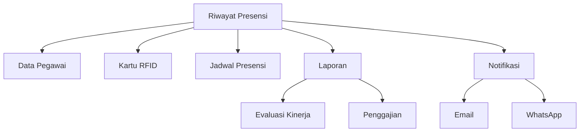

import {
  Card,
  CardGrid,
  Steps,
  Tabs,
  TabItem,
  Aside,
} from '@astrojs/starlight/components'

## Pengertian Riwayat Presensi

Riwayat Presensi Pegawai adalah modul untuk monitoring, analisis, dan pelaporan kehadiran seluruh pegawai madrasah. Modul ini menampilkan data presensi real-time yang tercatat melalui sistem RFID dan dapat dikoreksi secara manual jika diperlukan.

<CardGrid>
  <Card title='Real-time Monitoring' icon='rocket'>
    Pantau kehadiran pegawai secara langsung saat tap kartu RFID
  </Card>
  <Card title='Multi Filter' icon='setting'>
    Filter berdasarkan periode, pegawai, jabatan, atau status kehadiran
  </Card>
  <Card title='Koreksi Manual' icon='star'>
    Edit data presensi untuk kasus lupa tap atau kondisi khusus
  </Card>
  <Card title='Export Fleksibel' icon='document'>
    Generate laporan dalam berbagai format (Excel, PDF, CSV)
  </Card>
</CardGrid>

---

## Melihat Rekap Presensi

### Rekap Harian

**Melihat kehadiran pegawai hari ini**

<Steps>

1. **Buka Menu Riwayat Presensi**

   Navigasi ke **Menu Pegawai → Riwayat Presensi Pegawai**

2. **Dashboard Real-time**

   Dashboard akan menampilkan:
   - Total pegawai aktif
   - Sudah presensi: X pegawai
   - Belum presensi: Y pegawai
   - Terlambat: Z pegawai
   - Alpha: A pegawai

3. **Lihat Detail**

   Tabel akan menampilkan daftar pegawai dengan kolom:
   - Foto pegawai
   - Nama & NIP
   - Jabatan
   - Waktu Masuk
   - Waktu Pulang
   - Status Kehadiran
   - Aksi (Detail/Edit)

</Steps>

<Aside type='tip'>
  Dashboard akan **auto-refresh** setiap 30 detik untuk menampilkan data terbaru
  secara real-time.
</Aside>

---

## Filter Berdasarkan Periode

Sistem mendukung berbagai filter periode untuk analisis kehadiran.

<Tabs>
  <TabItem label="Hari Ini">
    **Presensi Real-time Hari Ini** - Default view saat membuka halaman - Update
    setiap pegawai tap - Cocok untuk monitoring harian **Klik**: Tab **"Hari
    Ini"**
  </TabItem>

<TabItem label='Minggu Ini'>
  **Rekap 7 Hari Terakhir** - Senin - Ahad (atau Senin - Sabtu untuk swasta) -
  Tampilkan tren kehadiran mingguan - Identifikasi pola keterlambatan **Klik**:
  Tab **"Minggu Ini"**
</TabItem>

<TabItem label='Bulan Ini'>
  **Rekap Bulan Berjalan** - Dari tanggal 1 sampai hari ini - Summary: total
  hadir, izin, sakit, alpha - Persentase kehadiran per pegawai **Klik**: Tab
  **"Bulan Ini"**
</TabItem>

  <TabItem label="Custom Range">
    **Pilih Tanggal Sendiri** - Klik **"Custom"** - Pilih tanggal mulai - Pilih
    tanggal akhir (max 3 bulan) - Klik **"Terapkan"** Cocok untuk laporan
    semester, triwulan, atau periode khusus
  </TabItem>
</Tabs>

### Quick Filter Periode

<CardGrid>
  <Card title="Kemarin" icon="star">
    Rekap presensi 1 hari sebelumnya untuk verifikasi
  </Card>

<Card title='7 Hari Terakhir' icon='document'>
  Analisis tren seminggu untuk evaluasi cepat
</Card>

<Card title='30 Hari Terakhir' icon='rocket'>
  Overview kehadiran sebulan penuh
</Card>

  <Card title="Bulan Lalu" icon="approve-check">
    Rekap bulan sebelumnya untuk laporan bulanan
  </Card>
</CardGrid>

---

## Filter Berdasarkan Pegawai

### Filter Individual

**Melihat riwayat presensi pegawai tertentu**

<Steps>

1. Klik dropdown **"Pilih Pegawai"**
2. Ketik nama pegawai di search box
3. Pilih pegawai dari hasil pencarian
4. Tabel akan menampilkan riwayat presensi pegawai tersebut

</Steps>

### Filter Multi Pegawai

**Bandingkan beberapa pegawai sekaligus**

1. Centang kotak di samping nama pegawai
2. Bisa pilih multiple (max 10)
3. Klik **"Bandingkan"**
4. Sistem tampilkan perbandingan kehadiran

---

## Filter Berdasarkan Jabatan

Analisis kehadiran berdasarkan jabatan untuk evaluasi kinerja per unit kerja.

### Pilihan Filter Jabatan

<Tabs>
  <TabItem label="Semua Jabatan">
    Tampilkan semua pegawai tanpa filter jabatan
  </TabItem>

<TabItem label='Guru'>Filter hanya guru mata pelajaran dan wali kelas</TabItem>

<TabItem label='Staff TU'>Filter hanya pegawai TU, bendahara, operator</TabItem>

<TabItem label='Struktural'>
  Filter hanya kepala madrasah dan wakil kepala
</TabItem>

  <TabItem label="Staff Pendukung">
    Filter satpam, kebersihan, driver, dll
  </TabItem>
</Tabs>

### Use Case Filter Jabatan

- **Rapat Guru**: Cek kehadiran guru untuk rapat
- **Evaluasi TU**: Analisis kedisiplinan staff TU
- **Monitoring Satpam**: Pastikan satpam shift hadir
- **Laporan per Unit**: Generate laporan per divisi

---

## Status Presensi

Sistem mencatat berbagai status kehadiran pegawai.

### Status Kehadiran

| Status        | Icon | Keterangan                                     | Warna   |
| ------------- | ---- | ---------------------------------------------- | ------- |
| **Hadir**     |      | Tepat waktu, tidak terlambat                   | Hijau   |
| **Terlambat** |      | Masuk melebihi toleransi keterlambatan         | Kuning  |
| **Izin**      |      | Tidak masuk dengan izin resmi (surat/approval) | Biru    |
| **Sakit**     |      | Tidak masuk karena sakit (dengan surat dokter) | Orange  |
| **Cuti**      | 🏖️   | Cuti resmi (tahunan, melahirkan, dll)          | Ungu    |
| **Alpha**     |      | Tidak masuk tanpa keterangan                   | Merah   |
| **Libur**     |      | Hari libur nasional/madrasah                   | Abu-abu |

### Detail Status

<Tabs>
  <TabItem label="Hadir">
    **Kehadiran Normal** **Kriteria**: - Tap masuk sebelum batas waktu - Dalam
    toleransi keterlambatan - Tap pulang sesuai jadwal **Contoh**: - Jadwal
    masuk: 07:00 - Toleransi: 15 menit - Pegawai tap: 06:55 → **Hadir**  -
    Pegawai tap: 07:10 → **Hadir**  (masih dalam toleransi)
  </TabItem>

<TabItem label='Terlambat'>
  **Keterlambatan** **Kriteria**: - Tap masuk melebihi toleransi - Masih dalam
  batas maksimal tap **Contoh**: - Jadwal masuk: 07:00 - Toleransi: 15 menit -
  Pegawai tap: 07:20 → **Terlambat** (5 menit lebih) **Sistem Mencatat**: -
  Durasi keterlambatan - Frekuensi terlambat per bulan - Alert jika >3x
  terlambat dalam sebulan
</TabItem>

<TabItem label='Izin/Sakit/Cuti'>
  **Tidak Hadir dengan Alasan** **Izin**: - Urusan keluarga, acara penting -
  Perlu approval atasan - Input manual oleh admin/atasan **Sakit**: - Tidak
  masuk karena sakit - Perlu surat dokter (>3 hari) - Dapat di-input sendiri
  (max 2 hari) **Cuti**: - Cuti tahunan (12 hari/tahun) - Cuti melahirkan (3
  bulan) - Cuti besar, dll - Harus approval kepala madrasah
</TabItem>

  <TabItem label="Alpha">
    **Tidak Hadir Tanpa Keterangan** **Kriteria**: - Tidak tap sampai batas
    maksimal - Tidak ada izin/sakit/cuti - Tidak ada koreksi manual **Contoh**:
    - Batas maksimal tap: 12:00 - Sampai jam 12:00 belum tap → **Alpha** 
    **Dampak**: - Potongan gaji/tunjangan - Surat peringatan (jika berulang) -
    Dihitung dalam evaluasi kinerja
  </TabItem>
</Tabs>

---

## Koreksi Data Presensi

Untuk kasus lupa tap, error sistem, atau kondisi khusus, admin dapat melakukan koreksi manual.

### Kapan Perlu Koreksi?

<CardGrid>
  <Card title="Lupa Tap" icon="warning">
    Pegawai hadir tapi lupa tap kartu RFID
  </Card>

<Card title='Tugas Luar' icon='rocket'>
  Pegawai dinas/tugas di luar madrasah seharian
</Card>

<Card title='Error Sistem' icon='star'>
  Reader RFID error, data tidak tercatat
</Card>

  <Card title="Kondisi Khusus" icon="document">
    Rapat di luar, workshop, atau acara resmi
  </Card>
</CardGrid>

### Cara Koreksi Data

<Steps>

1.  **Buka Detail Presensi**

    Cari tanggal dan pegawai yang akan dikoreksi

2.  **Klik Tombol Edit**

    Klik ikon **Edit** (pensil) pada row presensi tersebut

3.  **Pilih Jenis Koreksi**

           <Tabs>

    <TabItem label='Input Waktu Manual'>
      **Input Jam Masuk/Pulang** - Pilih: "Input Manual" - Isi waktu masuk
      (contoh: 07:00) - Isi waktu pulang (contoh: 15:30) - Isi alasan koreksi
      (wajib)
    </TabItem>

        <TabItem label="Ubah Status">
          **Ganti Status Kehadiran** - Pilih: "Ubah Status" - Pilih status baru:
          Izin/Sakit/Cuti - Isi alasan (wajib) - Upload bukti (opsional: surat
          izin/surat dokter)
        </TabItem>

             <TabItem label="Hapus Presensi">
            **Batalkan Presensi Salah** - Pilih: "Hapus Presensi" - Konfirmasi
            penghapusan - Isi alasan (wajib) Presensi akan dihapus dan status kembali
            "Belum Presensi"

          </TabItem>

    </Tabs>

4.  **Approval** (Opsional)

    Untuk perubahan tertentu, perlu approval:
    - Koreksi oleh **Operator** → Approval **Super Admin**
    - Koreksi masa lalu (>7 hari) → Approval **Kepala Madrasah**

5.  **Simpan Koreksi**

    Klik **"Simpan"**, sistem akan:
    - Catat perubahan di log
    - Update status presensi
    - Kirim notifikasi ke pegawai terkait (opsional)

</Steps>

<Aside type="caution" title="Audit Trail">
Semua koreksi data presensi akan **tercatat dalam log** yang mencakup:
- Siapa yang melakukan koreksi
- Kapan koreksi dilakukan
- Data sebelum dan sesudah koreksi
- Alasan koreksi

Log ini penting untuk audit dan transparansi.

</Aside>

---

## Export Laporan Presensi

Generate laporan kehadiran untuk keperluan administrasi dan evaluasi.

### Format Export

<Tabs>
  <TabItem label="Excel (.xlsx)">
    **Microsoft Excel - Rekomendasi** **Kelebihan**: - Dapat diedit dan analisis
    lanjutan - Support formula dan pivot table - Grafik dan chart bawaan **Isi
    Laporan**: - Sheet 1: Data presensi detail - Sheet 2: Summary per pegawai -
    Sheet 3: Grafik kehadiran **Use Case**: Analisis data, rekap bulanan,
    pelaporan ke atasan
  </TabItem>

<TabItem label='PDF'>
  **Portable Document Format** **Kelebihan**: - Siap cetak, layout rapi - Tidak
  dapat diedit (final) - Professional look **Isi Laporan**: - Header: Logo,
  judul, periode - Body: Tabel presensi - Footer: Tanda tangan digital **Use
  Case**: Arsip resmi, lampiran SK, dokumentasi
</TabItem>

  <TabItem label="CSV">
    **Comma-Separated Values** **Kelebihan**: - Format universal, ringan -
    Integrasi dengan sistem lain - Mudah di-import **Isi Laporan**: - Plain text
    dengan delimiter koma - Hanya data, tidak ada formatting **Use Case**:
    Import ke sistem lain, backup data raw
  </TabItem>
</Tabs>

### Cara Export

<Steps>

1. **Pilih Filter**

   Tentukan data yang akan di-export:
   - Periode waktu
   - Pegawai (semua atau pilihan)
   - Jabatan (semua atau filter)
   - Status kehadiran (semua atau tertentu)

2. **Klik Tombol Export**

   Klik button **"Export Laporan"** di pojok kanan atas

3. **Pilih Format**

   Pilih format yang diinginkan:
   - Excel (recommended)
   - PDF
   - CSV

4. **Customize Layout** (Opsional)

   Untuk PDF, Anda dapat:
   - Pilih orientasi: Portrait / Landscape
   - Tampilkan/sembunyikan kolom tertentu
   - Include grafik atau tidak

5. **Generate & Download**

   Klik **"Generate"**, tunggu proses selesai, lalu **Download**

</Steps>

<Aside type='tip'>
  Untuk laporan bulanan rutin, Anda dapat membuat **Template Laporan** yang
  tersimpan sehingga tidak perlu setting ulang setiap bulan.
</Aside>

---

## Statistik Kehadiran Pegawai

Dashboard menyediakan berbagai statistik untuk analisis kehadiran.

### Key Metrics

<CardGrid>
  <Card title="Tingkat Kehadiran" icon="star">
    **Persentase Kehadiran**
    
    Formula: (Total Hadir / Total Hari Kerja) x 100%
    
    -  >95%: Excellent
    -  85-95%: Good
    -  75-85%: Fair
    -  < 75%: Poor
  </Card>
  
  <Card title="Rata-rata Keterlambatan" icon="warning">
    **Durasi Terlambat per Pegawai**
    
    - Hitung total menit terlambat
    - Bagi dengan jumlah hari kerja
    - Identifikasi pegawai sering terlambat
  </Card>
  
  <Card title="Alpha Rate" icon="document">
    **Persentase Absen Tanpa Keterangan**
    
    Formula: (Total Alpha / Total Hari Kerja) x 100%
    
    Target: < 2% per bulan
  </Card>
  
  <Card title="Izin/Sakit/Cuti" icon="approve-check">
    **Cuti & Izin Terpakai**
    
    - Track sisa cuti tahunan
    - Monitor frekuensi izin
    - Analisis pola sakit
  </Card>
</CardGrid>

### Perbandingan Periode

| Metric              | Bulan Ini | Bulan Lalu | Trend         |
| ------------------- | --------- | ---------- | ------------- |
| Tingkat Kehadiran   | 96.5%     | 94.2%      | 📈 +2.3%      |
| Rata-rata Terlambat | 3.2 menit | 5.1 menit  | 📈 -1.9 menit |
| Alpha Rate          | 1.2%      | 2.8%       | 📈 -1.6%      |
| Total Izin          | 15 hari   | 12 hari    | 📉 +3 hari    |

---

## Grafik Kehadiran

Visualisasi data kehadiran untuk memudahkan analisis tren.

### Jenis Grafik

<Tabs>
  <TabItem label="Line Chart">
    **Grafik Garis - Tren Waktu** Menampilkan tren kehadiran dari hari ke hari
    atau bulan ke bulan **X-axis**: Tanggal/Bulan **Y-axis**: Persentase
    kehadiran Cocok untuk: Identifikasi pola, analisis tren jangka panjang
  </TabItem>

<TabItem label='Bar Chart'>
  **Grafik Batang - Perbandingan** Membandingkan kehadiran antar pegawai atau
  antar jabatan **X-axis**: Nama pegawai/Jabatan **Y-axis**: Jumlah hari hadir
  Cocok untuk: Ranking, komparasi antar unit
</TabItem>

<TabItem label='Pie Chart'>
  **Grafik Lingkaran - Proporsi** Menampilkan proporsi status kehadiran (Hadir,
  Izin, Sakit, Alpha) Cocok untuk: Summary cepat, presentasi ke atasan
</TabItem>

  <TabItem label="Heatmap">
    **Calendar Heatmap** Menampilkan pola kehadiran dalam bentuk calendar -
    Hijau tua: Hadir semua - Hijau muda: Hadir sebagian - Merah: Alpha banyak
    Cocok untuk: Identifikasi hari-hari bermasalah
  </TabItem>
</Tabs>

---

## Fitur Notifikasi

Sistem dapat mengirim notifikasi otomatis untuk berbagai kondisi.

### Alert Otomatis

<CardGrid>
  <Card title="Pegawai Alpha" icon="warning">
    **Notifikasi Real-time** Jika pegawai tidak tap sampai batas waktu, sistem
    kirim alert ke: - Admin sistem - Kepala Madrasah - Atasan langsung pegawai
    Via: Email, WhatsApp, Dashboard
  </Card>

<Card title='Keterlambatan Berulang' icon='star'>
  **Warning Kedisiplinan** Jika pegawai terlambat >3x dalam sebulan: - Alert ke
  admin - Notifikasi ke pegawai terkait - Recommend surat peringatan
</Card>

<Card title='Rekap Bulanan' icon='document'>
  **Otomatis Setiap Akhir Bulan** Sistem auto-generate dan kirim rekap ke: -
  Kepala Madrasah (semua pegawai) - Setiap pegawai (data pribadi) - Staff TU
  (untuk arsip)
</Card>

  <Card title="Reminder Cuti" icon="approve-check">
    **Pengingat Sisa Cuti** Notifikasi otomatis jika: - Sisa cuti >10 hari
    menjelang akhir tahun - Remind pegawai untuk ambil cuti - Cegah cuti hangus
  </Card>
</CardGrid>

---

## Laporan Khusus

### Laporan Kedisiplinan

**Untuk evaluasi kinerja pegawai**

Mencakup:

- Persentase kehadiran per pegawai
- Frekuensi keterlambatan
- Total alpha per periode
- Komparasi dengan rata-rata madrasah
- Rekomendasi: Reward atau Sanksi

### Laporan Jabatan

**Analisis kehadiran per unit kerja**

Mencakup:

- Tingkat kehadiran per jabatan
- Perbandingan antar jabatan
- Identifikasi jabatan dengan masalah kehadiran
- Rekomendasi perbaikan

### Laporan Keuangan

**Untuk perhitungan gaji/tunjangan**

Mencakup:

- Total hari kerja efektif per pegawai
- Potongan karena alpha/terlambat
- Tunjangan kehadiran (jika ada)
- Data untuk sistem penggajian

---

## Troubleshooting

### Data presensi tidak muncul

**Penyebab**:

- Koneksi reader RFID ke sistem terputus
- Database error
- Filter terlalu spesifik

**Solusi**:

1. Refresh halaman (F5)
2. Cek koneksi reader RFID
3. Reset filter ke default
4. Hubungi IT jika masih error

### Export laporan gagal

**Penyebab**:

- Data terlalu besar (>10.000 baris)
- Timeout server
- Format tidak didukung

**Solusi**:

1. Perkecil range waktu (max 3 bulan)
2. Filter data (pilih jabatan tertentu)
3. Coba format lain (Excel → CSV)
4. Download di off-peak hours

### Koreksi data ditolak

**Penyebab**:

- Tidak punya hak akses
- Perlu approval atasan
- Data sudah di-lock (akhir bulan)

**Solusi**:

1. Cek role dan hak akses Anda
2. Minta approval ke atasan
3. Hubungi Super Admin untuk unlock

### Grafik tidak muncul

**Penyebab**:

- Browser tidak support chart library
- JavaScript disabled
- Data tidak cukup untuk grafik

**Solusi**:

1. Update browser ke versi terbaru
2. Enable JavaScript
3. Pastikan ada minimal 7 hari data

---

## Best Practice

<CardGrid>
  <Card title="Cek Harian" icon="star">
    Review rekap presensi setiap hari untuk deteksi dini masalah kehadiran
  </Card>

<Card title='Koreksi Cepat' icon='rocket'>
  Lakukan koreksi manual maksimal 2 hari setelah kejadian agar data akurat
</Card>

<Card title='Backup Laporan' icon='approve-check'>
  Export dan simpan laporan bulanan sebagai arsip dan backup
</Card>

  <Card title="Evaluasi Rutin" icon="document">
    Lakukan evaluasi kehadiran setiap akhir bulan untuk perbaikan kedisiplinan
  </Card>
</CardGrid>

---

## Integrasi dengan Modul Lain

---

## Langkah Selanjutnya

<CardGrid>
  <Card title="Export Laporan" icon="document">
    Generate laporan kehadiran pegawai untuk periode tertentu. [Lihat Panduan
    Export →](#export-laporan)
  </Card>

  <Card title="Kelola Data Pegawai" icon="star">
    Update data pegawai untuk memastikan sinkronisasi dengan presensi. [Ke Data
    Pegawai →](./pegawai)
  </Card>
</CardGrid>
