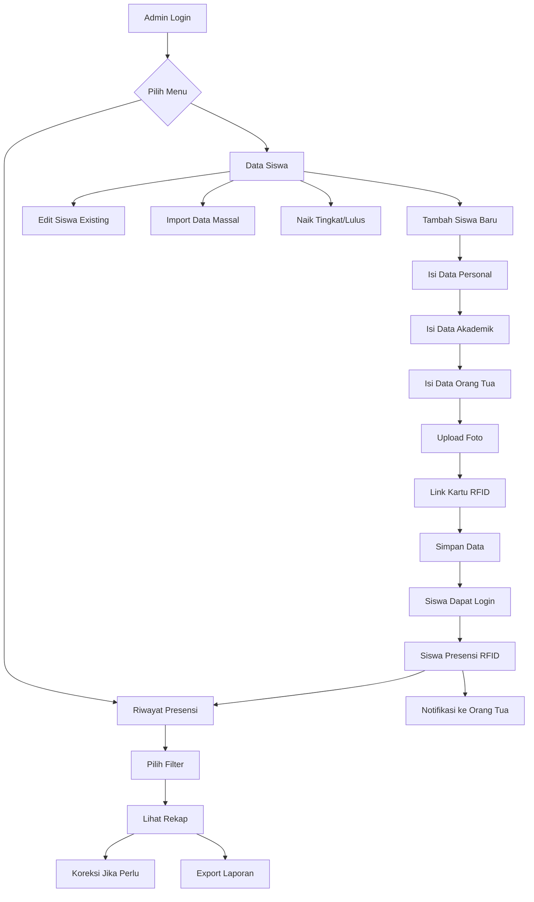
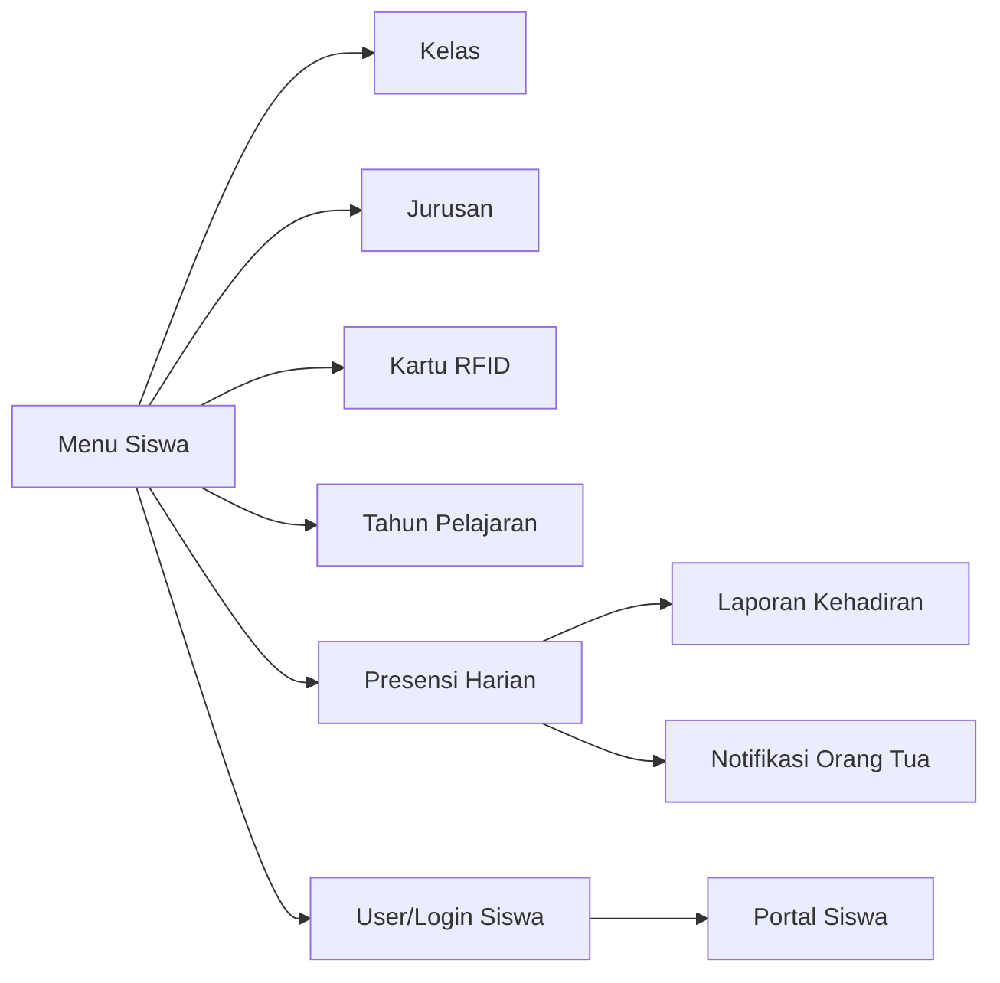

import {
    Card,
    CardGrid,
    Steps,
    Tabs,
    TabItem,
    Aside,
} from '@astrojs/starlight/components'

## Pengertian Menu Siswa

Menu Siswa adalah modul lengkap untuk mengelola data kesiswaan dan monitoring kehadiran seluruh siswa madrasah. Modul ini mencakup pengelolaan data personal, akademik, hingga analisis kehadiran per kelas atau individu.

<CardGrid>
    <Card title='Database Siswa Terpusat' icon='document'>
        Kelola ribuan data siswa dari berbagai tingkat dan jurusan dalam satu
        sistem
    </Card>
    <Card title='Presensi Real-time' icon='rocket'>
        Monitor kehadiran siswa secara langsung dengan sistem RFID otomatis
    </Card>
    <Card title='Notifikasi Orang Tua' icon='star'>
        Kirim notifikasi kehadiran anak ke WhatsApp orang tua secara otomatis
    </Card>
    <Card title='Laporan Lengkap' icon='puzzle'>
        Generate laporan kehadiran untuk wali kelas, BK, dan kepala madrasah
    </Card>
</CardGrid>

---

## Fungsi Menu Siswa

### Manajemen Data

**Kelola Informasi Kesiswaan**

- Data personal siswa (nama, NIS, NISN, kontak)
- Data akademik (kelas, jurusan, tahun masuk)
- Data orang tua/wali (nama, kontak, pekerjaan)
- Riwayat pendidikan sebelumnya
- Upload dokumen dan foto siswa
- Link kartu presensi RFID

### Monitoring Kehadiran

**Tracking Presensi Harian Siswa**

- Rekap kehadiran per siswa dan per kelas
- Status: Hadir, Terlambat, Izin, Dispensasi, Sakit, Alpha
- 📈 Grafik dan statistik kehadiran
- Filter berdasarkan periode (harian/bulanan)
- 📱 Notifikasi real-time ke orang tua

### Administrasi Kesiswaan

**Pengelolaan Administrasi Siswa**

- 📄 Upload dokumen penting (ijazah, KK, akta)
- 💳 Manajemen kartu RFID siswa
- 🔄 Import/export data massal
- Pindah kelas/naik tingkat (bulk action)
- 🎓 Status siswa: Aktif, Lulus, Keluar, Mutasi

---

## Daftar Sub-Menu Siswa

### 1. Data Siswa

**Pengelolaan Database Siswa**

<CardGrid>
    <Card title='CRUD Lengkap' icon='star'>
        Tambah, edit, hapus data siswa dengan interface yang mudah digunakan
    </Card>
    <Card title='Upload Foto' icon='document'>
        Upload foto siswa untuk ID card dan profil sistem
    </Card>
    <Card title='Import Massal' icon='rocket'>
        Import ratusan data siswa baru sekaligus via Excel atau ZIP file
    </Card>
    <Card title='Naik Tingkat/Lulus' icon='approve-check'>
        Proses kenaikan kelas atau kelulusan siswa secara massal
    </Card>
</CardGrid>

**Fitur Utama**:

- Tambah siswa baru (manual atau import)
- Edit data siswa existing
- Upload foto siswa untuk ID card
- Atur kelas dan jurusan
- Link dengan kartu presensi RFID
- Data orang tua/wali lengkap
- Pindah kelas siswa (individu/massal)
- Naik tingkat otomatis (kelas VII→XI→XII)
- Status lulus/keluar/mutasi
- Hapus data siswa (soft delete)

[Pelajari Selengkapnya →](./siswa)

---

### 2. Riwayat Presensi Siswa

**Monitoring dan Analisis Kehadiran Siswa**

<CardGrid>
    <Card title='Rekap Real-time' icon='rocket'>
        Lihat rekap kehadiran siswa yang ter-update secara real-time
    </Card>
    <Card title='Filter Multi Dimensi' icon='setting'>
        Filter berdasarkan periode, kelas, siswa, atau status kehadiran
    </Card>
    <Card title='Input Manual' icon='star'>
        Input presensi manual untuk siswa yang lupa tap kartu
    </Card>
    <Card title='Notifikasi Orang Tua' icon='document'>
        Kirim notifikasi otomatis ke WhatsApp orang tua saat anak presensi
    </Card>
</CardGrid>

**Fitur Utama**:

- Melihat rekap presensi per siswa
- Filter berdasarkan periode waktu
- Filter berdasarkan kelas dan jurusan
- Filter berdasarkan siswa tertentu
- Status presensi detail (Hadir, Terlambat, Izin, Dispensasi, Sakit, Alpha, Libur)
- Koreksi data presensi manual
- Input manual presensi (lupa tap)
- Export laporan (Excel/PDF)
- Statistik kehadiran per siswa
- Grafik kehadiran per kelas
- Notifikasi otomatis ke orang tua via WhatsApp

[Pelajari Selengkapnya →](./riwayat-presensi-siswa)

---

## Siapa yang Dapat Mengakses?

### Hak Akses Berdasarkan Role

<Tabs>
  <TabItem label="Super Admin">
    **Akses Penuh**  Kelola semua data siswa  Tambah/edit/hapus siswa 
    Import/export data massal  Lihat semua riwayat presensi  Koreksi data
    presensi  Generate semua laporan  Proses naik tingkat/kelulusan  Atur
    notifikasi orang tua
  </TabItem>

<TabItem label='Operator'>
    **Akses Operasional** Tambah/edit data siswa Upload foto siswa Import/export
    data Lihat riwayat presensi Koreksi data presensi Generate laporan Input
    manual presensi Tidak bisa hapus siswa Tidak bisa proses kelulusan
</TabItem>

<TabItem label='Wali Kelas'>
    **Akses Per Kelas** Lihat data siswa kelas binaannya Edit data siswa
    kelasnya (terbatas) Lihat presensi siswa kelasnya Koreksi presensi kelasnya
    Input manual presensi Generate laporan kelasnya Tidak bisa lihat kelas lain
    Tidak bisa hapus siswa
</TabItem>

<TabItem label='Guru BK'>
    **Akses Monitoring** Lihat semua data siswa Lihat semua riwayat presensi
    Generate laporan kehadiran Identifikasi siswa bermasalah Hanya baca, tidak
    bisa edit
</TabItem>

<TabItem label='Siswa'>
    **Akses Personal** Lihat data pribadi sendiri Update profil sendiri
    (terbatas) Lihat riwayat presensi sendiri Ajukan izin/dispensasi Tidak bisa
    lihat data siswa lain Tidak bisa edit data akademik
</TabItem>

  <TabItem label="Orang Tua">
    **Akses Anak Kandung**  Lihat data anak  Lihat riwayat presensi anak 
    Terima notifikasi kehadiran anak  Download laporan presensi anak  Tidak
    bisa edit data  Tidak bisa lihat siswa lain
  </TabItem>
</Tabs>

---

## Alur Kerja Menu Siswa

### Workflow Detail

<Steps>

1. **Setup Awal (Pendaftaran Siswa Baru)**
    - Admin input data siswa baru
    - Upload foto untuk ID card
    - Atur kelas dan jurusan
    - Input data orang tua/wali
    - Link dengan kartu presensi RFID

2. **Operasional Harian**
    - Siswa tap kartu RFID saat masuk sekolah
    - Data presensi otomatis tercatat
    - Notifikasi otomatis terkirim ke WhatsApp orang tua
    - Wali kelas monitoring presensi kelasnya real-time
    - Admin/operator monitoring dashboard

3. **Monitoring & Koreksi**
    - Wali kelas cek rekap presensi harian
    - Koreksi manual jika ada siswa lupa tap
    - Input manual untuk izin/sakit/dispensasi
    - Follow up siswa yang sering alpha

4. **Akhir Periode (Naik Tingkat/Lulus)**
    - Admin proses kenaikan kelas (X→XI, XI→XII)
    - Proses kelulusan siswa Kelas VIII I
    - Update status siswa (Lulus/Tidak Lulus)
    - Generate laporan akhir tahun

</Steps>

---

## Kategori Siswa

### Berdasarkan Status

<CardGrid>
  <Card title="Siswa Aktif" icon="star">
    **Status: Aktif Belajar** - Terdaftar dalam kelas aktif - Dapat presensi
    setiap hari - Mengikuti KBM normal - Tercatat dalam laporan
  </Card>

<Card title='Siswa Lulus' icon='approve-check'>
    **Status: Sudah Lulus** - Lulus ujian akhir - Status berubah "Lulus" - Tidak
    dapat presensi lagi - Data tersimpan untuk alumni
</Card>

<Card title='Siswa Keluar' icon='warning'>
    **Status: Drop Out** - Keluar sebelum lulus (DO) - Pindah sekolah (mutasi
    keluar) - Alasan pribadi/keluarga - Data diarsipkan
</Card>

  <Card title="Siswa Mutasi" icon="document">
    **Status: Pindahan** - Mutasi masuk dari sekolah lain - Pindah kelas/jurusan
    - Perlu verifikasi data
  </Card>
</CardGrid>

### Berdasarkan Tingkat & Jurusan

| Tingkat          | Jurusan               | Jumlah Tipikal | Wali Kelas |
| ---------------- | --------------------- | -------------- | ---------- |
| **kelas VII**    | Unggulan, IPS         | 6-8 rombel     | Ya         |
| **Kelas VIII **  | Unggulan, IPS, Bahasa | 6-10 rombel    | Ya         |
| **Kelas VIII I** | Unggulan, IPS, Bahasa | 6-10 rombel    | Ya         |

---

## Integrasi dengan Modul Lain

### Hubungan Antar Modul

- **Kelas**: Setiap siswa terikat pada satu kelas aktif
- **Jurusan**: Siswa memiliki jurusan sesuai kelasnya
- **Kartu RFID**: Siswa linked dengan kartu untuk presensi otomatis
- **Tahun Pelajaran**: Data siswa per tahun ajaran
- **Presensi Harian**: Tap RFID tercatat sebagai presensi
- **Laporan**: Rekap kehadiran untuk evaluasi dan rapor
- **Notifikasi**: Alert ke orang tua via WhatsApp
- **Portal Siswa**: Siswa login untuk lihat data pribadi

---

## Fitur Unggulan

<CardGrid>
  <Card title="Import Siswa Baru" icon="rocket">
    **Upload Ratusan Siswa Sekaligus** - Import dari Excel (format template) -
    Import foto siswa via ZIP file - Validasi otomatis data duplikat - Assign
    kelas otomatis Cocok untuk: Penerimaan siswa baru (PPDB)
  </Card>

<Card title='Naik Tingkat Massal' icon='star'>
    **Proses Kenaikan Kelas Otomatis** - Pilih semua siswa kelas VII - Klik
    "Naik ke Kelas VIII " - Sistem otomatis update kelas - Generate laporan
    kenaikan Cocok untuk: Akhir tahun ajaran
</Card>

<Card title='Notifikasi Orang Tua' icon='document'>
    **WhatsApp Real-time** - Siswa tap → Notifikasi terkirim - Informasi: Nama,
    waktu, status - Orang tua tenang, tahu anak sampai sekolah - Gratis, tidak
    ada biaya SMS Cocok untuk: Keamanan dan monitoring orang tua
</Card>

  <Card title="Export Laporan Fleksibel" icon="approve-check">
    **Multiple Format & Custom** - Excel: Analisis lanjutan - PDF: Cetak dan
    arsip - CSV: Integrasi sistem lain - Per kelas atau per siswa Cocok untuk:
    Pelaporan rutin ke atasan/orang tua
  </Card>
</CardGrid>

---

## Workflow Umum

### Skenario: Penerimaan Siswa Baru (PPDB)

**Awal tahun ajaran, ratusan siswa baru masuk**

<Steps>

1. **Persiapan Data**
    - Kumpulkan data siswa baru dari formulir PPDB
    - Scan dokumen (ijazah, KK, akta)
    - Foto siswa dengan background merah

2. **Import Massal**
    - Format data di Excel sesuai template
    - Upload Excel via sistem
    - Review preview, cek error
    - Proses import (sistem assign kelas otomatis)

3. **Upload Foto Massal**
    - Rename foto sesuai NIS/NISN
    - Zip semua foto
    - Upload ZIP file
    - Sistem match foto dengan data siswa

4. **Registrasi Kartu RFID**
    - Scan kartu RFID kosong
    - Link dengan data siswa
    - Test tap untuk validasi
    - Cetak kartu fisik

5. **Orientasi Siswa**
    - Serahkan kartu RFID + lanyard
    - Edukasi cara presensi
    - Aktivasi akun login siswa
    - Beri username/password

</Steps>

### Skenario: Kenaikan Kelas Akhir Tahun

**Siswa naik dari kelas VII ke XI, atau XI ke XII**

<Steps>

1. **Evaluasi & Seleksi**
    - Tentukan siswa yang naik kelas
    - Identifikasi siswa tidak naik (tinggal kelas)
    - Tentukan kelas tujuan (Unggulan/Reguler)

2. **Proses Naik Tingkat**
    - Filter siswa kelas VII yang naik
    - Pilih "Naik ke Kelas VIII "
    - Sistem otomatis update kelas
    - Assign ke rombel baru (VIII Unggulan1, 2, dst)

3. **Update Data**
    - Update wali kelas baru
    - Update jadwal pelajaran
    - Notifikasi ke siswa & orang tua
    - Generate laporan kenaikan

4. **Verifikasi**
    - Cek apakah semua siswa sudah di kelas baru
    - Cek siswa tinggal kelas tetap di kelas lama
    - Backup data untuk arsip

</Steps>

---

## Best Practice

<CardGrid>
  <Card title="Data Valid & Lengkap" icon="approve-check">
    Pastikan NIS, NISN, dan data orang tua akurat untuk menghindari masalah di
    kemudian hari
  </Card>

<Card title='Update Kontak Orang Tua' icon='star'>
    Verifikasi nomor WhatsApp orang tua setiap semester agar notifikasi terkirim
    dengan baik
</Card>

<Card title='Backup Rutin' icon='warning'>
    Export data siswa setiap bulan sebagai backup, terutama sebelum proses naik
    tingkat
</Card>

  <Card title="Edukasi Siswa" icon="document">
    Berikan orientasi sistem presensi kepada siswa baru agar tidak bingung dan
    bisa langsung adaptasi
  </Card>
</CardGrid>

---

## Tips Keamanan

<Aside type='tip'>
    - Batasi akses edit data siswa hanya untuk **Super Admin** dan **Operator**
    terpercaya - Data NISN dan NIK bersifat sensitif, jangan tampilkan di
    laporan publik - Aktifkan log aktivitas untuk audit trail semua perubahan
    data siswa - Enkripsi data orang tua (nomor HP, alamat) untuk privasi -
    Review hak akses secara berkala, nonaktifkan siswa yang sudah lulus/keluar
</Aside>

---

## Statistik & Monitoring

Dashboard Menu Siswa menyediakan statistik real-time:

### Key Metrics

- 👥 **Total Siswa Aktif**: Jumlah siswa yang masih belajar
- **Tingkat Kehadiran**: Persentase kehadiran rata-rata seluruh siswa
- **Siswa Alpha Hari Ini**: Alert untuk follow-up wali kelas/BK
- 📈 **Tren Kehadiran per Kelas**: Grafik komparasi antar kelas
- 🏆 **Kelas Terbaik**: Kelas dengan tingkat kehadiran tertinggi
- 📉 **Siswa Bermasalah**: Daftar siswa dengan kehadiran < 75%

### Visual Dashboard

- **Chart**: Bar chart kehadiran per kelas, pie chart status
- 🗓️ **Calendar View**: Heatmap kehadiran siswa per hari
- 📋 **Table**: Sortable dan searchable datatable
- 🔔 **Alert**: Real-time notification untuk siswa alpha atau terlambat >3x

---

## Langkah Selanjutnya

<CardGrid>
  <Card title="Kelola Data Siswa" icon="rocket">
    Mulai menambahkan data siswa lengkap untuk operasional sistem. [Ke Halaman
    Data Siswa →](./siswa)
  </Card>

  <Card title="Lihat Riwayat Presensi" icon="star">
    Monitor kehadiran siswa dan generate laporan kehadiran. [Ke Riwayat Presensi
    →](./riwayat-presensi-siswa)
  </Card>
</CardGrid>
