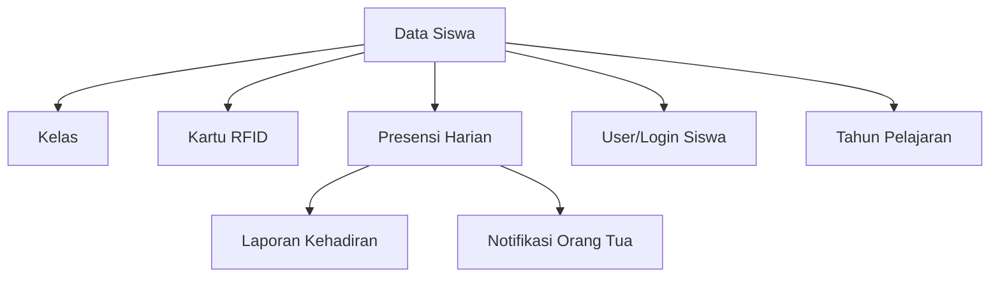

import {
    Card,
    CardGrid,
    Steps,
    Tabs,
    TabItem,
    Aside,
} from '@astrojs/starlight/components'

## Pengertian Data Siswa

Data Siswa adalah database lengkap yang menyimpan informasi seluruh siswa madrasah dari berbagai tingkat dan jurusan. Database ini mencakup data personal, akademik, data orang tua, hingga dokumen pendukung yang terintegrasi dengan sistem presensi.

<CardGrid>
    <Card title='Database Terpusat' icon='document'>
        Satu sumber data untuk ribuan siswa dari kelas VII sampai IX
    </Card>
    <Card title='Terintegrasi' icon='puzzle'>
        Terhubung dengan presensi, kartu RFID, kelas, dan notifikasi orang tua
    </Card>
    <Card title='Mudah Dikelola' icon='star'>
        Interface user-friendly untuk CRUD dan operasi massal (naik tingkat,
        lulus)
    </Card>
    <Card title='Scalable' icon='rocket'>
        Mampu menampung ribuan data siswa dengan performa optimal
    </Card>
</CardGrid>

---

## Menambah Siswa Baru

<Steps>

1. **Buka Menu Data Siswa**

    Navigasi ke **Menu Siswa → Siswa** dari sidebar

2. **Klik Tombol Tambah**

    Klik **"+ Tambah Siswa"** di pojok kanan atas

3. **Isi Data Personal**

    **Identitas Siswa**:
    - **Nama Lengkap** (wajib) - Sesuai akta lahir
    - **NIS** (wajib) - Nomor Induk Siswa madrasah
    - **NISN** (wajib) - Nomor Induk Siswa Nasional
    - **NIK** (wajib) - Nomor KTP/KK
    - **Tempat Lahir** (wajib)
    - **Tanggal Lahir** (wajib)
    - **Jenis Kelamin** (wajib) - L/P
    - **Agama** (wajib) - Islam (default)
    - **Anak ke-** (opsional) - Urutan dalam keluarga

    **Kontak**:
    - **No. HP Siswa** (opsional) - WhatsApp siswa
    - **Email Siswa** (opsional) - Email aktif
    - **Alamat Lengkap** (wajib)
    - **RT/RW** (opsional)
    - **Kelurahan/Desa** (wajib)
    - **Kecamatan** (wajib)
    - **Kabupaten/Kota** (wajib)
    - **Kode Pos** (opsional)

4. **Isi Data Akademik**
    - **Tahun Masuk** (wajib) - Contoh: 2024
    - **Kelas** (wajib) - Pilih dari dropdown
    - **Jurusan** (wajib) - Otomatis sesuai kelas
    - **Tahun Pelajaran** (wajib) - Otomatis tahun aktif
    - **Asal Sekolah** (opsional) - SMP/MTs asal
    - **No. Ijazah Sebelumnya** (opsional)
    - **Status Siswa** (wajib) - Aktif (default)

5. **Isi Data Orang Tua/Wali**

    **Data Ayah**:
    - Nama Ayah (wajib)
    - NIK Ayah (opsional)
    - Pekerjaan Ayah (wajib)
    - Penghasilan Ayah (opsional)
    - No. HP Ayah (wajib) - WhatsApp aktif

    **Data Ibu**:
    - Nama Ibu (wajib)
    - NIK Ibu (opsional)
    - Pekerjaan Ibu (wajib)
    - Penghasilan Ibu (opsional)
    - No. HP Ibu (wajib) - WhatsApp aktif

    **Data Wali** (jika ada):
    - Nama Wali (opsional)
    - Hubungan dengan siswa
    - No. HP Wali (opsional)

6. **Upload Foto Siswa**
    - Klik **"Upload Foto"**
    - Pilih file foto (JPG/PNG, max 2MB)
    - Background: Merah untuk siswa
    - Crop dan sesuaikan jika perlu

7. **Link Kartu RFID** (Opsional)
    - Jika sudah ada kartu RFID, input nomor RFID
    - Atau skip, akan diisi nanti saat kartu ready

8. **Simpan Data**

    Klik **"Simpan"** untuk menyimpan data siswa

</Steps>

<Aside type='tip'>
    Pastikan **nomor HP orang tua** yang diinput **aktif WhatsApp** karena akan
    digunakan untuk notifikasi kehadiran anak secara real-time.
</Aside>

---

## Data yang Dibutuhkan

### Data Wajib

<CardGrid>
  <Card title="Identitas Siswa" icon="star">
    - Nama lengkap - NIS (Nomor Induk Siswa) - NISN (dari Kemendikbud) - NIK
    (KTP/KK) - Tempat & tanggal lahir - Jenis kelamin - Agama - Alamat lengkap
  </Card>

<Card title='Data Akademik' icon='document'>
    - Tahun masuk - Kelas (VII, VIII, IX) - Jurusan (Unggulan/Reguler) - Tahun
    pelajaran - Status siswa (Aktif)
</Card>

  <Card title="Data Orang Tua" icon="approve-check">
    - Nama Ayah & Ibu - Pekerjaan Ayah & Ibu - **No. HP Ayah/Ibu (WhatsApp)**
    Minimal satu nomor HP orang tua harus ada untuk notifikasi
  </Card>
</CardGrid>

### Data Opsional

| Kategori     | Data          | Keterangan            |
| ------------ | ------------- | --------------------- |
| **Personal** | Anak ke-      | Urutan dalam keluarga |
|              | Email siswa   | Untuk komunikasi      |
|              | No. HP siswa  | WhatsApp pribadi      |
| **Akademik** | Asal sekolah  | SMP/MTs sebelumnya    |
|              | No. Ijazah    | Ijazah SMP/MTs        |
| **Keluarga** | NIK orang tua | Untuk verifikasi      |
|              | Penghasilan   | Untuk beasiswa        |
|              | Data wali     | Jika diasuh wali      |

---

## Mengatur Kelas Siswa

Setiap siswa harus terdaftar dalam satu kelas aktif.

### Memilih Kelas

<Tabs>
  <TabItem label="Saat Input Baru">
    **Pilih dari Dropdown** 1. Di form tambah siswa, cari field **"Kelas"** 2.
    Klik dropdown, pilih kelas yang sesuai 3. Jurusan akan otomatis terisi
    sesuai kelas 4. Contoh: Pilih "VII Unggulan" → Jurusan: Unggulan, Tingkat: VII
  </TabItem>

<TabItem label='Pindah Kelas'>
    **Ubah Kelas Siswa** 1. Edit data siswa 2. Ubah field **"Kelas"** 3. Simpan
    perubahan Siswa akan berpindah ke kelas baru mulai hari berikutnya
</TabItem>

  <TabItem label="Naik Tingkat">
    **Kenaikan Kelas Massal** Gunakan fitur **"Naik Tingkat"** untuk memindahkan
    banyak siswa sekaligus: 1. Filter siswa kelas VII 2. Centang semua siswa yang
    naik 3. Klik **"Naik ke Kelas VIII "** 4. Pilih rombel tujuan (VIII Unggulan 1, 2, 3,
    dst) 5. Proses [Lihat detail →](#naik-tingkat)
  </TabItem>
</Tabs>

---

## Menghubungkan dengan Kartu RFID

Agar siswa dapat presensi dengan sistem RFID, data siswa harus di-link dengan kartu.

### Cara Link Kartu RFID

<Steps>

1. **Siapkan Kartu RFID**

    Pastikan siswa sudah memiliki kartu RFID aktif (sudah ajukan dan selesai)

2. **Buka Data Siswa**

    Klik **Edit** pada siswa yang akan di-link

3. **Scan Nomor RFID**
    - Gunakan RFID reader untuk scan kartu
    - Atau input manual nomor RFID (10 digit integer)
    - Contoh: 1365289563

4. **Simpan**

    Klik **"Simpan"**, sistem akan validasi:
    - Apakah nomor RFID sudah terdaftar?
    - Apakah sudah digunakan siswa lain?

5. **Test Tap**

    Minta siswa test tap kartu di reader untuk konfirmasi

</Steps>

<Aside type='caution'>
    Satu nomor RFID hanya bisa di-link ke **satu siswa**. Jika nomor sudah
    digunakan, sistem akan menolak dan menampilkan error.
</Aside>

---

## Mengedit Data Siswa

### Edit Data Personal & Akademik

<Steps>

1. Cari siswa di tabel menggunakan search atau filter
2. Klik ikon **Edit** (pensil) pada row siswa
3. Ubah data yang perlu diperbarui
4. Klik **"Simpan"**

</Steps>

### Yang Dapat Diedit

- Data personal (nama, kontak, alamat)
- Data akademik (kelas, status)
- Data orang tua (nama, kontak)
- Foto siswa
- Nomor RFID
- NIS, NISN, NIK (hati-hati, harus sesuai dokumen resmi)

<Aside type='note'>
    Perubahan kelas siswa akan **langsung berlaku** dan mempengaruhi wali kelas,
    laporan, dan notifikasi. Pastikan data yang diinput sudah benar.
</Aside>

---

## Upload Foto Siswa

Foto siswa digunakan untuk:

- ID card / kartu RFID
- Profil di sistem
- Absensi visual (opsional)
- Laporan dan dokumen

### Ketentuan Foto

<CardGrid>
  <Card title="Format File" icon="document">
    - JPG, JPEG, PNG - Maksimal 2 MB - Resolusi minimum 300x400 px - Resolusi
    ideal 600x800 px
  </Card>

<Card title='Background' icon='star'>
    - **Merah** untuk siswa - Background polos, tidak bergambar - Lighting
    cukup, tidak gelap/silau
</Card>

  <Card title="Pose" icon="approve-check">
    - Pas foto formal - Wajah menghadap kamera - Tidak pakai kacamata hitam -
    Tidak selfie atau foto candid - Seragam sekolah (direkomendasikan)
  </Card>
</CardGrid>

### Cara Upload Foto

<Tabs>
  <TabItem label="Upload Satu Foto">
    **Saat Input/Edit Siswa** 1. Klik button **"Upload Foto"** 2. Pilih file
    dari komputer 3. Crop jika perlu 4. Klik **"Simpan"**
  </TabItem>

  <TabItem label="Upload Massal">
    **Import Foto via ZIP** 1. Siapkan folder berisi semua foto siswa 2. Nama
    file foto: `{NIS}.jpg` atau `{NISN}.jpg` - Contoh: `2024001.jpg` (NIS) -
    Contoh: `0012345678.jpg` (NISN) 3. Compress folder menjadi ZIP 4. Klik
    **"Import Foto Siswa"** 5. Upload file ZIP 6. Sistem akan otomatis match
    dengan data siswa
  </TabItem>
</Tabs>

---

## Import Data Siswa Massal

Untuk menambahkan banyak siswa sekaligus (misalnya siswa baru PPDB), gunakan fitur import.

### Import dari Excel

<Steps>

1. **Download Template Excel**

    Klik button **"Download Template"** di halaman Data Siswa

2. **Isi Data di Excel**

    Lengkapi kolom-kolom berikut:

    | Kolom          | Wajib | Contoh             |
    | -------------- | ----- | ------------------ |
    | nama_lengkap   | Ya    | Ahmad Zainuddin    |
    | nis            | Ya    | 2024001            |
    | nisn           | Ya    | 0012345678         |
    | nik            | Ya    | 3601012010010001   |
    | tempat_lahir   | Ya    | Pandeglang         |
    | tanggal_lahir  | Ya    | 2010-01-01         |
    | jenis_kelamin  | Ya    | L / P              |
    | agama          | Ya    | Islam              |
    | alamat         | Ya    | Jl. Merdeka No. 10 |
    | kelas_kode     | Ya    | VII-Unggulan-1     |
    | tahun_masuk    | Ya    | 2024               |
    | nama_ayah      | Ya    | Ahmad Dahlan       |
    | hp_ayah        | Ya    | 081234567890       |
    | pekerjaan_ayah | Ya    | Petani             |
    | nama_ibu       | Ya    | Siti Aminah        |
    | hp_ibu         | Ya    | 081298765432       |
    | pekerjaan_ibu  | Ya    | Ibu Rumah Tangga   |
    | status_siswa   | Ya    | Aktif              |

3. **Upload File Excel**
    - Klik **"Import Data Siswa"**
    - Pilih file Excel yang sudah diisi
    - Klik **"Upload"**

4. **Preview & Validasi**
    - Sistem akan tampilkan preview data
    - Cek apakah ada error atau warning:
        - NIS/NISN duplikat
        - Format tanggal salah
        - Kode kelas tidak ditemukan
    - Perbaiki jika ada yang salah

5. **Proses Import**
    - Jika tidak ada error, klik **"Proses Import"**
    - Tunggu hingga selesai (bisa 1-5 menit untuk ratusan data)
    - Sistem akan tampilkan summary:
        - Berhasil: X siswa
        - Gagal: Y siswa (dengan detail error)

</Steps>

<Aside type='caution' title='Perhatian!'>
    - Data yang sudah ada (duplikat NIS/NISN) akan **dilewati** atau
    **di-update** sesuai pengaturan - Pastikan format tanggal sudah benar:
    **YYYY-MM-DD** (contoh: 2010-01-15) - Kode kelas harus sudah terdaftar di
    sistem (format: VII-Unggulan-1), jika tidak akan error - Nomor HP harus
    format Indonesia (08xxx atau 62xxx)
</Aside>

---

## Import Foto Siswa via ZIP

Untuk upload banyak foto sekaligus:

<Steps>

1. **Siapkan Folder Foto**

    Kumpulkan semua foto siswa dalam satu folder

2. **Rename File Foto**

    Nama file harus sesuai NIS atau NISN:
    - `2024001.jpg` (NIS)
    - `0012345678.jpg` (NISN)
    - Ekstensi: `.jpg`, `.jpeg`, `.png`

3. **Compress ke ZIP**
    - Zip folder tersebut
    - Nama ZIP bebas, contoh: `foto_siswa_x_2024.zip`

4. **Upload ZIP**
    - Klik **"Import Foto Siswa"**
    - Pilih file ZIP
    - Upload

5. **Proses Import**
    - Sistem extract ZIP
    - Match foto dengan data siswa berdasarkan nama file
    - Tampilkan summary:
        - Berhasil: X foto
        - Tidak cocok: Y foto (siswa tidak ditemukan)

</Steps>

<Aside type='tip'>
    Foto yang tidak cocok dengan data siswa akan dilewati. Cek log import untuk
    detail siswa mana yang fotonya tidak ter-upload.
</Aside>

---

## Export Data Siswa

Export data untuk keperluan pelaporan, backup, atau integrasi sistem lain.

### Format Export

<Tabs>
  <TabItem label="Excel (.xlsx)">
    **Microsoft Excel - Rekomendasi** **Kelebihan**: - Dapat diedit dan analisis
    lanjutan - Support formula dan pivot table - Grafik dan chart bawaan **Isi
    Export**: - Sheet 1: Data siswa lengkap - Sheet 2: Summary per kelas - Sheet
    3: Statistik **Use Case**: Analisis data, rekap per kelas, dapodik
  </TabItem>

<TabItem label='PDF'>
    **Portable Document Format** **Kelebihan**: - Siap cetak, layout rapi -
    Tidak dapat diedit (final) - Professional look **Isi Export**: - Header:
    Logo, judul, tanggal - Body: Tabel data siswa - Footer: Tanda tangan kepala
    madrasah **Use Case**: Arsip resmi, lampiran SK, dokumentasi
</TabItem>

  <TabItem label="CSV">
    **Comma-Separated Values** **Kelebihan**: - Format universal, ringan -
    Integrasi dengan Dapodik/sistem lain - Mudah di-import **Isi Export**: -
    Plain text dengan delimiter koma - Hanya data, tidak ada formatting **Use
    Case**: Import ke Dapodik, backup data raw
  </TabItem>
</Tabs>

### Custom Export

Anda dapat memfilter data sebelum export:

- **Filter Kelas**: Export hanya kelas VII Unggulan, atau Kelas VIII semua jurusan
- **Filter Status**: Hanya siswa aktif, atau include lulus/keluar
- **Pilih Kolom**: Pilih kolom mana saja yang akan di-export
- **Include Foto**: Export dengan foto atau tanpa foto

---

## Pindah Kelas / Naik Tingkat

### Pindah Kelas Individual

**Untuk memindahkan satu siswa ke kelas lain**

<Steps>

1. Edit data siswa yang akan dipindah
2. Ubah field **"Kelas"** ke kelas tujuan
3. Simpan

</Steps>

**Use Case**: Siswa pindah jurusan (Unggulan→ IPS), atau pemerataan kelas

### Naik Tingkat Massal

**Untuk kenaikan kelas di akhir tahun ajaran (X→XI, XI→XII)**

<Steps>

1. **Filter Siswa**
    - Klik tab **"kelas VII"** (atau XI)
    - Centang **"Pilih Semua"** atau pilih siswa tertentu yang naik

2. **Klik Naik Tingkat**

    Klik button **"Naik ke Kelas VIII "** (atau XII)

3. **Pilih Rombel Tujuan**

    Sistem akan tampilkan pilihan:
    - **Otomatis**: Sistem distribusi siswa merata ke semua rombel
    - **Manual**: Anda pilih rombel tujuan untuk setiap siswa

    Untuk mode otomatis:
    - Siswa X Unggulan→ VIII Unggulan(dipisah ke rombel 1, 2, 3 otomatis)
    - Siswa X IPS → XI IPS (dipisah ke rombel 1, 2 otomatis)

4. **Preview Perubahan**

    Sistem tampilkan preview:
    - Siswa A: VII Unggulan → VIII Unggulan1
    - Siswa B: VII Unggulan → VIII Unggulan2
    - dst...

    Review dan pastikan sudah benar

5. **Konfirmasi & Proses**

    Klik **"Proses Naik Tingkat"**

    Sistem akan:
    - Update kelas semua siswa terpilih
    - Update tahun pelajaran
    - Log aktivitas
    - Generate laporan kenaikan kelas

6. **Notifikasi**

    Sistem otomatis kirim notifikasi ke:
    - Siswa: "Selamat, Anda naik ke Kelas VIII Unggulan1"
    - Orang tua: "Anak Anda naik ke Kelas VIII Unggulan1"
    - Wali kelas baru: "Siswa baru di kelas Anda: ..."

</Steps>

<Aside type='tip'>
    Lakukan backup data sebelum proses naik tingkat massal untuk berjaga-jaga
    jika ada kesalahan dan perlu rollback.
</Aside>

---

## Siswa Lulus / Keluar

### Proses Kelulusan

**Untuk siswa Kelas VIII I yang lulus ujian**

<Steps>

1. **Filter Siswa Kelas VIII I**

    Pilih semua siswa Kelas VIII I yang lulus

2. **Klik Proses Kelulusan**

    Klik button **"Proses Kelulusan"**

3. **Input Data Kelulusan**
    - Tanggal lulus
    - Nomor ijazah
    - Rata-rata nilai (opsional)
    - Upload scan ijazah (opsional)

4. **Konfirmasi**

    Sistem akan:
    - Update status siswa → **"Lulus"**
    - Nonaktifkan kartu RFID
    - Nonaktifkan akun login
    - Pindah data ke database alumni
    - Generate sertifikat digital (opsional)

5. **Notifikasi**

    Kirim notifikasi kelulusan ke siswa & orang tua via WhatsApp

</Steps>

### Siswa Keluar (DO/Mutasi)

**Untuk siswa yang keluar sebelum lulus**

<Steps>

1. Edit data siswa yang keluar
2. Ubah **Status Siswa** menjadi **"Keluar"**
3. Isi **Alasan Keluar**:
    - Drop Out (DO)
    - Mutasi keluar (pindah sekolah)
    - Alasan pribadi/keluarga
4. Isi **Tanggal Keluar**
5. Simpan

</Steps>

Sistem akan:

- Nonaktifkan kartu RFID siswa
- Nonaktifkan akun login
- Data tetap tersimpan untuk histori
- Generate surat keterangan pindah (jika mutasi)

---

## Menghapus Data Siswa

<Aside type='danger' title='Peringatan!'>
    Menghapus data siswa adalah **tindakan permanen** dan **tidak dapat
    dibatalkan**. Hanya lakukan jika benar-benar yakin.
</Aside>

### Kapan Boleh Hapus?

- Data duplikat atau salah input
- Siswa belum pernah presensi
- Test data atau data dummy

### Kapan TIDAK Boleh Hapus?

- Siswa sudah pernah presensi
- Sudah ada riwayat nilai atau transaksi
- Sudah terhubung dengan kartu RFID

**Solusi**: Gunakan **"Ubah Status: Keluar"** daripada menghapus.

### Cara Hapus

<Steps>

1. Cari siswa yang akan dihapus
2. Klik ikon **Hapus** (trash) pada row siswa
3. Konfirmasi penghapusan dengan klik **"Ya, Hapus"**
4. Data akan dihapus permanen

</Steps>

---

## Troubleshooting

### Tidak bisa simpan data siswa baru

**Penyebab**:

- NIS atau NISN sudah terdaftar (duplikat)
- Format NISN salah (harus 10 digit)
- Kelas tidak valid atau tidak aktif

**Solusi**:

1. Cek pesan error di form
2. Pastikan NIS dan NISN unik
3. Validasi format NISN: 10 digit angka
4. Pilih kelas yang aktif di tahun pelajaran ini

### Import Excel gagal semua

**Penyebab**:

- Format Excel salah (bukan template yang disediakan)
- Ada kolom wajib yang kosong
- Format tanggal tidak sesuai (harus YYYY-MM-DD)
- Kode kelas tidak terdaftar
- Nomor HP format salah

**Solusi**:

1. Download ulang template resmi
2. Cek log error untuk detail
3. Perbaiki data di Excel sesuai error
4. Pastikan format tanggal: 2010-01-15
5. Upload ulang

### Foto tidak muncul setelah upload

**Penyebab**:

- File terlalu besar (>2MB)
- Format tidak didukung (harus JPG/PNG)
- Koneksi internet terputus saat upload

**Solusi**:

1. Compress foto hingga < 2MB
2. Convert ke JPG atau PNG
3. Upload ulang dengan koneksi stabil

### Naik tingkat massal error

**Penyebab**:

- Kelas tujuan belum dibuat
- Kapasitas kelas tujuan penuh
- Ada siswa yang status "Keluar"

**Solusi**:

1. Buat kelas tujuan terlebih dahulu (VIII Unggulan1, 2, 3, dst)
2. Tingkatkan kapasitas kelas jika perlu
3. Uncheck siswa berstatus "Keluar" sebelum proses

---

## Best Practice

<CardGrid>
  <Card title="Data Akurat" icon="approve-check">
    Pastikan NIS, NISN, dan NIK sesuai dokumen resmi untuk menghindari masalah
    di Dapodik
  </Card>

<Card title='Update Kontak Orang Tua' icon='star'>
    Verifikasi nomor WhatsApp orang tua setiap semester agar notifikasi lancar
</Card>

<Card title='Backup Rutin' icon='warning'>
    Export data siswa setiap bulan sebagai backup, terutama sebelum naik
    tingkat/kelulusan
</Card>

  <Card title="Validasi Import" icon="document">
    Selalu preview dan cek error sebelum finalisasi import untuk menghindari
    data corrupt
  </Card>
</CardGrid>

---

## Integrasi dengan Modul Lain

---

## Langkah Selanjutnya

<CardGrid>
  <Card title="Ajukan Kartu RFID" icon="rocket">
    Setelah data siswa lengkap, ajukan kartu RFID untuk presensi otomatis.
    [Pelajari Kartu Presensi →](../menu-kartu-presensi/pengajuan-kartu-presensi)
  </Card>

  <Card title="Lihat Riwayat Presensi" icon="star">
    Monitor kehadiran siswa dan generate laporan. [Pelajari Riwayat Presensi
    →](./riwayat-presensi-siswa)
  </Card>
</CardGrid>
